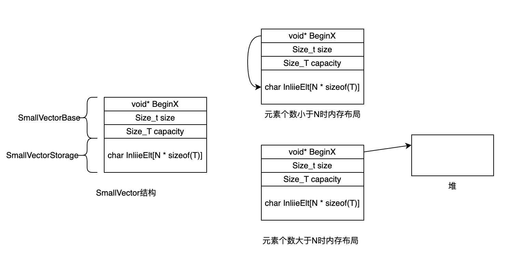

ADT提供了的顺序和std一样包括连续内存管理的容器以及链表形式的容器。

# 顺序容器-连续内存

连续内存主要包括：SmallVector、Arrayref、TinyPtrVecotr。其中SmallVector和ArrayRef是最常用的数据类型。

## SmallVector
这是ADT对标std::vector提供的容器，它的接口和std::vector也非常类似，一般来说它的性能优于std::vector，主要原因是smallvector在实现时进行了优化。smallvector的标准使用方式为smallvecotr<type, initial_length>，使用方式和std::vector也类似。smallvector和std::vector相比多个一个模板参数initial_length，这个参数表示smallvector预分配的内存，并且这个内存分配在栈上，而不是预分配在堆中。也就是说，当元素数量较少时，SmallVector会在栈上分配内存，避免了堆上内存分配和释放的开销。只有在元素数量超过阈值时，SmallVector才会在堆上动态分配内存，这时它的行为和std::vector类似。smallvector和std::vector在插入元素时，当超过当前容器的大小时，都会进行扩容，std::vector会重新分配更大的内存块，并将元素从旧内存复制到新内存中，这可能导致内存重新分配和复制的开销。smallvector优先在栈上分配，超过容量切换到堆上。
SmallVector实现采用了一点比较“特殊”的方式，它采用了多继承的方法实现栈+堆混合存储，代码如下：
 ```SmallVector : public SmallVectorImpl<T>,
                      SmallVectorStorage<T, N> {
           
 ...
 }
```

其中SmallVectorImpl对应的是堆存储，SmallVectorStorage对应的是栈存储。SmallVectorStorage本质上是要给数组，所以它的空间是在栈上。而SmallVectorImpl会将SmallVectorStorage对应的数组地址以及数组的长度进行保存，默认情况下并不会在堆中分配空间，当往SmallVector添加元素时总是先判断数据长度是否超过数组的范围，如果超过则进行堆空间分配，如果是第一次从堆中分配，使用malloc并且将栈中数据使用memcpy复制到堆中；如果不是第一次在堆中分配内存，使用realloc分配。
SmallVector内存布局如下所示。



LLVM中提供了API，例如to_vector将std::vector转换到SmallVector，方便整个框架使用SmallVector，在转换过程中会重新构造一个SmallVector对象，同样地如果要从SmallVector转换到std::vector也是重构一个stad::vector对象。所以双方的互转成本较高，而且SmallVector并不适用于std中的各种标准算法，所以在LLVM项目中可以看到两种容器都有使用，一般来说如果需要使用标准算法，优先使用std::vector；当不涉及到算法时，两种容器都可以，如无特别要求一般使用SmallVector。

## ArrayRef
ArrayRef是ADT中提供的一个简化顺序容器，它可以从std中的array、vector以及ADT中的SmallVector进行构造，该容器最大的特点是它并没有自己的内存，它和源容器共享内存。所以一般它用于从顺序容器读元素的场景。
此外ADT中还提供了MutableArrayRef和OwningArrayRef，正如它们的名字描述，MutableArrayRef也是和源容器共享内存，但是它提供了一些API可以修改源容器中元素。而OwningArrayRef则是拥有自己的内存，每次创建OwningArrayRef都会分配对应的内存空间。

## TinyPtrVector
这是针对SmallVector优化的特殊类型，它适用于容器大多数时候只有0个或者1个元素的场景，对于这样的场景使用该容器可以不必使用SmallVector，相当于直接使用原始类型的指针。所以它使用了一个Union来表示其存储layout，一个是原始类型的指针，另一个是SmallVector的指针。

# 顺序容器-List
ADT提供了链表类型simplelist、iplist和ilist。同时开发者可以基于链表的一些基础数据结构定义自己的链表类型。

## 基础链表数据结构
基础链表数据结构主要是提供链表的基础操作，例如设置链表的前驱、后继。

### ilist_node
这是ADT中一个常见的基类，它实现了双向链表。

### ilist_node_with_parent
这是ADT另外一个比较常用的list基类，它也是双向链表，同时提供了一些基础的API用于访问派生类型的父类型。它接受两个类型，分别是当前类型以及它的父类型。
使用该类型时，需要实现实现getParent（）这样的API才能保证正确性。同时要求父类型实现getSublistAccess（）这样的API。
例如MBB继承于该类型，它的父类型为MachineFunction，两者分别需要定义对应的API。

### node_options
ADT中链表结点还可以附加一些option，最典型是sentinel和tag。

#### ilist_sentinel
该选项表示结点是否哨兵结点。

#### ilist_tag
为Node添加一个标签，用于确保只有对应tag的node才能加入到list中。例如：

``` //定义两个tagA、B
 struct A {};
 struct B {};
 //定义结点，包括标签A、B
 struct N : ilist_node<N, ilist_tag<A>>, ilist_node<N, ilist_tag<B>> {};

 void foo() {
   // ListA只能接受结点有Tag A的节点
   simple_ilist<N, ilist_tag<A>> ListA;
   // ListB只能接受结点有Tag B的结点
   simple_ilist<N, ilist_tag<B>> ListB;
   N N1;
   ListA.push_back(N1);
   ListB.push_back(N1);
 }
```

## simple_list
基于ilist_node实现的双向链表，它并不支持真正的Delete，它的remove、erase接口都是将结点从链表中移除，并不会执行结点的析构函数。另外simple_list也不支持traits，所以也不会在结点变化时执行额外的操作。

**push_back只能接受引用类型，不会执行对象的析构函数**
一些例子：
1. simple_ilist<T>给出默认值。
2. simple_ilist<T,ilist_sentinel_tracking<true>>启用ilist_node::isSentinel() API。
3. simple_ilist<T, ilist_tag ,ilist_sentinel_tracking<false>> 指定 A 标签，并且应该关闭跟踪。
4. simple_ilist<T,ilist_sentinel_tracking<false>, ilist_tag > 和3相同。

## Iplist/ilist

继承于simple-list，ADT中支持的双向链表，并且这个链表可以支持多态类型的存储，所以是Intrusive Polymorphic的链表。它最大的创新点有两个：
1）在于iplist可以支持基类以及派生类对象，例如instructions和basicblock。
2）位list添加一个traits，在list中对象删除、添加、转移等动作时可以调用Callback进行处理。
注意ilist是iplist的别名。

**push_back只能接受指针类型**


## ImmutableList

提供一个不可变的List，对于该类型不能直接创建，通常都是ImmutableListFactory完成对象创建。

<!-- more -->
