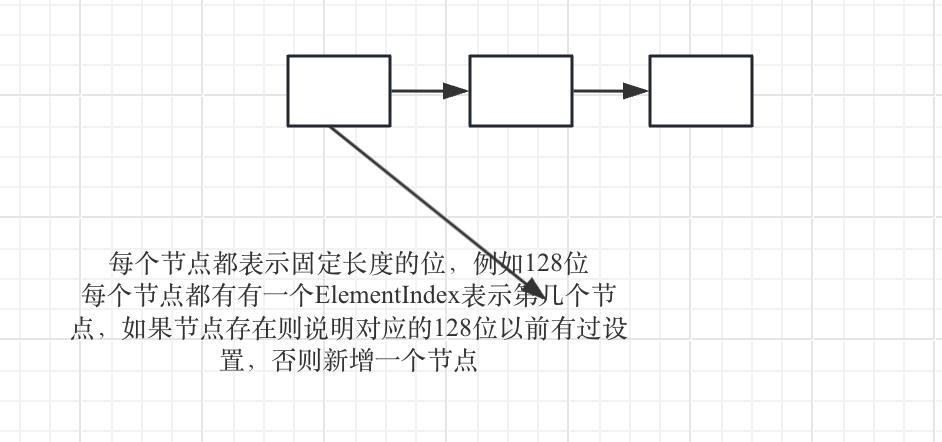

# String
ADT中提供的字符串有一个典型的特点，通常不分配内存，而是公用内存。因此在使用ADT中相关的String类型，需要特别小心。

## StringRef

ADT中提供的字符串类，这个类并不会针对的分配内存，它包含一个const char*和length分别表示指向的对字符串和长度。它和原始的字符串共享内存，因此StringRef大多数操作都是Immutable，即操作都是返回原始字符串的一个Copy，例如front（）返回字符串的第一个字符的Copy，而不是原始字符串的引用；再例如Copy会重新生成分配一块内存，然后再构造StringRef。

另外ADT还提供了StringLiteral，它继承于StringRef，它接受一个字符串字面量作为输入，主要目的为了避免全局String对象的构造。而基于StringLiteralADT还提供了StringSwitch的功能，类似于swith-case，实现case功能，但case仅仅是将满足匹配的情况下将结果设置为最后的输入参数。

## SmallString

SmallString本身继承于SmallVector，也就是它使用SmallVector作为字符串真正的存储，同时它又提供了一些字符串的API，例如find、compare、startswith等，这个字符串相关的API实际上会将SmallVector的底层存储（实际是char*）作为StringRef的输入，所以这些API在使用时都先构造一个StringRef，然后调用StringRef中相关的API。

## Twine

是ADT中一个特殊的字符串类，它的主要目的是方便多个字符串（或者数字）连接成一个字符串，它在设计时并不会直接连接两个输入，而是通过树的形式将两个输入转化为树的左右子树。因此Twine不会真正的分配内存，可以直接构造Twine对象，也可以将多个Twine对象通过concat形成一颗Twine树，在执行toStringRef后才会将树中所有的节点示例化一个SmallString的对象，并返回为StringRef。

## std中的string

在底层采用了char*作为存储结构，提供了一系列的API包括增删改查等。实际上ADT中提供的string相关类都是对std中string的增强，用于特殊场景。例如StringRef只是共享字符串，所以方便表示一个字串等。

# 位容器
ADT中Bit相关类型更多的是对std的补充。

## BitVector/SmallBitVector
使用SmallVector<uintptr_t>作为底层存储结构，用于提供位操作。
SmallBitVector则是使用一个unitptr_t作为底层存储，因此它只能管理32位或者64位（依赖于OS），它也提供了一系列的API，在实现时将unintptr_x直接转换位SmallVector使用，从而直接使用BitVector

## SpareBitVector

ADT中实现的一个稀疏位操作，它的目的是尽可能的只存储非零的位信息。适合于位数据特别大的场景。它在实现时采用两层结构，第一层基于链表，第二层基于数组，数据长度固定（默认位128位），表示一个元素。然后链表将所有的元素链接起来，它的结构如下所示：

使用链表的好处非常方便添加或者删除位信息。当然对于一些位操作，例如intersect、union则较为复杂，需要处理两层结构。

此外ADT在还提供了一系列的位操作，主要用于替代std中操作，例如bitfield等，主要原因时std中并未支持一些API。

## PackedVector
借助BitVector实现了一个压缩Vector。它除了能接受push_back接口外还可以接受“！”、“｜”位运算操作。

<!-- more -->
