SelectionDAGIsel是一种局部指令选择算法，它以函数中的基本块为粒度，针对基本块内的LLVM IR生成最优的MIR指令，不考虑跨基本块间的指令处理。但是基本块中有一个特殊的指令φ函数需要特别处理，一方面是因为φ函数在后端中并没有一条指令与之对应，另一方面则是因为φ函数表达的是基本块之间的汇聚关系，在处理当前基本块时，编译器并不知道控制流汇聚的情况。所以SelectionDAGIsel实现时将指令分成2类处理。

<!-- more -->

* 以基本块为粒度，对基本块内的指令（忽略φ函数）进行指令选择。
* 针对φ函数处理基本块之间的关系，在基本块完成指令选择后再为基本块之间重构汇聚关系（再次添加φ函数）。
下面首先来介绍基本块粒度的指令选择过程，在基本块内指令选择执行完毕后再介绍φ函数的处理。
基本块中每一条LLVM IR都会被初始化为DAG IR，然后经过数据类型合法化、向量合法化、操作合法化等流程，进入指令选择环节和调度环节，最后被转换成MIR。示意图如图7-5所示。
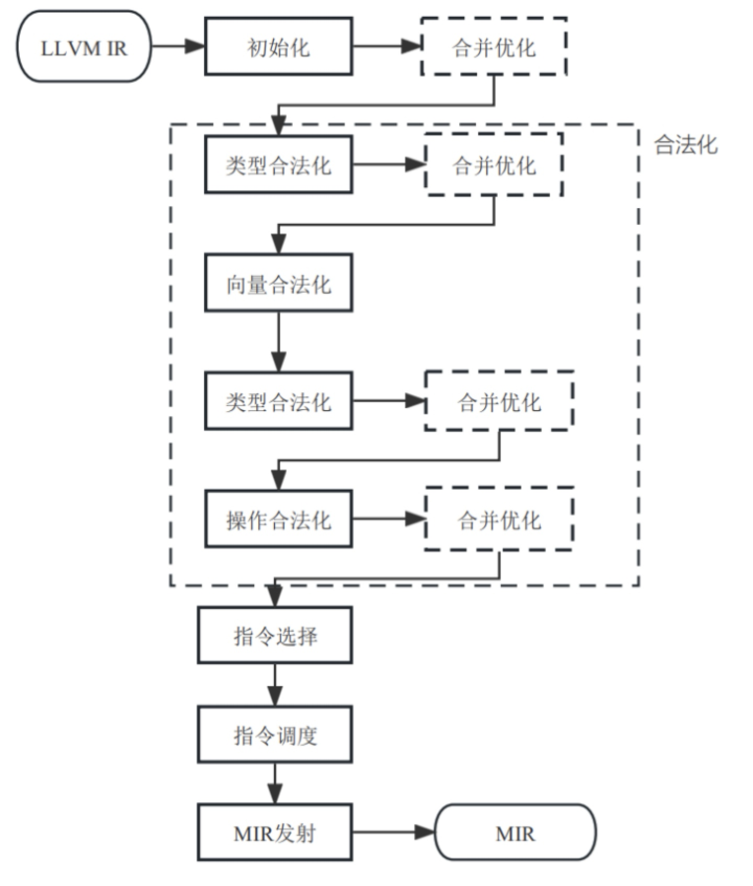

图7- 5 SelectionDAGISel针对基本块进行指令选择流程图

注意：在图7-5中可以看到，从LLVM IR生成到MIR的过程中有多个合并优化环节。这些环节本质上都是一些窥孔优化，其目的是清理上一个环节可能产生的冗余DAG表达、用单个节点替换同功能的多个节点组合，减轻下一个环节需要处理的节点数量，提升编译器的处理效率。限于篇幅本书不对合并优化介绍，所以在图7-5中用虚框表示。
另外，图7-5中“类型合法化”被调用了两次：第一次处理是对所有的节点类型进行处理，确保处理后的数据类型都是后端架构可以支持的，然后再判断基于这些数据类型的操作是否合法；第二次“类型合法化”则是因为在“操作合法化”的过程中，可能会重新产生架构不支持的数据类型，因此需要再调用一次进行查缺补漏，将新产生的不合法类型清理干净，经过此阶段后产生的节点操作类型和数据类型，均应是合法的，否则编译器会直接抛出错误。详细的处理过程将在7.2节中介绍。
基本块之间的φ函数处理也比较简单，当基本块指令处理完毕后（处理到基本块的最后一条LLVM IR，这条指令是Terminator指令），根据CFG获取后继基本块的第一条指令，如果指令是φ函数，说明后继基本块中需要重构φ函数相关的依赖，会先记录这些信息（如φ函数的位置、使用变量等），在所有的基本块都执行完指令选择后再重构φ函数。
指令选择时引入了新的数据结构（即DAG），在DAG中使用SDNode来表示节点，它将指令格式抽象为一组操作码和操作数，以此来屏蔽不同处理器的架构和指令集之间的差异，避免针对每个指令进行特定单独的处理，可以提升编译器的处理效率。下面先认识一下SDNode，再介绍LLVM IR如何转换成以SDNode构成的DAG IR，并基于SDNode实现指令合法化，然后再介绍如何基于DAG进行指令选择（也称指令匹配），最后生成MIR。

## 7.2.1 SDNode简介

SDNode作为DAG的基本单位，它包含了节点的编号、操作数信息（包括操作数序列、操作数个数）、该节点的使用者序列、该节点对应的源码在源文件中的位置等信息，并提供了获取这些信息的接口。具体关于SDNode结构可以参考附录A.2。
每个SDNode都可以有输入和输出，其输入可以是一个叶子节点或是另一个SDNode的输出，一般又可以将SDNode节点的输出称为值。SDNode的值按照功能可以分为2种类型：一类用于标识数据流，一类用于标识控制流。

### 1.标识数据流的SDNode

标识数据流的SDNode值是数据运算产生的结果，比如零元运算（如常数赋值节点）、一元运算（如取反操作neg、符号零扩展操作sign_extend、位截断truncate）、二元运算（如加、减、乘、除、左右位移）、多元运算（如条件选择select）等产生的输出节点。如图7-6中所示，标识数据流的SDNode值由数据运算操作产生，这些操作节点接受多个参数作为入参，而参数可以是数据流类型的值，也可以是控制流类型的值。
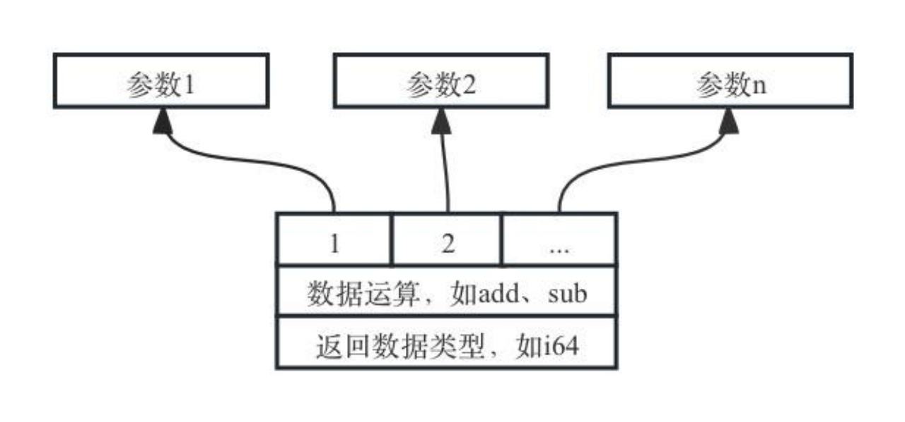

图7- 6 数据流SDNode示意图

### 2.标识控制流的SDNode

标识控制流的SDNode值用于描述节点与节点之间的关系，常见的为chain和glue。chain用于表示多个节点之间的顺序执行关系，glue则用于表示两个节点之间不能穿插其他的节点（在本书DAG中chain关系用蓝色虚线表示，glue关系用蓝色实线表示，这和使用LLVM工具的输出略有不同，在LLVM工具中对于glue使用红色实线表示，在印刷时无法提供红色实线，所以统一修改为蓝色实线）。
如图7-7所示，是一个32位内存空间的写（Store）操作对应的SDNode。其中ch为表示依赖顺序关系的chain，其他字段在7.2.2节会进一步介绍。

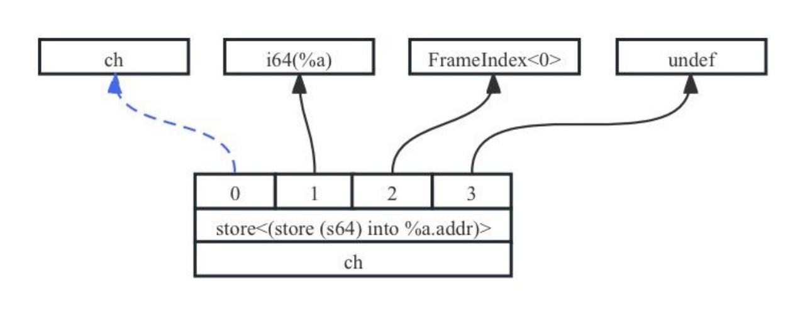

图7- 7 标记控制流SDNode示意图

为什么SDNode要引入控制流关系描述？可以假设这样的场景，代码片段中同时存在Load和Store指令，并且Load和Store指令总是顺序执行，如果没有chain的话，Load和Store都接收内存地址信息作为入参，两者之间并不存在数据上的依赖冲突。如果要求对内存先写后读，必须是写内存指令先被运行，然后读内存指令才能执行，否则会出现内存读取错误，所以编译器使用了参数chain来规定两个指令之间的顺序关系。读/写操作既使用chain作为入参，也会产生一个chain作为输出。在先写后读的指令序列中，Load指令输出的chain会被用作相应Store指令的输入。像内存读写这一类的操作指令，对其他同类指令存在控制流上的顺序依赖，必须按照固定的顺序被执行（顺序中可以插入其他无关的指令），否则会导致程序运行偏离原本的语意。这一类操作指令也被称为具有边界效应（Side Effect）的操作，除了内存读写，还有函数调用、函数返回等也是类似情况。
注意：在LLVM实现中，为了方便，对于操作而言，如果chain是入参，一般将chain设置为第一个参数；如果chain是输出，则一般是最后一个输出。每个DAG都有起始节点Entry和结尾节点Root（也称为根节点），起始节点一般使用EntryToken作为标志，并产生一个chain作为输出，这个chain会贯穿整个DAG直至在根节点处终止。在函数执行过程中可能会分叉成为多条链，这种情况下链与链之间是相互独立的，不存在执行顺序上的依赖；而多条链也可能在某个节点重新汇聚成一条链。

## 7.2.2 LLVM IR到SDNode

指令选择以基本块作为粒度，对基本块中的每一条指令进行处理，将其转换为对应的SDNode节点，整个基本块都被处理完以后，就可以得到与基本块对应的DAG，这一转换过程中不会处理φ指令，φ指令的处理会在所有基本块转换完成后再进行。从IR到SDNode的过程本质上是逐一映射的转换过程，LLVM IR可以映射为一个或多个SDNode。本书通过一个例子演示LLVM IR到SDNode的转换过程，LLVM IR共计67条指令，而对应的SDNode则多达几百个（参考附录A.1和A.2），由于篇幅有限，我们无法针对每一条LLVM IR介绍其转换到SDNode的过程，仅仅覆盖几类LLVM IR，这几种LLVM IR的介绍刚刚能覆盖我们的例子，其余LLVM IR到SDNode的转换读者可以参考源码自行学习。本节使用的示例代码如代码清单7-1所示。
指令选择示例函数callee和caller（7-1.c）
```long callee(long a, long b) {
    long c = a + b;
    return c;
}
int caller() {
    long d = 1;
    long e = 2;
   int f = callee(d, e);
   return f;
}
```
在本例中有两个函数callee和caller，callee函数接收入参a和b，将两者的和c作为输出；caller函数对callee函数进行调用，传递d和e作为函数callee的参数，返回函数调用的结果f。
本节以BPF64后端为例演示LLVM IR到SDNode到转换过程。在BPF64架构的调用约定中，使用r1～r5寄存器进行参数传递，r0寄存器储存函数的返回值；在BPF64中只有64位数据是合法数据，其余数据类型均为不合法的。
使用clang编译代码7-1.c获得对应LLVM IR如代码清单7-2所示（编译命令为：clang -O0 -S -emit-llvm 7-1.c -o 7-2.ll）。
callee和caller对应的IR（7-2.ll）
```define i64 @callee(i64 noundef %a, i64 noundef %b)  {
entry:
  %a.addr = alloca i64, align 8
  %b.addr = alloca i64, align 8
  %c = alloca i64, align 8
  store i64 %a, ptr %a.addr, align 8
  store i64 %b, ptr %b.addr, align 8
  %0 = load i64, ptr %a.addr, align 8
  %1 = load i64, ptr %b.addr, align 8
  %add = add nsw i64 %0, %1
  store i64 %add, ptr %c, align 8
  %2 = load i64, ptr %c, align 8
  ret i64 %2
}
define i32 @caller() {
entry:
  %d = alloca i64, align 8
  %e = alloca i64, align 8
  %f = alloca i32, align 4
  store i64 1, ptr %d, align 8
  store i64 2, ptr %e, align 8
  %0 = load i64, ptr %d, align 8
  %1 = load i64, ptr %e, align 8
  %call = call i64 @callee(i64 noundef %0, i64 noundef %1)
  %conv = trunc i64 %call to i32
  store i32 %conv, ptr %f, align 4
  %2 = load i32, ptr %f, align 4
  ret i32 %2
}
```
下面就以代码清单7-2为例进行介绍，在这个例子中涉及的LLVM IR分类主要有：
* 运算类：add（加法）；
* 类型转换类：truncate（类型截断）；
* 内存操作类：load（内存读）和store（内存写）；
* 函数调用和参数传递：call（函数调用）。
下面分别介绍。

### 1.运算类IR到SDNode的转换

在代码清单7-1的函数callee中有一个加法运算： c = a + b，它对应的LLVM IR为：%add = add nsw i64 %0, %1。其中%add与c对应，%0与a对应，%1与b对应；add为该条IR的操作符，表示加法运算；nsw是一个符号扩展标记，表示需要进行有符号数溢出检查。
运算类IR的转换比较简单，只需要把LLVM IR指令的操作数替换成相应SDNode值，把指令操作码映射为SDNode的指令操作码即可。在DAG中用t指代节点序号，上述IR片段对应的SDNode表达为：t13: i64 = add nsw t11, t12，用图表示形式为：
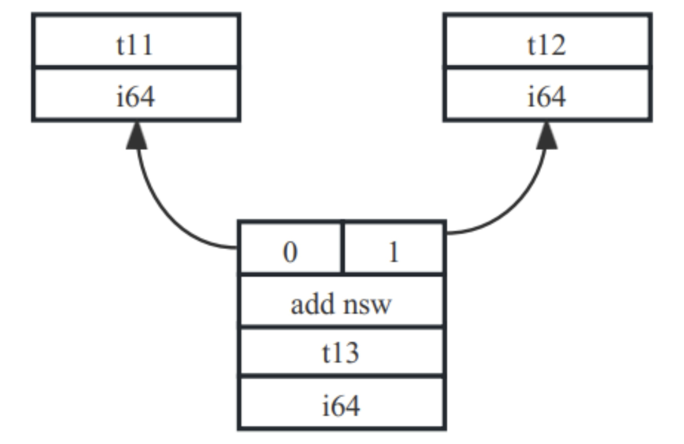

图7- 8 add运算SDNode示意图

在图中t13表示add操作的序号，结果为i64类型，它接收2个参数分别是t11和t12，t11和t12分别是参数对应的SDNode，这里只关注add节点，暂时不关注参数节点t11和t12如何形成的。对于add节点来说其转换为SDNode的过程相对简单，它是根据LLVM IR中的add指令直接映射得到。其他运算类IR到SDNode也是类似处理。
注意：虽然SDNode表达中，当前的操作节点的名字仍为“add”，但这已经不是LLVM IR层面的add指令，而是ISD命名空间里的SDNode节点。

### 2.类型转换类IR到SDNode的转换

在程序中经常涉及类型转换，如LLVM IR中有显式的trunc指令进行类型截断或者bitcast进行位转换。对于这类显式类型转换指令，在SDNode中也存在对应的类型一一映射LLVM IR。例如caller函数中调用callee，callee的返回值为i64类型，但是caller使用i32类型进行返回值接收，此时LLVM IR中会使用一个trunc指令将返回值进行截断，指令为：%conv = trunc i64 %call to i32。对于这样的指令，SDNode也会有truncate类型的节点与之对应。故该IR对应的SDNode表达为：t24: i32 = truncate t23。用图表示形式为7-9所示。

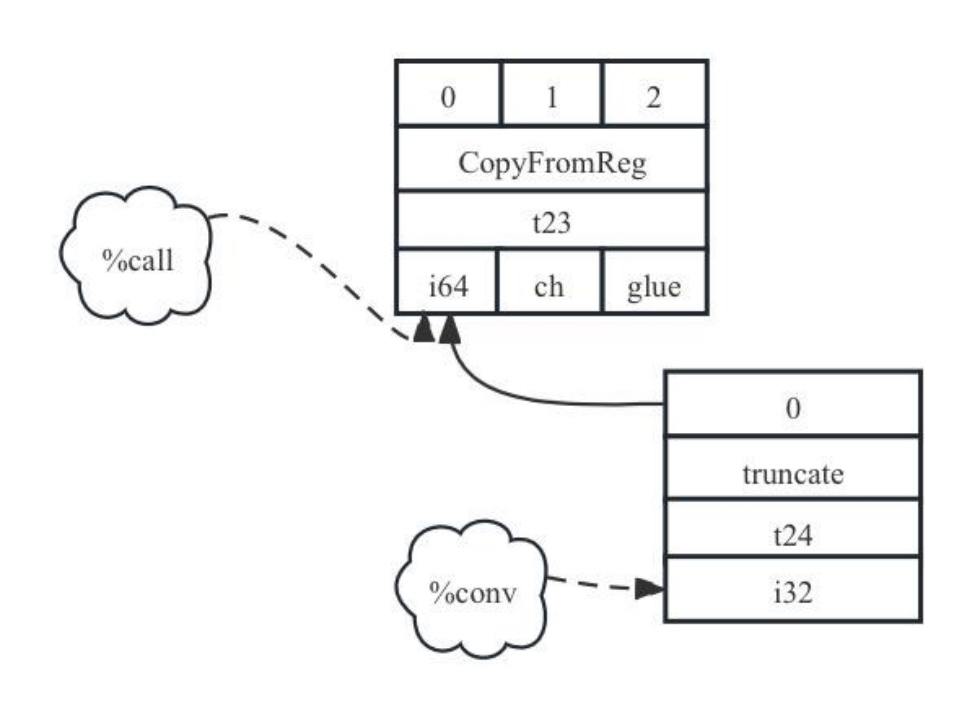

图7- 9 truncate操作SDNode示意图

在这里我们仅仅关注trunc这条IR到SDNode的转换，暂时不关注t23这个节点，在下面的函数调用会介绍为什么会存在t23。可以看到显式类型转换到SDNode也是一一对应。
除了显式类型转换外，代码执行时还存在一些隐式类型转换。例如在函数调用、返回或者switch的条件式中，对于类型有明确的要求，此时可能会生成隐式类型转换，所以在SDNode中会增加一些类似any_extend、sgin_extend、zero_extend等节点。例如本例中caller返回值类型为i64，但是返回值f为i32类型，所以存在隐式转换（将i32提升至i64），在SDNode中会增加any_extend隐式转换节点（any_extend仅使用于整数类型，扩展后的数据高位是未定义的），其表达为：t28: i64 = any_extend t27。用图表示形式为7-10所示。
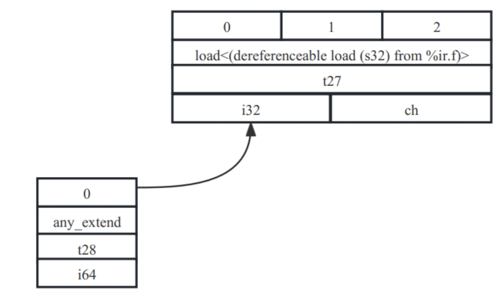

图7- 10 any_extend操作SDNode示意图

在这里我们仅仅关注any_extend这个节点，暂时不关注t27相关的load节点如何生成以及后续如何使用t28。可以看到t27类型为i32，而t28类型为i64，使用any_extend进行了类型提升（关于any_extend在7.2.3数据类型合法化中会继续介绍）。

### 3.访存类IR到SDNode的转换

在LLVM IR中访存指令为Load、Store，这里以Store指令为例进行介绍。以callee中第一条store指令为例：store i64 %a, ptr %a.addr, align 8，它对应的SDNode为：t8: ch = store<(store (s64) into %ir.a.addr)> t0, t2, FrameIndex:i64<0>, undef:i64，对应图表示为7-11所示。
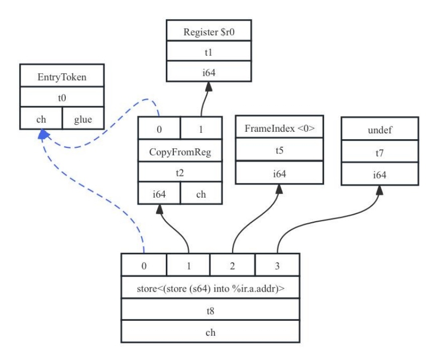

图7- 11 Store操作SDNode示意图

可以看出LLVM IR中的store指令和序号为t8的SDNode节点对应，在这个节点中它有4个输入：0、1、2、3，其中：
1. 1）输入0是chain依赖，它依赖于EntryToken节点（基本块的入口），即store必须在EntryToken节点后才能执行。
2. 2）输入1在LLVM IR是参数%a（待赋值的值），它也会被转换为一个SDNode，使用CopyFromReg节点将%a转换为t2，然后再将t2作为store节点的输入（为什么引入CopyFromReg，而不是直接使用%a？原因是调用约定通常会要求参数使用物理寄存器，在例中%a为callee函数的第一个入参，需要从物理寄存器r0中读取。此处引入t2这样的赋值指令后将物理寄存器赋值到虚拟寄存器中，有助于继续保持当前IR的SSA形式，解耦指令选择和寄存器分配阶段，屏蔽大部分的后端架构差异，这将更有利于指令选择、指令调度和寄存器分配的执行）。
3. 3）输入2是store指令的目的地址，LLVM IR中使用ptr %a.addr，由于ptr %a.addr是一个栈变量，所以会被直接转换为FrameIndex<0>节点，表示栈中第0个槽位。
4. 4）输入3是undef节点，它描述的是相对于目的地址（输入2）的偏移量。默认情况下Store和Load节点的最后一个输入都是undef，它仅仅是一个占位符。
注意：引入FrameIndex和Undef节点的原因是在指令选择中可以针对Store和Load进行优化，例如在一些后端有Indexed Load/Store的访存格式，该格式可以包括一个基地址Baseptr和一个偏移量Offset，在访存时真实访问的地址是Baseptr+Offset，对于这样的指令格式最后一个输入存放的就是Offset。默认情况下Load和Store都不会使用最后一个字段，在指令选择的合并优化中，根据指令的关系，当发现多条指令符合Indexed Load/Store的访存方式时会将转换成一条Indexed Load/Store指令，目前仅仅只有少数几个后端，如ARM、PPC等才支持这样的访存方式（这样的访存模式在TD文件也会有相应的定义）。

### 4.函数调用相关IR到SDNode的转换

函数调用的处理与后端架构设计密切相关，所以在处理函数调用相关的LLVM IR时，各个架构需要根据自身的调用约定进行实现，这涉及了三个方面：入参处理、函数调用、函数返回。
函数调用涉及了两个函数过程之间的交互，包括了从调用过程传递参数和移交控制给被调用过程，以及从被调用过程返回结果和控制给调用过程。本节仍然以7-1.ll为例来演示从caller到callee整个调用过程中SDNode的生成。函数调用包含了4个步骤。
#### （1）callee被调用前
需要准备参数给callee,，要将待传递参数存放在适当的寄存器或者栈单元中。在参数传递时，使用物理寄存器来传递参数可以保证过程调用的高效性，但寄存器并不是无限的，也就不可能被随意使用，一般后端调用约定都会规定可用于传参的寄存器个数，超过最大参数寄存器的参数会被放到栈上。7-1.ll中函数调用对应的LLVM IR为：%call = call i64 @callee(i64 noundef %0, i64 noundef %1)，它传递%0和%1两个64位变量作为参数（%0和%1分别对应源码中的d和e），其SDNode表达为通过CopyToReg节点将两个变量的值分别复制到物理寄存器r1和r2中（引入CopyToReg节点就是为了处理调用约定），然后将r1、r2作为BPFISD::CALL的参数（BPFISD::CALL是BPF架构定义的函数调用SDNode）。该call指令对应的SDNode表达为：t20: ch,glue = BPFISD::CALL t18, TargetGlobalAddress:i64<ptr @callee> 0, Register:i64 $r1, Register:i64 $r2, t18:1，可以看出该SDNode节点直接依赖TargetGlobalAddress、$r1、$r2、t18这四个节点。实际上对于call类型的SDNode节点还会引入TokenFactor、callseq_start、callseq_end等伪指令节点。对应的图如图7-12所示。
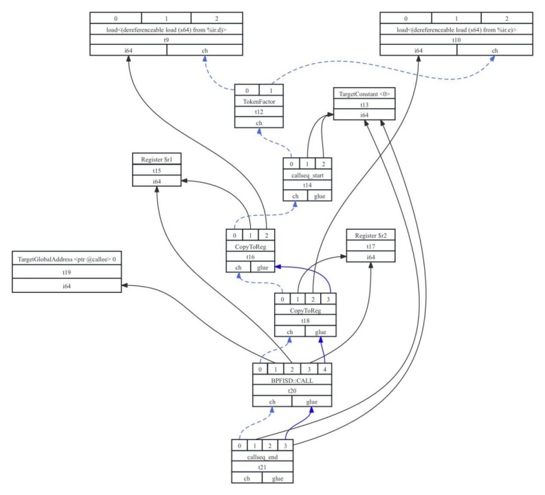

图7- 12 call指令调用SDNode示意图

在该图中有3类节点值得读者注意：
1. 1）TokenFactor节点：该节点接收多个操作数作为输入，并只产生一个操作数作为输出，用于表示其多个输入操作数关联的操作是相互独立的。如上例中，TokenFactor依赖的两个节点t9和t10为caller调用callee所需要传递的参数d和e的访存操作，表示这两个访存操作是相互独立的。一般来说，让TokenFactor节点依赖call指令的入参节点（如t9、t10节点），call指令序列又依赖TokenFactor节点，这是为了保证call指令参数的处理全部在call指令执行前就已经就绪。
2. 2）callseq_star、callseq_end节点：这2个节点是伪指令节点，分别位于call指令前后，如图7-12所示。这2个伪指令对应于后端的ADJCALLSTACKDOWN和ADJCALLSTACKUP指令（它们通常用于动态栈分配，例如定义数组int a[i]，其中i为变量，数组a的大小是未知的，所以需要动态栈分配，否则就无法准确确定栈的大小和对象的位置）。
3. 3）r2和r1之间的依赖节点（t16和t18）：caller在调用callee时，传递了2个参数，根据调用约定分别使用r1和r2传递，所以需要构建CopyToReg节点。但注意观察可以发现r1和r2之间有glue依赖，为什么会产生这样的情况？这是为了在真正执行callee之前，让所有的参数都完成执行准备，并且参数和call指令放在一起执行。当然参数之间glue的顺序并无强制要求，例如图7-12中t18依赖t16，实际上转换两者的位置也是可以的。
注意：上面介绍的是以BPF后端为例得到的DAG，特别是call指令和后端调用约定密切相关，不同的后端得到的DAG完全不同。例如使用nvptx（英伟达后端）会发现几乎没有相同的SDNode节点。在LLVM的实现中该部分功能一般封装为一个函数LowerCall，每个后端在实现call指令的转换时都需要实现该函数。我们在第13章总结了如何添加一个新后端时也明确指出需要后端实现该功能，读者可以重点关注一下。
#### （2）callee被调用执行
callee从相应的寄存器或者栈单元中取出参数，并开始运行。在本例中由于采用O0编译优化级别，所有的参数、局部变量都会被存放在栈内存中，使用alloca为变量分配独立的内存空间，例如7-1.ll中callee中%a、%b、%c三条指令。使用栈变量时通过Load、Store指令进行读、写。（在O2优化等级下，会将这些变量尽可能存入寄存器而不是内存中，省去上述的分配内存、读写内存的操作，以提升程序的执行效率，同时优化代码的codesize）。对于内存操作已经介绍，参考7.2.2节中访存类IR转换。
#### （3）callee执行结束
callee执行结束时需要按照调用约定将返回值存放在相应的寄存器单元中，将控制返回给caller。callee中的返回指令为ret i64 %2。与call指令类似，ret指令是后端相关的（需要在LowerReturn函数中实现），本例中在BPF后端中定义了BPFISD::RET_FLAG类型，生成的SDNode表达为t20: ch = BPFISD::RET_GLUE t19, Register:i64 $r0, t19:1，对应的图形式如7-13所示。：
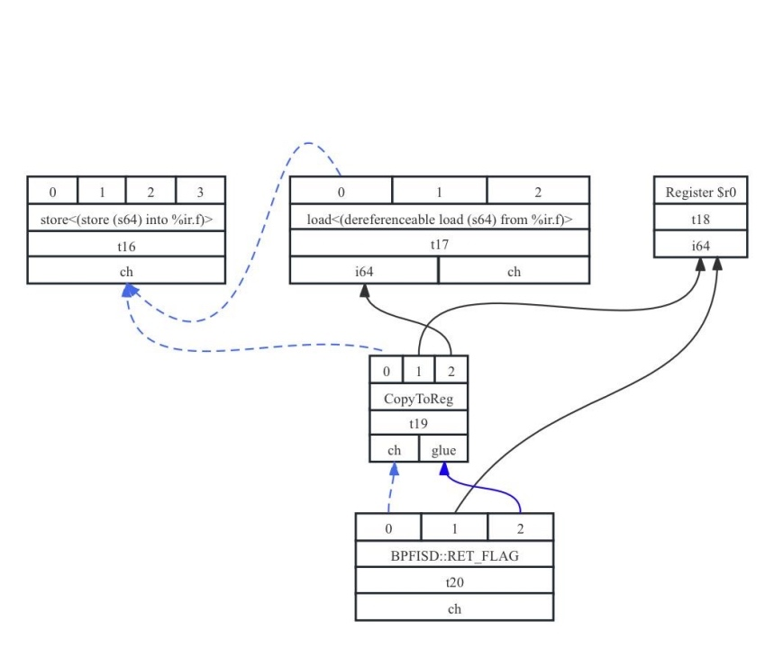

图7- 13 函数调用返回SDNode示意图

从图7-13可以看出callee的返回值需要存放在物理寄存器r0中（BPF后端调用约定的要求），而计算结果f需要从栈中%ir.f进行加载（节点t17），加载后需要将其转存到r0中（节点t18），所以引入了CopyToReg节点（节点t19）。最后还可以看到t19和t17都依赖于t16，主要是说明访问内存之前必须完成写操作，所以引入了chain依赖。
#### （4）callee被调用完成
caller获得控制，从返回值寄存器单元中获取返回值，供后续使用，并继续执行。本7-1.ll中caller调用指令%call = call i64 @callee(i64 noundef %0, i64 noundef %1)，call指令执行完成，结果放在%call中，而calllee的返回值已经放在了物理寄存器r0中，所以会引入CopyFromReg节点将物理寄存器r0的值赋值到虚拟寄存器中。对应的SDNode表达为：t23: i64,ch,glue = CopyFromReg t21, Register:i64 $r0, t21:1，其图形式为7-14所示。

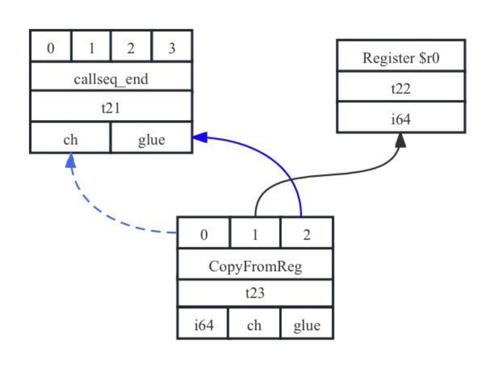

图7- 14 函数调用结束后继续执行时涉及的SDNode示意图

至此，函数caller和callee中涉及的LLVM IR都已介绍完毕，以callee为例看看生成的DAG图（记为7-1-callee.svg），如图7-15所示。


图7- 15 callee对应的DAG图

### 5.PHI指令处理
上文以caller、callee为例介绍了一般指令转换为SDNode的过程，但是还有一个重要的指令φ函数的转换并未提及。SelectionDAGIsel是以基本块为粒度处理LLVM IR，所以直接处理φ函数可能会导致结果不正确，因为φ函数是基本块的汇聚点，它涉及多个基本块的信息整合。指令选择过程中在遍历基本块中的IR指令构建DAG时，当遍历到基本块最后的一条指令（最后一条指令是终结指令，如跳转指令），会判断当前基本块的后继基本块中是否存在φ函数节点，如果存在，会为φ函数生成对应的虚拟寄存器，并记录下和φ函数相关的操作数、基本块等信息，当所有基本块的指令选择都完成后，再根据这些记录的信息来为基本块间添加φ函数及操作数。
考虑有如下IR片段（代码清单7-3），片段中有3个基本块，其中基本块if.end是基本块if.then和基本块if.else的后继基本块，函数流程可能从if.then或是从if.else跳转到if.end；如果是从if.then跳转到if.end，则变量%0的赋值取常量值66，否则取常量值77（%0的取值也可以是变量，为简单起见，使用常量进行介绍）。
φ函数示例
```...
if.then:
br label %if.end

if.else:
br label %if.end

if.end:           ; preds = %if.else, %if.then
%0 = phi i32 [ 66 %if.then], [ 77, %if.else]
...
```
以处理基本块if.else为例，当基本块中的指令处理完毕后，发现后继基本块if.end有φ函数，会创建一个虚拟寄存器用于存放与之对应φ函数中的操作数。代码7-3中φ函数的前驱基本块if.else对应φ函数的操作数为常量77，所以在if.else基本块中会生成CopyToReg节点，表现为将φ函数的操作数（常量77）拷贝到分配的虚拟寄存器（例如为%5），示意图如图7-16所示。
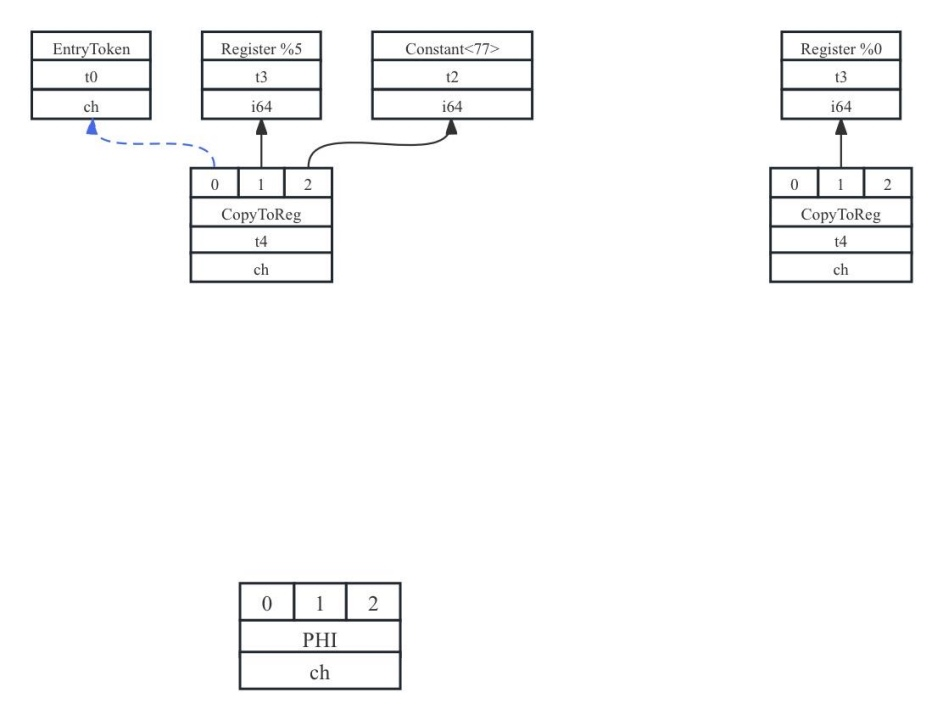

图7- 16 基本块if.else为后继基本块的φ函数插入额外SDNode示意图

当所有的基本块都完成指令选择后，再对φ函数进行处理。首先为φ函数确定位置（位置信息是确定的，因为LLVM IR已经包含了φ函数的位置信息），为φ函数添加寄存器和对应的基本块作为操作数，代码7-3中φ函数处理完后生成结果如代码清单7-4所示。在代码7-4中φ函数的操作数%bb.0与%bb.1分别与代码7-3中的%if .then和%if.else基本块对应，%2和%5则分别是两个基本块中为φ函数中操作数分配的虚拟寄存器（gpr表示通用寄存器）。
生成PHI机器伪指令
```bb.2.if.end:
; predecessors: %bb.0, %bb.1（分别对应IR中%if.then和%if.else基本块）
  %0:gpr = PHI %2:gpr, %bb.0, %5:gpr, %bb.1
```
经过初始化流程后，LLVM IR都被转换成了SDNode，基本上每条LLVM IR逐一对应。由于SDNode的生成过程是针对兼容所有后端而设计的，导致生成的DAG中可能存在大量的冗余节点以及特定架构不支持的数据类型或是操作类型。所以在SelectionDAG初始化完成以后，会进行一次SDNode节点合并操作来对DAG图进行优化（如图7-5中所示），然后进入到合法化处理环节，以消除架构无法处理的节点，生成可供架构进行指令选择使用的合法DAG。下面看看如何进行合法化。
## 7.2.3 SDNode合法化
合法化SDNode是DAG生成过程中很重要的一个环节。合法化主要包含类型合法化（Type Legalize）、操作合法化（Action Legalize）和向量合法化（Vector Legalize）。数据是操作的基础，所以合法化过程中会首先根据TD文件，对DAG中各个节点的数据类型进行校验，如果遇到架构不支持的数据类型，需要对其进行处理，使之成为目标架构可以支持的数据类型。只有经过数据类型合法化的DAG才可以继续进入到操作合法化处理流程。向量合法化指的是对向量类型和操作进行的合法化。
### 1.类型合法化
对于一个目标架构而言，什么样的数据类型是合法的——这是由目标架构的设计者通过寄存器描述（在TD文件中）定义的。目标架构支持的数据类型可以有多种，也即有多个合法化类型，其中比特位长度最短的，称为最小合法化类型。
在数据类型合法化的处理过程中，会遍历DAG中的所有节点，检查节点的数据类型是否合法。在LLVM中存在Legal、Promote、Expand、Soften这四种主要的标量数据类型处理方式，其中Legal表明当前数据类型是架构支持的，即是合法的，不需要做额外处理；另外三种则表示可以通过特定的处理，将当前不合法的数据类型转变为合法数据类型；若经过所有的处理都无法将非法数据类型合法化，编译器会抛出错误终止运行。除了这四种标量合法化操作类型外，还有针对数组类型的Scalarize（将数组标量化）、Split（将数组拆分）、Widen（扩展为更长的数组）等合法化操作。
在合法化操作之前会根据TD文件获得该架构支持的所有合法数据类型，并计算出LLVM中所有数据类型对应目标架构中的合法化操作。这个流程处理的是LLVM支持的公共数据类型，有一些架构会定义一些独有的数据类型（不属于公共数据类型），开发者可以在该架构中手动扩展添加与之对应的合法化操作类型。
在一个后端中，某个数据类型应该被设置为Legal、Promote、Expand中的哪一种？总的来说遵循以下几条规则。
1. 1)根据TD文件中定义的寄存器类型，找到架构支持的最大整数类型（称为LargestInt），如架构中仅支持32位和64位的整型寄存器，其最大整型即为64位。
2. 2)所有超过最大整型LargestInt的类型，都使用Largest作为基础类型，标记为Expand，意为使用多个（2的n次方）基础类型的寄存器组合来表示该类型。
3. 3)所有比最大整型LargestInt小的数据类型，首先需要判断是否为后端支持的合法类型，如果不是就标记为Promote，并使用离该类型向上最近的一个合法类型来表示该类型。例如，int64为LargestInt，int32为一个合法类型，int16为非法类型，会将int16提升到int32而非int64。
4. 4)其它的一些类别，如f128、f64、f32在不合法的情况下转为i128、i64、i32来表示，其合法化规则被标记为Soften。
本章以BPF64后端中的处理为例进行说明标量数据合法化操作类型。在BPF64后端中，仅有64位数据类型为合法类型，故64位数据类型同时也是BPF64后端的最大整型和最小/最大合法类型。BPF64后端数据合法化的操作包含以下几种。
1）Legal：目标架构支持的合法类型，不需要进行转换。如i64是合法类型，记为Legal。
2）Promote：当操作数类型小于目标架构的最小合法类型，类型需要提升至最小合法类型。考虑有IR片段%add = add nsw i32 %0, %1，其中add指令的两个32位操作数%0和%1（从相应内存中通过load指令读取出来使用），经过add操作输出的%add的数据类型也是i32，所以在初始化为SDNode的时候会产生any_extend节点，将%add扩展为i64后再使用，any_extend表示扩展后的数据的高32位（扩展位）是未定义，只有低32位的数据存在意义，如图7-17a所示。在类型合法化过程中，会将i32操作数提升至i64类型（提升的方法为，32位操作数原本需要被存入32位内存，会强制转变成存入64位长度内存，所以新的64位长度内存的高32位也是未定义的），然后再进行add操作获得i64的输出，如图7-17b所示。比较图7-17a和7-17b可以看到，经过这一合法化操作，7-17b还可以省去7-17a中any_extend节点。
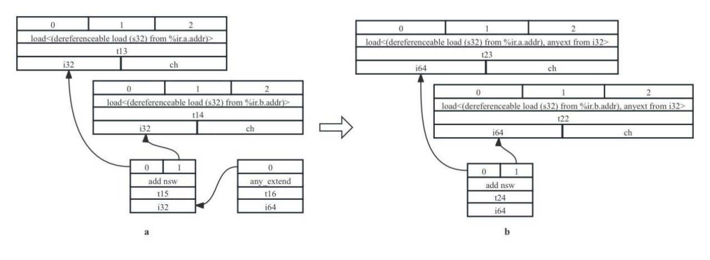

图7- 17 类型合法化Promote示例图

3）Expand：当操作数类型大于目标架构最大合法类型，需要进行扩展操作，用多个合法类型的组合来表示该类型。考虑有IR片段%add = add nsw i128 %0, %1，其中add指令的两个操作数%0和%1都是i128类型，经过add操作后获得的数据类型也为i128，其对应的SDNode节点序列如图7-18a所示。在类型合法化过程中，会将原来的i128操作数使用两个内存上连续的i64类型来表示。在图7-18b中可以看到add的两个操作数t17、t18被拆成了高64位（t17:1、t18:1）和低64位（t17:0、t18:0），高低位分别各自做add操作（低位如果产生了进位操作，需要加到高64位的和里），获得的两个i64类型数据依然被存在内存上相邻的两个i64长度空间里，共同组成i128类型的输出t19。
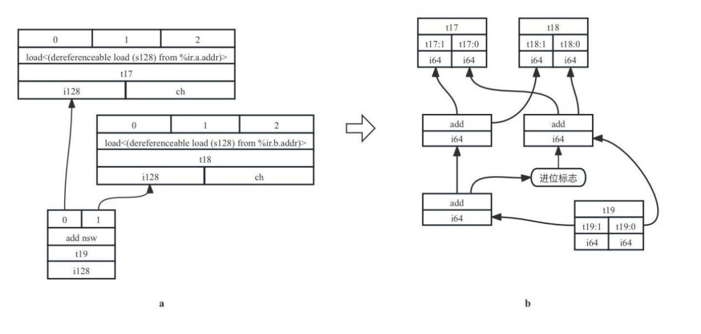

图7- 18 类型合法化Expand示例图

4）Soften：将浮点数类型转变为同等长度的整型。考虑有IR片段%add = fadd float %0, %1，其中fadd指令为浮点数加法指令，其两个操作数%0和%1都是float类型（可以从内存中读取），经过运算后产生的输出也是float类型；在被初始化为SDNode的时候，会产生bitcast节点，将float 32位输出转换为32位整型，再通过any_extend节点将其提升为64位整型，产生的SDNode节点如图7-19a所示；由于BPF64后端并不支持f32数据类型，故而在类型合法化操作时，会调用Soften操作，将f32类型转为同长度的i32类型；由于i32类型也不是BPF64架构中的合法类型，所以会调用Promote操作，将i32类型再提升为i64类型，之后将获得的两个i64操作数作为参数调用LLVM内嵌（builtin-in）的浮点加法__addsf3函数（该函数在LLVM已经声明，但是需要在架构后端中有对应的实现，否则会抛出找不到该函数的错误）。得到的结果如图7-19b所示：
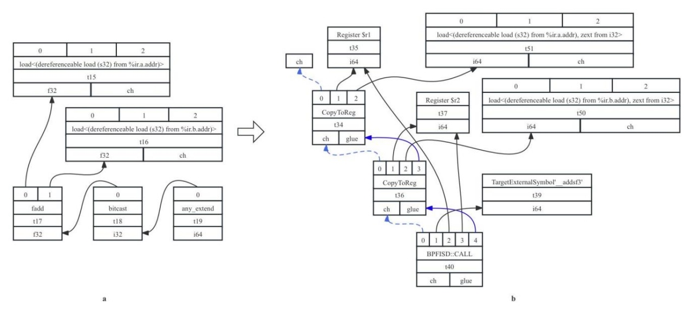

图7- 19 类型合法化Soften示例图

经过数据类型合法化处理之后的DAG，每个节点的数据类型都应该是目标架构可处理的，在此基础上可以开始进行操作（或运算）处理。但是不是所有的操作都是后端支持的，操作是否是合法，也需要经过校验，不合法的操作，也需要经过处理转变为后端可以支持的操作。
### 2.操作合法化
操作合法化的过程是将所有的节点进行拓扑排序后、从后往前逆序依次处理（采取逆序遍历的主要好处是，当下层节点发生变化的时候上层节点可以增量式更新，避免重新计算整个DAG图的全量节点）。在对节点进行合法化操作前，首先判断是不是有别的节点使用了当前节点，如果没有任何节点使用当前节点，则说明当前节点是冗余的，会被直接删除，不参与合法化过程。在合法化过程中可能会产生一些新的节点，这些节点也需要再次经过合法化处理。通常来说，LLVM中的操作合法化处理类型分为以下几类。
1)Legal：目标架构本身就支持该操作，可以直接映射为后端指令。
2)Promote：与数据合法化操作的Promote类似，表示当前数据类型不被支持，需要被提升为更大的数据类型（提升后的数据类型可能是Legal的）以后才可以被正常处理。
3)Expand：对某个后端尚不支持对操作，尝试将该操作扩展为别的操作，如果失败的话就会转为LibCall的方式。考虑有代码片段如清单7-5所示。
Expand示例
```int16_t add(int16_t a, int16_t b) {
  return a + b;
}
```
其中参数和返回值类型都为i16类型，在生成SDNode的过程中，会产生sign_extend_inreg节点，用于将a+b的i16类型运算结果转成i64类型（后续再拷贝到r0寄存器中作为返回），如图7-20a中所示。sign_extend_inreg的第一个操作数是经过数据类型合法化过程后，被扩展为了i64类型的——这一信息被记录在了第二个操作数ValueType:ch:16中，表明扩展前其原始数据类型为非法类型16位长度。由于后端中并没有与sign_extend_inreg对应的指令操作，故会对其做expand动作，生成7-20b所示的shl（左移48位）、再sra（右移48位）的节点，通过位移来实现和扩展同样的功能。
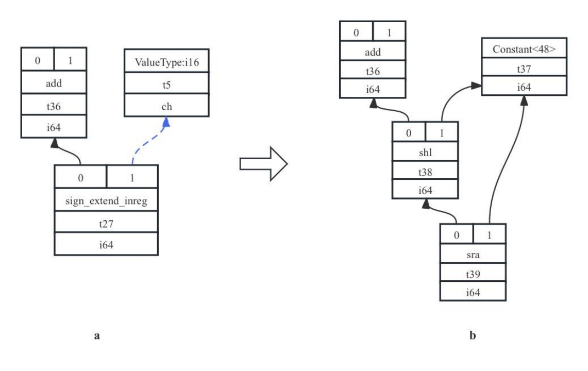

图7- 20 操作合法化 Expand示例图

4)LibCall：对某个后端尚不支持的操作，使用LibCall来完成该操作（调用库函数）。当然Libcall调用的函数需要在对应的架构中有实现，否则会报错，提示架构找不到该函数的实现。
 考虑有如下浮点数除法的代码片段，如代码清单7-6所示。
libcall示例
```double a = 3.14;
double b = a / 4;
```
其生成的LLVM IR为：%div = fdiv double %0, 4.000000e+00。该LLVM IR片段会相应生成图7-21a所示的SDNode节点。由于BPF64架构中没有浮点除法指令，fdiv这个节点被替换成了对LLVM内嵌函数__divf3的调用。同时由于a的数据类型为double（f64），不是BPF64支持的合法数据类型，所以也被转变成了合法类型i64后使用。结果如图7-21b所示。
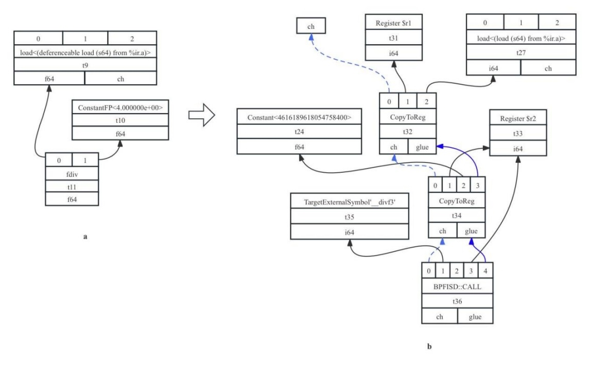

图7- 21 操作合法化LibCall示意图

5)Custom：使用目标架构自定义的实现，来完成该操作的实现，这些实现可以是上述几种合法化操作的组合，也可以是用户自己编写代码进行匹配。在图7-18提到的例子%add = add nsw i128 %0, %1中，在合法化128位数据时，会将“进位标志”的处理映射成一个setcc节点，如图7-22a中所示，在该节点中，t44是两个低64位值的和（t43代表了其中一个低64位），若t44的值小于t43（判断条件t45），说明在加法过程中发生了翻转，需要进位标志置1。BPF64后端首先会将setcc扩展为select_cc[ select_cc的含义为，当t43（操作数0）和t40（操作数1）节点满足t45（操作数4）的判断条件时，返回输入t70（操作数2，真值）的值，否则返回输入1（操作数3，假值）的值。]，得到的结果如图7-22b所示。然后对select_cc进行Custom操作，最后得到的结果如图7-22c所示。可以看到，7-22b和7-22c转换前后输入存在两个区别，一是将7-22b中setult节点在7-22c中替换成来Constant<10>这个常量，这是因为在BPF64架构中将setult判断条件换成了枚举序号来处理；二是操作数0和1的位置发生了互换，这是BPF针对判断条件为setult时，将两个操作数做了交换处理——这样的处理方式只有BPF64的架构开发者知道为什么要这么做、以及怎么做，LLVM的通用指令选择机制无法得知这样的意图，所以需要目标架构自己编写定制化的代码进行实现。
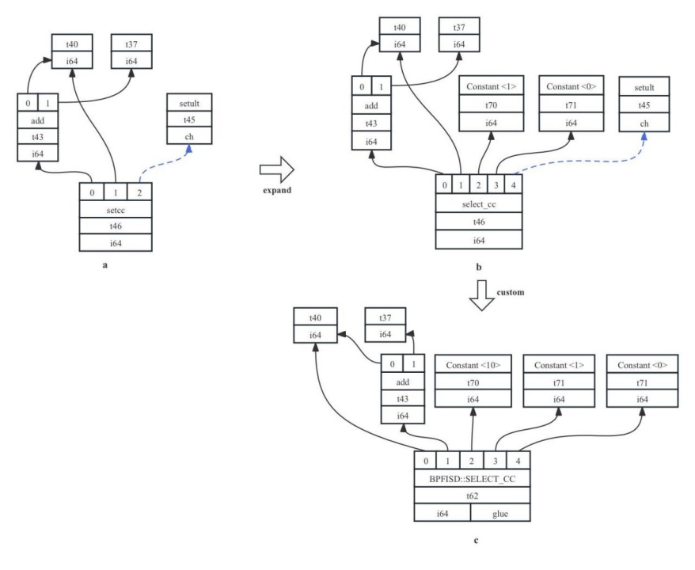

图7- 22 操作合法化Custome示例图

在操作合法化的过程中，会存在一些优化及数据拆分操作，这些操作有可能会产生新的节点以及未被校验是否合法的数据类型。所以在操作合法化处理完成后，还会再进行一次数据类型合法化，以确保DAG中节点的数据类型都是可处理的。
### 3.向量合法化
LLVM还实现了向量合法化。主要是因为一些CPU架构为了加速数据处理能力，推出了可以并行处理多个数据的指令——SIMD指令（Single Instruction Multiple Data，单指令多数据）。这些指令的特点在于，一条指令可以处理多个数据。如图7-23所示，要完成4组A、B变量的加法，获得结果C。如果使用普通加法指令，一条指令只能对两个操作数进行一次加法操作，需要4条加法指令才可以完成操作；而使用SIMD加法指令后，一条指令可以对两个向量进行加法操作，只需要一条指令即可完成操作，此时的操作数类型为v4i64（是向量类型）。
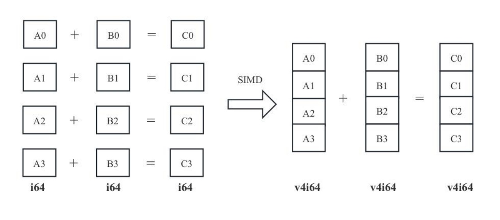

图7- 23 向量操作示意图

为了使能CPU的SIMD功能，在编译器中也增加了向量数据类型的处理。与普通数据类型类似，编译器处理过程中，不可避免地会产生后端无法支持的向量数据类型，因此也需要对向量类型进行合法化处理。
对向量类型的合法化操作也分为类型合法化和操作合法化，视具体情况也会将不合法的向量操作转变为标量操作。总的来说，向量类型合法化的原理与标量类型的处理相似，本书中不再展开介绍。
### 4.合法化示例
最后我们仍然以代码清单7-2中的IR为例，来看看合法化处理后结果。callee函数中只使用了64位数据类型，对于BPF64架构而言是合法数据类型，故经过数据合法化流程后其DAG不会产生变化；而caller中将调用callee函数的返回值（64位）赋值给一个32位变量f，f又作为caller的返回值，这一过程就出现了对于BPF64架构而言不合法的数据类型，在合法化流程中会被处理。图7-24中展示了caller函数中的合法化操作。
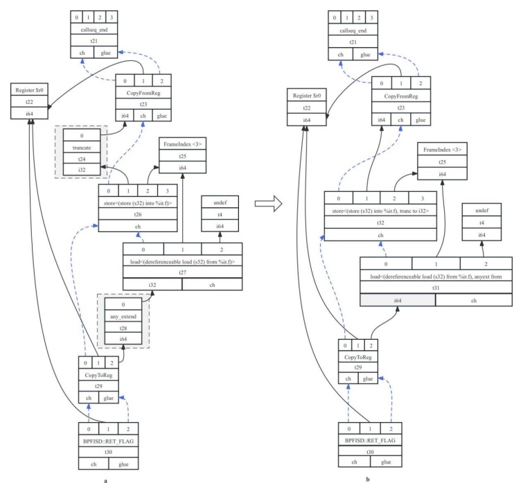

图7- 24 Caller合法化前后DAG图

在图7-24a中，callseq_end标志着调用callee函数的结束，在这之后由于函数callee的返回值是64位数据，会从物理寄存器r0中将返回值拷贝到64位的变量；而用于装载返回值的变量f的数据类型是32位，所以会生成截断节点truncate，将64位变量截断为32位后，存入为变量f的内存区域中；之后还需要将32位的f从内存中读取出来用于返回，由于BPF64的返回类型应为64位，所以会生成扩展节点any_extend，将f扩展为64位后再存入返回寄存器r0中用于返回（注意这些节点是在初始化DAG时生成的）。
在合法化处理过程中，不合法的32位数据类型被提升（Promote）为64位后存入变量f对应的内存区域，后直接从该内存中读取64位的数据来作为返回值，截断和扩展指令都被消除。得到的结果如图7-24b所示。
## 7.2.4 机器指令匹配
在经过数据类型及操作合法化处理后，所有的SDNode只包含目标平台可以处理的操作和类型。接下来就需要为这些SDNode寻找与之对应的架构指令，这一过程称为“指令选择”。
SelectionDAGIsel算法会从DAG的根节点开始（根节点位于DAG的出口），对每个SDNode节点进行遍历处理，为其寻找对应的架构指令。从出口开始进行指令选择，意味着整个指令选择的过程自底向上进行。
在指令选择的过程中会判断被遍历到的节点是否被其他节点使用，如果发现没有其他节点使用，同样会将其标记为冗余节点，跳过匹配选择，并该节点删除。指令选择的过程中，大部分SDNode节点是依赖根据TD文件生成的匹配表MatcherTable自动完成指令选择的；但有一些特殊的节点（如具有多个输出的节点）是无法通过匹配表来完成的匹配的，这种情况下就需要开发者在遍历到这些节点时，自行编写逻辑来完成指令的匹配。
在编译构建LLVM的过程中，LLVM源码并不是最早开始被编译的，工程首先会构建llvm-tblgen工具，并使用该工具将TD文件解析成C/C++风格的.inc头文件。在第6章已经详细介绍了TD到C++代码的过程，并且以指令匹配为例介绍LLVM中常见的几种指令匹配的写法。这里以BPF后端为例，后端代码在llvm/lib/Target/BPF目录下的TD文件经llvm-tblgen处理以后，会在构建目录build/lib/Target/BPF下生成处理后的.inc文件。指令选择过程中使用的inc文件名为xxxGenDAGISel.inc（如BPFGenDAGISel.inc）。其中包含的静态表项MatcherTable，在指令匹配选择中扮演了至关重要的角色。在第6章也为读者展示了匹配表的大概样子。在本节针对匹配表的内容进行介绍，以及介绍如何使用匹配表完成指令的选择。
由于MatchTable非常庞大，有些后端该文件可以达到几十万行代码，限于篇幅我们无法对整个匹配表的内容进行介绍，所以仅仅选择匹配表的一些代码片段介绍其功能和使用。以BPF后端生成的BPFGenDAGISel.inc文件为例中，匹配表的部分代码片段如代码清单7-7。
MatchTable片段
```void DAGISEL_CLASS_COLONCOLON SelectCode(SDNode *N)
{
  // 第一部分内容：匹配表初始信息以及第一个匹配节点ISD::INTRINSIC_W_CHAIN匹配信息.
  #define TARGET_VAL(X) X & 255, unsigned(X) >> 8
  static const unsigned char MatcherTable[] = {
/* 0*/ OPC_SwitchOpcode /*36 cases */, 21|128,1/*149*/, TARGET_VAL(ISD::INTRINSIC_W_CHAIN),// ->154
/*     5*/  OPC_RecordNode, // #0 = 'intrinsic_w_chain' chained node
/*     6*/  OPC_Scope, 28, /*->36*/ // 4 children in Scope
/*     8*/   OPC_CheckChild1Integer, 114|128,40/*5234*/, 
/*    11*/   OPC_RecordChild2, // #1 = $pseudo
/*    12*/   OPC_MoveChild2,
/*    13*/   OPC_CheckOpcode, TARGET_VAL(ISD::Constant),
...  
 // 第二部分内容：ISD::STORE节点的匹配信息.
/*   154*/ /*SwitchOpcode*/ 114|128,1/*242*/, TARGET_VAL(ISD::STORE),// ->400
/*   158*/  OPC_RecordMemRef,
/*   159*/  OPC_RecordNode, // #0 = 'st' chained node
/*   160*/  OPC_RecordChild1, // #1 = $src
...  
 // 第三部分内容：ISD::ADD节点的匹配信息.
/*  2449*/ /*SwitchOpcode*/ 83, TARGET_VAL(ISD::ADD),// ->2535
/*  2452*/  OPC_Scope, 14, /*->2468*/ // 2 children in Scope
/*  2454*/   OPC_RecordNode, // #0 = $addr
/*  2455*/   OPC_CheckType, MVT::i64,
/*  2457*/   OPC_CheckComplexPat, /*CP*/1, /*#*/0, // SelectFIAddr:$addr #1 #2
/*  2460*/   OPC_MorphNodeTo1, TARGET_VAL(BPF::FI_ri), 0,
                 MVT::i64, 2/*#Ops*/, 1, 2, 
             // Src: FIri:{ *:[i64] }:$addr - Complexity = 9
             // Dst: (FI_ri:{ *:[i64] } FIri:{ *:[i64] }:$addr)
/*  2468*/  /*Scope*/ 65, /*->2534*/
/*  2469*/   OPC_RecordChild0, // #0 = $src2
/*  2470*/   OPC_RecordChild1, // #1 = $imm
/*  2471*/   OPC_Scope, 38, /*->2511*/ // 3 children in Scope
/*  2473*/    OPC_MoveChild1,
/*  2474*/    OPC_CheckOpcode, TARGET_VAL(ISD::Constant),
/*  2477*/    OPC_Scope, 15, /*->2494*/ // 2 children in Scope
/*  2479*/     OPC_CheckPredicate, 0, // Predicate_i64immSExt32
/*  2481*/     OPC_MoveParent,
/*  2482*/     OPC_CheckType, MVT::i64,
/*  2484*/     OPC_EmitConvertToTarget, 1,
/*  2486*/     OPC_MorphNodeTo1, TARGET_VAL(BPF::ADD_ri), 0,
                   MVT::i64, 2/*#Ops*/, 0, 2, 
               // Src: (add:{ *:[i64] } GPR:{ *:[i64] }:$src2, (imm:{ *:[i64] })<<P:Predicate_i64immSExt32>>:$imm) - Complexity = 7
               // Dst: (ADD_ri:{ *:[i64] } GPR:{ *:[i64] }:$src2, (imm:{ *:[i64] }):$imm)
/*  2494*/    /*Scope*/ 15, /*->2510*/
/*  2495*/     OPC_CheckPredicate, 0, // Predicate_i32immSExt32
/*  2497*/     OPC_MoveParent,
/*  2498*/     OPC_CheckType, MVT::i32,
/*  2500*/     OPC_EmitConvertToTarget, 1,
/*  2502*/     OPC_MorphNodeTo1, TARGET_VAL(BPF::ADD_ri_32), 0,
                   MVT::i32, 2/*#Ops*/, 0, 2, 
               // Src: (add:{ *:[i32] } GPR32:{ *:[i32] }:$src2, (imm:{ *:[i32] })<<P:Predicate_i32immSExt32>>:$imm) - Complexity = 7
               // Dst: (ADD_ri_32:{ *:[i32] } GPR32:{ *:[i32] }:$src2, (imm:{ *:[i32] }):$imm)
/*  2510*/    0, /*End of Scope*/
/*  2511*/   /*Scope*/ 10, /*->2522*/
/*  2512*/    OPC_CheckType, MVT::i64,
/*  2514*/    OPC_MorphNodeTo1, TARGET_VAL(BPF::ADD_rr), 0,
                  MVT::i64, 2/*#Ops*/, 0, 1, 
              // Src: (add:{ *:[i64] } i64:{ *:[i64] }:$src2, i64:{ *:[i64] }:$src) - Complexity = 3
              // Dst: (ADD_rr:{ *:[i64] } i64:{ *:[i64] }:$src2, i64:{ *:[i64] }:$src)
```
笔者仅仅截取了匹配表的三部分内容，第一部分是匹配表的表头信息以及第一个匹配节点。
第一行表示从当前行一直到第154字节之前的内容，是针对SDNode节点ISD::INTRINSIC_W_CHAIN的匹配规则（匹配表中的数字表示的是字节偏移，例如154表示的是第154字节），其中：
* /* 0*/：指元素在数组中的索引值。
* OPC_SwitchOpcode：数组中的第一项为OPC_SwitchOpcode，表示这是一个处理SDNode的匹配表。
* /*36 cases */：表示该SDNode的匹配有36种case。
* 21|128,1/*149*/：表示当前匹配表的大小，大小为(1 << 7) + 21 = 149（字节）；上述MatcherTable的位置1和位置2的值分别为21|128和1，后面的注释信息为149，实际上这是一种变长的编码方式存储数据，其最高位用来表示下一个数据是否属于当前的数据的一部分。21|128，最高位为1，则表示后面的数据1也是属于当前的数据，最终的数据为(1 << 7) + 21 = 149，刚好是注释中的内容。
* ARGET_VAL(ISD::INTRINSIC_W_CHAIN)：当前匹配表处理的SDNode节点为ISD::INTRINSIC_W_CHAIN)；TARGET_VAL是一个宏，含义是将值展开为低8位和高8位，由于ISD::INTRINSIC_W_CHAIN的值大于1字节的数据范围，因此做了展开。注意，TARGET_VAL占两个字节。
* // ->154：LLVM会记录每个SDNode对应的匹配片段在整张匹配表中的起始位置，当指令选择流程遍历到某个SDNode时，就会直接跳转到其对应的匹配表中的位置开始进行匹配。例如第一行的尾部给出的154，表示从154字节处开始定义一个新的匹配节点，根据154字节处的内容得知这里是针对STORE节点的匹配规则描述（MatcherTable中第二部分），从2449字节开始是针对ADD节点的匹配规则描述（MatcherTable中第三部分）。
* OPC_xxx：这些都对应匹配流程中的行为，如OPC_RecordNode为记录当前节点，OPC_CheckChild1Integer为校验当前节点的第一个子节点是不是为整型数，OPC_CheckOpcode为校验当前节点的指令编号。多个行为串联成了一条匹配路径，读者可以查阅LLVM手册了解每个匹配操作的功能。
由于STORE节点在匹配表中项目过多，所以本书选择较为简单的ADD节点进行介绍。示例中第三部分内容是ADD节点的匹配信息，匹配表中从2449字节到2514字节之间描述的就是ADD匹配过程，当开始匹配ISD::ADD节点时，可以查询到其匹配片段位于整张匹配表的2452字节处，便跳转到此处开始匹配。匹配过程会经过OPC_RecordNode、OPC_CheckType、OPC_CheckComplexPat这些匹配动作，如果几个动作或校验规则都满足，说明ISD::ADD节点及其操作数和指令描述信息完全匹配，其结果是机器指令BPF::FI_ri，本轮指令匹配成功结束，然后再开始进行下一个SDNode节点的匹配；如果其中某一个动作或校验规则执行未成功，就会跳转到匹配表的2468开始下一条匹配路径，在这条路径里，会尝试将节点匹配到机器指令ADD_rr，如果过程中某个动作或规则未执行成功，则会进入到其他机器指令ADD_ri、ADD_rr_32、ADD_ri_32的匹配路径[ 这里指令ADD_后面的r表示寄存器，i表示立即数，32表示使用的寄存器为32位；rr表示两个操作数都是寄存器，ri表示一个操作数是寄存器、另一个是立即数。]；如果所有的匹配路径都无法满足当前的ADD节点，则本轮指令匹配失败，编译器会抛出错误。“匹配成功”的标志是校验路径走到了OPC_EmitNode或者OPC_MorphNodeTo这一类节点。在这类节点的处理过程中，会填充操作数Ops（包括链等数据依赖）、操作数类型VTList，然后调用getMachineNode方法，获取相应的Machine SDNode节点，替换原来的 DAG SDNode节点（Machine SDNode会包含后端指令的信息）。
可以发现整个匹配过程本质上是一个自动机（DFA），根据当前节点的状态，依次判断各种信息（类型、匹配模式等），所以可以直观地将ADD这个节点的匹配过程描述为如图7-25所示的状态机（图中省略了匹配ADD_rr、ADD_ri等指令所需要进行的操作数校验动作）。
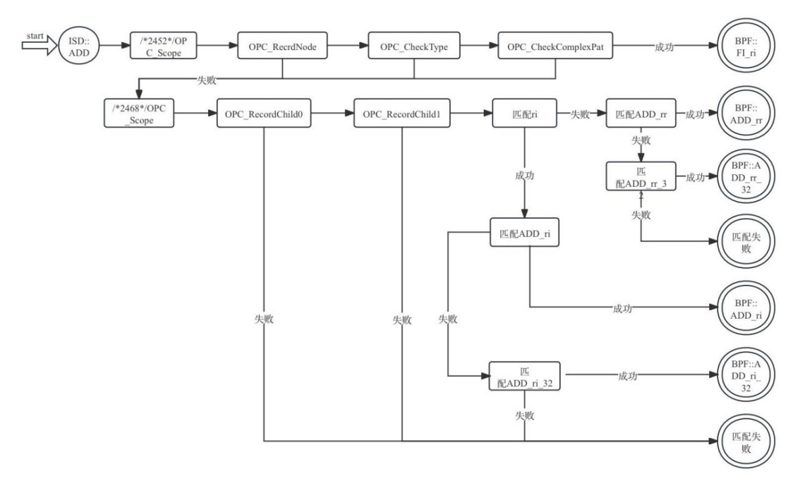

图7- 25 ADD指令匹配过程对应的DFA示意图

图7-25中还有一个特别值得注意的地方：它和一般简单的DFA不同，匹配表构成的DFA中存储了额外的信息，用于标记当前节点匹配失败后下一个匹配的起始位置，而不像传统的DFA匹配失败会依次回退，这里使用存储了额外的信息，例如在2452这个节点中记录下一个匹配位置是2468，即当从2452开始匹配，如果发现不匹配，无论是匹配到2454、2455、2457、2460中的哪一位置，都直接从2468开始新的匹配。这是由于匹配表非常大，通过这样的方式可以加速指令匹配过程。
下面通过例子简单演示ISD::ADD的匹配过程。假设有一段待匹配的SDNode代码如代码清单7-8所示。
待匹配的add SDNode序列
```t35: i64 = add nsw t33, t34
t36: i64,ch = load<(dereferenceable load (s64) from %ir.d.addr)> t30, FrameIndex:i64<3>, undef:i64
t37: i64 = add nsw t35, t36
```
这里以t37: i64 = add nsw t35, t36节点的匹配为例，该节点要匹配的SDNode为ISD::ADD，节点存在三个操作数，其中t35和t36为输入，t37为输出，三个操作数均为64位数据，存放在寄存器中。
匹配流程如下：
1)根据操作数偏移表（OpcodeOffset）中的记录，找到针对ISD::ADD节点的匹配起始位置为序号2449，从这里开始匹配进行当前匹配路径的处理；在下一行中，/*->2468*/字段表明，若当前匹配路径因失败中断，需要跳转至序号2468进行下一路径的匹配。
2)序号2452、2454、2455匹配成功，但在序号2457匹配条件失败，因为第0个操作数t37不是FrameIndex类型，就跳转至序号2468继续；在下一行中，/*->2534*/字段会更新下一路径的起始位置，若当前匹配路径失败，再一次需要跳转至序号2534继续尝试匹配。
3)序号2469、2470、2471、2473匹配成功（在序号2471时，失败后的下一跳位置从序号2534更新为2511），在序号2474匹配条件失败，因为第二个入参t36不是Constant常数类型，跳转至序号2511继续，若失败，跳转至序号2522继续。
4)序号2512匹配成功，紧接着在序号2514遇到OPC_MorphNodeTo1，该节点表明模式匹配成功，当前匹配路径的终点是机器指令BPF::ADD_rr，原IR中的SDNode ISD::ADD被匹配为BPF::ADD_rr指令，然后当前节点的指令匹配过程以成功结束，可以准备开始下一节点的匹配。
通过debug模式下编译器的处理日志，可以验证上述匹配流程，针对t37: i64 = add nsw t35, t36这一节点的匹配从匹配表的2452开始，在2457失败后从2468继续匹配，在2474失败后又从2511继续匹配，并成功匹配到ADD_rr指令。日志如代码清单7-9所示。
匹配add的log日志
```ISEL: Starting selection on root node: t37: i64 = add nsw t35, t36
ISEL: Starting pattern match
Initial Opcode index to 2452
Match failed at index 2457
Continuing at 2468
Match failed at index 2474
Continuing at 2511
Morphed node: t37: i64 = ADD_rr nsw t35, t36
ISEL: Match complete!
```
指令选择结束后，几乎所有的SDNode节点都会和目标机器指令关联起来。例如代码清单7-8中节点add、store、load等，分别被成功匹配到了BPF架构指令集中的ADD_rr、STD、LDD指令。但需要注意的是，指令选择后还有部分伪指令并没有被匹配为真实的后端指令，例如EntryToken、CopyFromReg、TokenFactor、CopyToReg等节点并未发生任何变化，仍然是SDNode节点的形式。换句话说，此时的DAG中同时存在了SDNode节点和Machine SDNode节点，一方面是因为这些伪节点究竟应该被硬件怎么执行——目前仍然无法得知；另一方面是因为使用部分伪指令（例如COPY）有利于后续的工作（寄存器分配、编译优化）。这些节点一般会保留在MIR中，在后续的流程中被处理（例如在寄存器分配后会将COPY指令变成真实的硬件指令，在第11章介绍）。
这里仍然以图7-15中的callee为例看一下经过指令匹配流程后被转换成的DAG图，如图7-26所示。
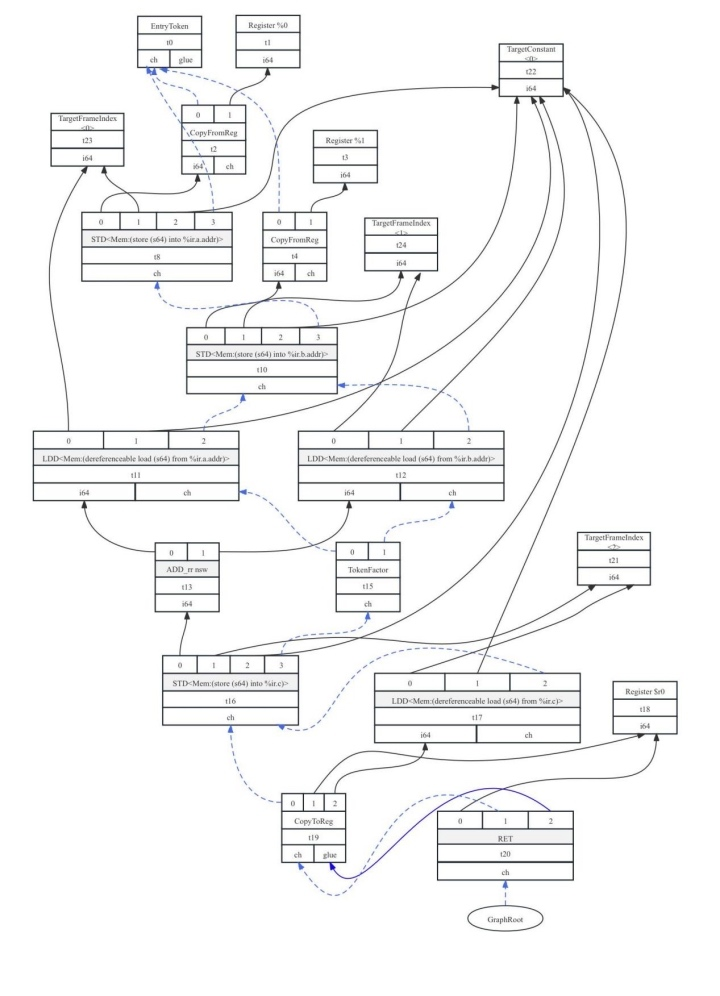

图7- 26 Callee指令匹配后的DAG

可以看出，图7-15中add、store、load等节点，在图7-26分别被成功匹配到了BPF架构指令集中的ADD_rr、STD、LDD指令。由此说明指令选择完成。
## 7.2.5 从DAG输出MIR
代码表达经过机器指令匹配后仍然是DAG的形式，编译器需要遍历每个SDNode节点，生成与之对应的MIR。实际上，在生成机器指令表达之前，会先对DAG的节点进行调度优化，chain和glue等标志指令间控制依赖关系的SDNode值在调度过程中被使用并最终消除，最后产生的MIR中已经不携带这些信息。指令调度过程作为一种优化策略，不会影响到从DAG到MIR的转换，相关内容读者可以阅读第8章学习。
从SDNode节点发射生成MIR分为两种情况：
第一种情况是SDNode在指令选择阶段已经匹配了机器指令，直接生成相应的MIR，并放入与MIR基本块对应的机器基本块（MachineBasicBlock，MBB）中即可。生成相应MIR的过程为：
1)根据指令选择的结果新建相应的MIR。
2)将原SDNode节点相关的操作数、数据结构中的节点属性等信息，相应地复制到MIR节点和数据结构中。
3)将MIR插入到MBB中的相应位置。
第二种情况是针对特殊节点，这些节点是架构无关的且一般会存在控制流依赖，后端架构中并不能通过指令选择找到与这些节点对应的汇编指令，如表示寄存器拷贝的节点CopyFromReg、CopyToReg，会被转变为COPY伪指令放入到MBB中，这些伪指令在后续的优化环节中会被消除或是转换为真实的机器指令。
在第7.2.2节中提到为基本块之间更新φ函数，即为φ函数添加寄存器，也是在这一阶段进行处理的。
从SDNode生成MIR过程比较简单，例如一个SDNode为：t8: ch = STD<Mem:(store (s64) into %ir.a.addr)> t2, TargetFrameIndex:i64<0>, TargetConstant:i64<0>, t0，它对应的MIR为：STD %0:gpr, %stack.0.a.addr, 0 :: (store (s64) into %ir.a.addr)。可以看出两者几乎是一一对应的翻译，所以不再详细展开。
仍以代码清单7-2中的callee函数为例，其经过指令选择后的DAG序列表达如代码清单7-10。
经过指令选择后的callee DAG表达
```Selected selection DAG: %bb.0 'func:entry'
SelectionDAG has 20 nodes:
  t0: ch = EntryToken
    t4: i64,ch = CopyFromReg t0, Register:i64 %1
      t2: i64,ch = CopyFromReg t0, Register:i64 %0
    t8: ch = STD<Mem:(store (s64) into %ir.a.addr)> t2, TargetFrameIndex:i64<0>, TargetConstant:i64<0>, t0
  t10: ch = STD<Mem:(store (s64) into %ir.b.addr)> t4, TargetFrameIndex:i64<1>, TargetConstant:i64<0>, t8
  t12: i64,ch = LDD<Mem:(dereferenceable load (s64) from %ir.b.addr)> TargetFrameIndex:i64<1>, TargetConstant:i64<0>, t10
  t11: i64,ch = LDD<Mem:(dereferenceable load (s64) from %ir.a.addr)> TargetFrameIndex:i64<0>, TargetConstant:i64<0>, t10
    t13: i64 = ADD_rr nsw t11, t12
    t15: ch = TokenFactor t11:1, t12:1
  t16: ch = STD<Mem:(store (s64) into %ir.c)> t13, TargetFrameIndex:i64<2>, TargetConstant:i64<0>, t15
    t17: i64,ch = LDD<Mem:(dereferenceable load (s64) from %ir.c)> TargetFrameIndex:i64<2>, TargetConstant:i64<0>, t16
  t19: ch,glue = CopyToReg t16, Register:i64 $r0, t17
  t20: ch = RET Register:i64 $r0, t19, t19:1
```
在经过MIR生成处理后，产生的MIR如代码清单7-11。
callee MIR表达
```Function Live Ins: $r1 in %0, $r2 in %1

bb.0.entry:
  liveins: $r1, $r2
  %1:gpr = COPY $r2
  %0:gpr = COPY $r1
  STD %0:gpr, %stack.0.a.addr, 0 :: (store (s64) into %ir.a.addr)
  STD %1:gpr, %stack.1.b.addr, 0 :: (store (s64) into %ir.b.addr)
  %2:gpr = LDD %stack.0.a.addr, 0 :: (dereferenceable load (s64) from %ir.a.addr)
  %3:gpr = LDD %stack.1.b.addr, 0 :: (dereferenceable load (s64) from %ir.b.addr)
  %4:gpr = nsw ADD_rr %2:gpr(tied-def 0), killed %3:gpr
  STD killed %4:gpr, %stack.2.c, 0 :: (store (s64) into %ir.c)
  %5:gpr = LDD %stack.2.c, 0 :: (dereferenceable load (s64) from %ir.c)
  $r0 = COPY %5:gpr
  RET implicit $r0

# End machine code for function func.
```
注意：当SDNode转换为MIR之后，表示控制流依赖的chain和glue等信息被完全消除，所有的节点都变成了机器指令，这些机器指令“几乎”可以直接映射成机器汇编运行。这里说“几乎”，是因为此时的机器指令虽然已经和最终的汇编指令很接近，但其大部分指令操作数使用哪些寄存器储存值还没有被确定下来，这还依赖第10章中所介绍的“寄存器分配”；此外，这一阶段的指令序列并不一定是最高效的，还需要经过后端的优化，才可以获得执行效率更高的序列，典型的优化手段可以在第9章中看到。
