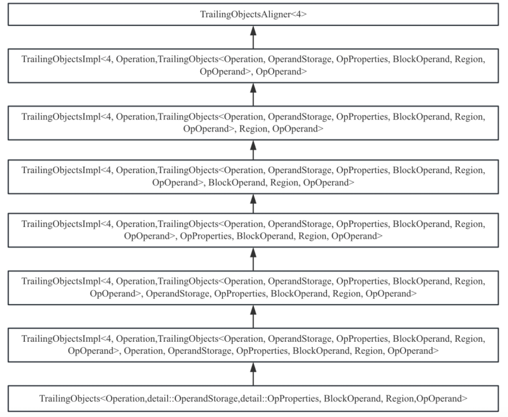
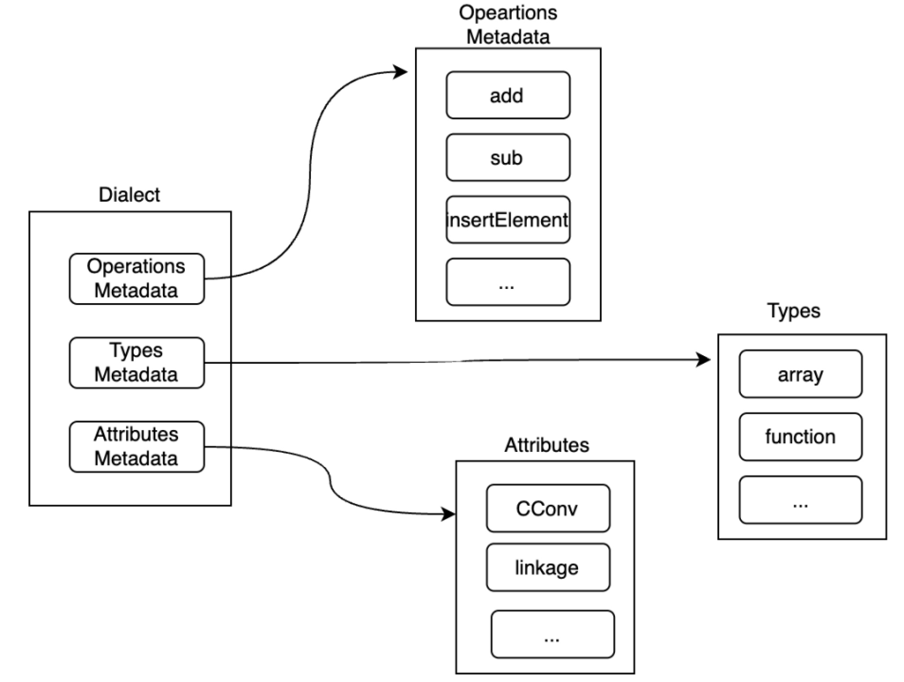
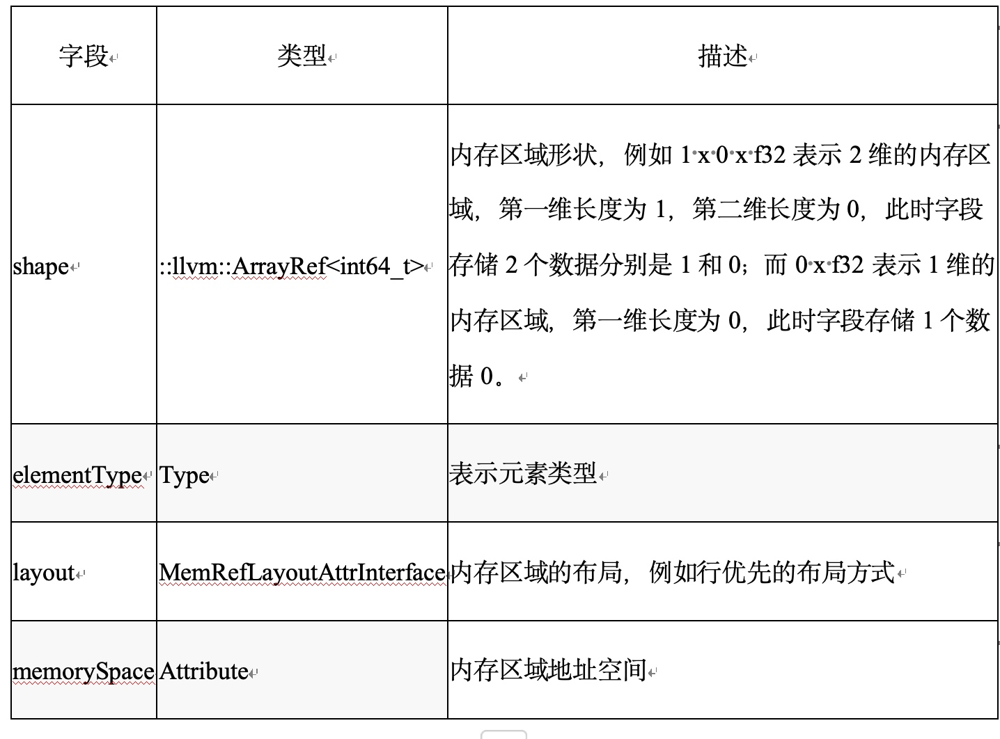
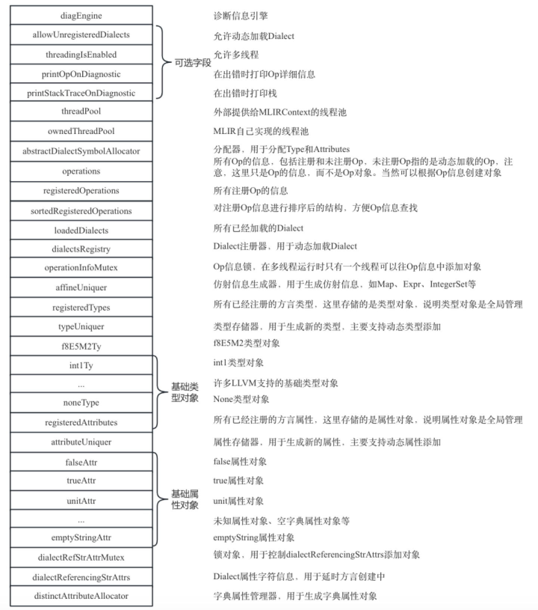

# 第3章类型、属性、操作和方言详解

第2章简单介绍了MLIR基础知识，本章将详细介绍MLIR方言、操作、类型和属性相关知识。操作是MLIR中最基础的概念，变换、转换、分析等都是针对操作进行；类型用于修饰操作；属性可以修饰操作和方言，为操作和方言提供额外的信息；方言用于管理类型、属性和操作元数据（方言管理的类型和属性都是对象，原因是类型和属性都是全局唯一；但是操作可以多次示例化多个操作对象，所以方言并不直接管理操作对象，而是管理操作的元数据）。本章最后会介绍MLIR框架提供的MLIRContext，它用于管理各种方言，开发者通过MLIRContext可以访问方言、从而访问类型和属性以及操作元数据（并可以通过操作元数据示例化操作对象）。下面逐一介绍类型、属性、操作和方言。

## 3.1类型

在MLIR中类型作用于操作，例如操作的结果、操作中的操作数、基本块参数等都是有类型的。类型可以分为两类：内建类型（Built-in type）和自定义类型。内建类型是MLIR提供的常见类型，例如BFloat16、Integer、Complex、Vector、RankedTensor、UnRankedTensor、MemRef等，开发者可以直接使用内建类型。当内建类型无法满足开发者需要时，开发者可以自定义类型，对于自定义类型MLIR框架并未提供显式的约束，所以开发者可以任意定义需要的类型。对于内建类型，MLIR框架会负责类型的降级（例如从MLIR世界进入到LLVM世界时，MLIR会统一将内建类型转换为LLVM IR能够接受的类型）；对于自定义类型，开发者需要在方言降级时进行类型的降级，否则可能会出错（无法成功降级）。
我们知道在一个系统中类型通常都是唯一的（类型可以看作是操作对象的约束，多个操作共享同一种类型约束，所以一个类型只需要示例化对象即可；当操作的约束不同时，应该使用不同的类型描述），类型对象通常存在方言中。本质上类型就是C++的类，当使用类型时就是示例化一个C++类的对象。

### 3.1.1类型定义和使用
对于类型定义MLIR框架提供了3种定义方法，分别是通过C++代码直接定义、通过TD定义、通过IRDL方言进行定义。
通过C++代码直接定义的类型并未直接暴露在TD世界中，因此在TD只能将其作为代码片段使用，这样的类型通常是操作不会直接使用，但是在MLIR框架可能会使用，例如LLVMStructType表示LLVM中的结构体类型，这个类型在所有的操作都不需要（结构体只是类型集合体，它没有明确的语义，和操作的要求并不一致。因此在TD中无需定义），但是在MLIR世界到LLVM世界时，会发现一些类型在LLVM中并不存在，所以可以将MLIR世界中的类型通过LLVM世界的结构体进行表示。
通过IRDL定义类型是MLIR框架提供的高级功能，它本质上也是基于TD定义类型，在第12章会简单介绍相关概念。
通过TD定义类型是最为常见的形式，这是本节的重点。通过TD文件进行定义类型，需要使用mlir-tblgen工具将TD文件转变记录，然后再将记录翻译为C++类，同时mlir-tblgen工具提供了一些胶水代码，将类型注册到方言中，方便开发者使用方言中的类型。下面以内建类型Integer为例介绍如何定义和使用类型。

#### TD定义
首先在TD中定义类型，Integer在TD中的定义如代码3-1所示。

```def Builtin_Integer : Builtin_Type<"Integer"> {
  let summary = "Integer type with arbitrary precision up to a fixed limit";
  let description = [{
    ......
  }];
  let parameters = (ins "unsigned":$width, 
"SignednessSemantics":$signedness);
  let builders = [
    //自定义构造器接受两个参数分别是width和signedness，
//width要求是unsigned类型，
//signedness要求是一个自定义约束，类型为SignednessSemantic
//默认值为Signless
    TypeBuilder<(ins "unsigned":$width,
                     CArg<"SignednessSemantics", 
"Signless">:$signedness)>
  ];

  // IntegerType自定义了StorageClass，可以节约空间
  let genStorageClass = 0;
  let skipDefaultBuilders = 1;
  let genVerifyDecl = 1;
  let extraClassDeclaration = [{
    /// 整数的符号语义信息，用于区别无符号整数、有符号整数
    enum SignednessSemantics : uint32_t {
      Signless, /// 整数没有符号语义
      Signed,   /// 有符号整数
      Unsigned, /// 无符号整数
    };
    // 其它信息忽略
    ......
  }];
}
```
为了节约篇幅，笔者将Builtin_Integer中两个字段description和extraClassDeclaration进行了删减（下同），其中description字段描述的是Integer类型的描述信息，用于生成文档；extracClassDeclaration描述的是Integer类型需要开发者额外在C++文件用到的类型定义和需要实现的函数声明。
下面对Integer的实现做一个简单的介绍，主要字段的含义如下：
* summary/description：Integer类的描述信息，主要用于文档生成。
* parameter：Integer类的参数，MLIR中Integer类可以接受两个参数，分别是Integer的位宽和符号标志；通常mlir-tblgen工具基于parameter生成类型构造函数，和skipDefaultBuilders配合使用。
* builders：开发者自定义构建Integer对象的构造器。
* genStorageClass：表示是否为Integer类自动生成StorageClass，StorageClass用于表示Integer的内存布局，该值为0表示不会自动生成StorageClass。
* skipDefaultBuilders：是否为Integer类生成默认的构造函数，该值为1表示不生成。和parameter配合使用。
* genVerifyDecl：是否为Integer类生成默认的verify函数声明，该值为1表示生成函数声明；verify函数主要用于校验生成的类型对象是否合法。
* extraClassDeclaration：是否需要为Integer类增加额外的C++成员函数和成员变量。
另外Integer类继承于Builtin_Type，而Builtin_Type也是一个记录类，它的定义如代码3-2所示。

```class Builtin_Type<string name, list<Trait> traits = [],
                   string baseCppClass = "::mlir::Type">
    : TypeDef<Builtin_Dialect, name, traits, baseCppClass> {
  let mnemonic = ?;
}
```
可以看到Builtin_Type是TypeDef的封装类，主要是指定了Integer在生成的对应C++基类为::mlir::Type。
当开发者自定义类型时通常直接继承于TypeDef，当然也可以类似于Integer类型的厨房方法封装一个记录基类，此处为Builtin_Type，主要原因是MLIR框架提供了多个内建类型，对于内建类型都会要求生成的对应C++基类为::mlir::Type，所以封装一个记录基类可以节约代码量。

#### 从TD到记录

接下来使用mlir-tblgen工具将解析TD文件，将记录类翻译为记录信息，Integer类对应的记录以及解释如3-3所示。

```def Builtin_Integer {// Constraint TypeConstraint Type DialectType AttrOrTypeDef TypeDef Builtin_Type //这是Builtin_Integer类型的继承信息
  // Integer类的约束信息，表示该类型可以直接作为类型约束使用。该字段来自TypeDef
  Pred predicate = anonymous_5;
  string summary = "Integer type with arbitrary precision up to a fixed limit";
  // Integer类类在自动生成的C++代码中的类名
  string cppClassName = "IntegerType";
  code description = [{
    // ......
  }];
  string builderCall = "";
  //IntegerType被方言Builtin_Dialect管理
  Dialect dialect = Builtin_Dialect;
//自动生成的IntegerType继承于该字段定义的值即mlir::Type
  string cppBaseClassName = "::mlir::Type";
  //IntegerType定义的存储类
  string storageClass = "IntegerTypeStorage";
  string storageNamespace = "detail";
  bit genStorageClass = 0;
  bit hasStorageCustomConstructor = 0;
  dag parameters = (ins "unsigned":$width, "SignednessSemantics":$signedness);
  list<AttrOrTypeBuilder> builders = [anonymous_344];
  list<Trait> traits = [];
  string mnemonic = ?;
//IntegerType形式使用时的汇编格式，即可以通过字符串格式定义类型的创建
  string assemblyFormat = ?;
  bit hasCustomAssemblyFormat = 0;
  bit genAccessors = 1;
  bit skipDefaultBuilders = 1;
  bit genVerifyDecl = 1;
  code extraClassDeclaration = [{
    /// ......
  }];
  code extraClassDefinition = [{}];
  string cppType = "::mlir::IntegerType";
}
//这是一个约束信息，在TD中使用CArgs约束Integer构造函数中的第2个参数
def anonymous_343 {// CArg
  string type = "SignednessSemantics";
  string defaultValue = "Signless";
}
// 自定义构造器的实现
def anonymous_344 {// AttrOrTypeBuilder TypeBuilder
  //通过dagParms生成构造函数，它有2个参数以及参数包含了对应的约束
  dag dagParams = (ins "unsigned":$width, anonymous_343:$signedness);
  string body = "";
  string returnType = "";
  bit hasInferredContextParam = 0;
}
```

这一步骤和llvm-tblgen工具生成记录没有什么区别，唯一不同需要主要的是MLIR类型相关的主要字段含义，关键字段在3-3中进行了解释。关于如何生成记录可以参考《深入理解LLVM：代码生成》第6章。

#### 从记录到C++代码
再接下来使用mlir-tblgen工具从记录提取信息，生成C++类。上面提到Integer类型需要自定义IntegerTypeStorage，它定义了Integer类型真正的存储结构，代码如代码3-4所示.

```//IntegerType类的存储结构，该类定义了整数类型的内存布局以及key类型，
//key是用于HasMap中，通过key标识唯一性.
struct IntegerTypeStorage : public TypeStorage {
  IntegerTypeStorage(unsigned width,
                     IntegerType::SignednessSemantics signedness)
      : width(width), signedness(signedness) {}

  ///定义的key类型用于标识hashmap中对象的唯一性.
  using KeyTy = std::tuple<unsigned, IntegerType::SignednessSemantics>;

  //忽略部分代码
 ......

  //定义构造函数，
  static IntegerTypeStorage *construct(TypeStorageAllocator &allocator, KeyTy key) {
    return new (allocator.allocate<IntegerTypeStorage>())
        IntegerTypeStorage(std::get<0>(key), std::get<1>(key));
  }

  KeyTy getAsKey() const { return KeyTy(width, signedness); }

//IntegerType类型包含了2个信息，整数长度和符号。为了节约空间，这里使用伪定义
//这也是为什么不要自动生成存储类的原因，这里可以看到使用32位即可
//如果自动生成存储类，会占用2个32位
  unsigned width : 30;
  IntegerType::SignednessSemantics signedness : 2;
};
```
IntegerTypeStorage最主要的目的就是存储Integer类型的成员变量，这样做是为了保持Integer类型干净，成员变量全部移入到IntegerTypeStorage中。
对于Integer类型，mlir-tblgen工具生成的C++类如3-5所示。

```class IntegerType : public ::mlir::Type::TypeBase<IntegerType, ::mlir::Type, detail::IntegerTypeStorage> {
public:
  using Base::Base;
  // 来自于extraClassDeclaration成员函数和成员变量，忽略
  ......
  //自动生成代码
//get函数获取Integer类型对象
//getChecked函数获取Integer类型对象并对Integer类型对象进行验证
//可以看到这2个函数中最后2个参数都是来自于Parameter的输入字段
//根据Parameter获取Integer类型对象，get函数返回Interger类型对象或空对象
//getChecked函数还会对Integer类型对象进行验证
  using Base::getChecked;
  static IntegerType get(::mlir::MLIRContext *context, unsigned width, SignednessSemantics signedness = Signless);
  static IntegerType getChecked(::llvm::function_ref<::mlir::InFlightDiagnostic()> emitError, ::mlir::MLIRContext *context, unsigned width, SignednessSemantics signedness = Signless);
  //自动生成代码，用于对构造的Integer对象进行验证，
//可以看到verify函数中最后2个参数都是来自于Parameter的输入字段，
//验证工作针对Parameter进行验证，如果对象的参数合法返回成功，否则返回失败
  static ::mlir::LogicalResult verify(::llvm::function_ref<::mlir::InFlightDiagnostic()> emitError, unsigned width, SignednessSemantics signedness);
  // 自动生成代码，来自于Parameter的输入字段 
  unsigned getWidth() const;
  SignednessSemantics getSignedness() const;
};
```
代码3-5中可以看到IntegerType继承于TypeBase，TypeBase的定义如代码3-6所示.

```class Type {
public:
  //辅助类类型定义.
  template <typename ConcreteType, typename BaseType, typename StorageType, template <typename T> class... Traits>
  using TypeBase = detail::StorageUserBase<ConcreteType, BaseType, StorageType, detail::TypeUniquer, Traits...>;
  //真正的类型存储类，对于IntegerType来说ImplType就是IntegerTypeStorage
  using ImplType = TypeStorage;

  using AbstractTy = AbstractType;

  constexpr Type() = default;
  /* implicit */ Type(const ImplType *impl)
      : impl(const_cast<ImplType *>(impl)) {}

  // ......

protected:
  ImplType *impl{nullptr};
};
```
其中StorageUserBase也是模板类，定义如3-7所示。

```template <typename ConcreteT, typename BaseT, typename StorageT,
          typename UniquerT, template <typename T> class... Traits>
class StorageUserBase : public BaseT, public Traits<ConcreteT>... {

  //辅助类型定义，定义好的类型方便在自动生成代码中使用
  using Base = StorageUserBase<ConcreteT, BaseT, StorageT, UniquerT, Traits...>;
// ......

  //get函数用于获取或者创建一个新的存储类对象，当存储类型对象存在直接返回
//不存在创建一个新的存储类对象
//从这个类的实现也可以猜测出来，IntegerType中get函数的实现会调用到这里
  template <typename... Args>
static ConcreteT get(MLIRContext *ctx, Args &&...args) {
......
//这里的UnigerT就是具体的存储类型
return UniquerT::template get<ConcreteT>(ctx, std::forward<Args>(args)...);
}

  // ......
};
```

看到这里，读者朋友应该猜测到是谁调用StorageUserBase的get函数，一般来说是自动生成的代码各个具体类中get函数的实现，但由于这些内建类型比较特殊，它们会被频繁使用，所以设置了缓存，因此IntegerType中get函数的实现如代码3-8所示。

```IntegerType IntegerType::get(MLIRContext *context, unsigned width,
IntegerType::SignednessSemantics signedness) {
	//首先从缓存中获取类型对象
if (auto cached = getCachedIntegerType(width, signedness, context))
return cached;
	//调用StorageUserBase中的get获取对象
return Base::get(context, width, signedness);
}
```

关于如何通过StorageUserBase类中get函数获取类型对象，我们暂时不介绍，在3.1.3节再展开。
简单总结如下，在MLIR框架为了方便管理类型对象，将其分为两部分：
* 类型（Type）：提供常见的API，例如get获取类型对象，getChecked用于返回验证通过的类型对象，否则返回为空对象。。
* 类型存储（TypeStorage）：大多数情况类型对象只需要一个，相对来说比较简单，一般不需要任何额外信息的存储。对于需要实例化多个类戏对象的类型，会通过参数进行区别，对于这样的情况可以为类型设计一个具体的类型存储对象，在存储对象中保存具体的参数，并且可以根据类型存储的信息实例化不同的对象。然后把类型和类型存储进行关联，通过类型中统一的API访问不同的类型对象。
通过上述代码可以看出IntegerType类结构如图3-1所示。


当类型定义完成后，需要将类型注册到方言中，这样类型才能被使用。

#### 注册类型到方言中
假设定义一个自定义类型为Types.td，自定义方言为MyDialect。Types.td在mlir-tblgen自动生成C++代码后默认的文件名为Types.cpp.inc（当然开发者可以指定文件名）。在Dialect方言中定义一个初始化方法initialize，通常会在initialize调用addTypes将类型注册到方言中（方言的initialize方法在方言初始化时被调用）。initialize方法代码如3-9所示。

```void MyDialect::initialize() {
//将已经定义的类型类添加到方言中，这里addTypes是一个模版函数，接受类型类
addTypes<
//这里的GET_TYPEDEF_LIST是mlir-tblgen工具生成的宏定义
//在生成类型文件Types.cpp.inc中通过该宏将所有的类型类抓取出来
//其实就是所有类型类的前向声明
#define GET_TYPEDEF_LIST
#include "MyDialect/Types.cpp.inc"
>();
}
```
addTypes有一个模版参数，可以接受多个类型，并将所有的类型都注册到方言中，方言最终通过一个map对象存储类型对象（具体的存储样式在3.4节会再次介绍）。
对于内建类型来说，所有的内建类型可以被所有操作共享，因此内建类型对象会被放在MLIRContext中（MLIRContext是“全局”唯一对象）。

### 3.1.2类型文法
在代码3-3中有2个字段，分别是assemblyFormat和hasCustomAssemblyFormat分别用于定义类型对应的标准汇编格式和自定义汇编格式。通过汇编格式的解析可以生成类型对象，或者将类型对象序列化到汇编格式。MLIR框架为类型、属性和操作定义了默认的汇编格式，如果开发者发现默认的汇编格式不符合要求时可以自定义汇编格式（通常自定义格式是为了更好的代码可读性）。
在IntegerType中并没有自定义汇编格式，我们来看一下MLIR框架对于类型统一定义的格式。为了准确表达格式的定义，MLIR框架使用EBNF（Extended Backus–Naur Form）进行定义格式，MLIR中类型的定义如3-10所示。

```//MLIR框架中类型分为3类：别名、方言类型、内建类型
type ::= type-alias | dialect-type | builtin-type

//类型列表的定义，它表示多个类型通过“，”隔开
type-list-no-parens ::=  type (`,` type)*
type-list-parens ::= `(` `)` | `(` type-list-no-parens `)`

// 变量和类型格式，变量和类型通过符号“：”隔开
ssa-use-and-type ::= ssa-use `:` type
ssa-use ::= value-use

// 一个非空变量和类型列表，元素通过符号“，”隔开
ssa-use-and-type-list ::= ssa-use-and-type (`,` ssa-use-and-type)*

//函数类型定义，包含了参数和返回类型，两者通过符号“->隔开
function-type ::= (type | type-list-parens) `->` (type | type-list-parens)
//别名类型定义，通过以“！”为起始符号进行标识。
type-alias-def ::= `!` alias-name `=` type
type-alias ::= `!` alias-name

dialect-namespace ::= bare-id
//下面定义方言类型，例如我们在自定义方言中定义了一个类型，默认格式就是下面的定义
//方言类型的汇编格式就是以“！”开头，有可以分为2种格式
//它们的区别是是否包含简写类型名
dialect-type ::= `!` (opaque-dialect-type | pretty-dialect-type)

opaque-dialect-type ::= dialect-namespace dialect-type-body

pretty-dialect-type ::= dialect-namespace `.` pretty-dialect-type-lead-ident dialect-type-body?
pretty-dialect-type-lead-ident ::= `[A-Za-z][A-Za-z0-9._]*`

dialect-type-body ::= `<` dialect-type-contents+ `>`
dialect-type-contents ::= dialect-type-body
                            | `(` dialect-type-contents+ `)`
                            | `[` dialect-type-contents+ `]`
                            | `{` dialect-type-contents+ `}`
                            | [^\[<({\]>)}\0]+
```
MLIR框架实现了默认的类型格式解析，例如我们自定义方言MyDialect中定义了类型String，则它的默认格式为“!MyDialec<String>”。
每一个内建类型在MLIR框架都有自己的汇编格式，例如IntegerType的汇编格式对应EBNF格式如代码3-11所示。
```//整数类型根据符号信息可以分为3类，分别以字符串“si”、“ui”、“i”开头。
//分别表示有符号整数、无符号整数和不关心符号的整数
//3类整数除了符号信息外，还包括了整数位信息
signed-integer-type ::= `si` [1-9][0-9]*
unsigned-integer-type ::= `ui` [1-9][0-9]*
signless-integer-type ::= `i` [1-9][0-9]*
integer-type ::= signed-integer-type |
                 unsigned-integer-type |
                 signless-integer-type
```
例如我们使用“i18”表示长度为18位的整数。内建类型的字符串解析以及类型序列化均由MLIR框架提供，例如类型序列化的代码片段如代码3-12所示。。

```void AsmPrinter::Impl::printTypeImpl(Type type) {
TypeSwitch<Type>(type)
......
//忽略其它，仅仅关注IntegerType，针对IntegerType根据符号信息和长度输出格式
.Case<IntegerType>([&](IntegerType integerTy) {
if (integerTy.isSigned())
os << 's';
else if (integerTy.isUnsigned())
os << 'u';
os << 'i' << integerTy.getWidth();
})
.....
//此处是方言格式的系列化，说明方言类型和内建类型是同一优先级
.Default([&](Type type) { return printDialectType(type); });
}
```

### 类型使用和类型对象创建过程
当定义好类型以后，并且通过胶水代码将类型注册到方言中就可以使用类型。两种常见的使用方式：一是在TD定义操作中使用类型、二是在C++代码中使用类型。在C++代码中使用类型比较简单，因为类型已经被转换为C++类，而且已经注册到方言中，所以可以通过方言获取要使用的类型对象。在TD中使用类型，涉及到的一个问题就是类型的解析，即将一个字符串解析为一个类型，然后将类型和具体的要约束的变量进行关联（要约束的变量指的是操作的返回值、操作的操作数、基本块参数等）。
由于定义的类型属于元数据，实例化后的对象称为类型对象。类型对象是特殊的对象，它们的作用是修饰操作的结果或者输入的参数，对于结果或者操作数的类型，它们虽然属于静态信息，但是在运行系统中，需要具体的类型对象才能描述它们。一般来说，一个类型在运行时只需要一个类型对象，但是还有一些类型在运行时存在多个类型对象。例如Integer类型可以接受长度和符号信息，那么si16和ui32分别表示有符号类型16位整数和无符号整数32为整数。使用一个整数类型对象无法描述这2种类型，通常的实现是让IntegerType接受2个参数，并根据不同的参数实例化不同的整数类型对象。
需要提一点，同一类型不同参数实例化后的类型对象是不同的对象，而同一参数实例化后的类型对象是一个对象，类型对象具有唯一性。例如si16和ui32是不同的类型对象，但是在使用中多次实例化si16得到的是同一个对象。下面仍然以IntegerType为例来看看如何创建类型对象。
代码3-8提供了获取整数类型对象的入口，它会调用代码3-7中的get函数。在代码3-7中可以看到get函数会调用TypeUniquer中get函数，代码片段如3-13所示。

```struct TypeUniquer {
/// 同一类型获取唯一的示例对象.
template <typename T, typename... Args>
static T get(MLIRContext *ctx, Args &&...args) {
return getWithTypeID<T, Args...>(ctx, T::getTypeID(),
	std::forward<Args>(args)...);
}

template <typename T, typename... Args>
static std::enable_if_t<
!std::is_same<typename T::ImplType, TypeStorage>::value, T>
getWithTypeID(MLIRContext *ctx, TypeID typeID, Args &&...args) {
	//可以看到最终调用到MLIRContext中的get函数从而获取对象
	//可以简单认为MLIRContext使用hashmap存放对象
	return ctx->getTypeUniquer().get<typename T::ImplType>(
[&, typeID](TypeStorage *storage) {
		storage->initialize(AbstractType::lookup(typeID, ctx));
	},
	typeID, std::forward<Args>(args)...);
}

//忽略部分代码
......

//注册含有参数的类型对象
template <typename T>
static std::enable_if_t<
!std::is_same<typename T::ImplType, TypeStorage>::value>
registerType(MLIRContext *ctx, TypeID typeID) {
	ctx->getTypeUniquer().registerParametricStorageType<typename T::ImplType>(typeID);
}
//注册单示例类型对象
template <typename T>
static std::enable_if_t<
std::is_same<typename T::ImplType, TypeStorage>::value>
registerType(MLIRContext *ctx, TypeID typeID) {
	ctx->getTypeUniquer().registerSingletonStorageType<TypeStorage>
		(typeID, [&ctx, typeID](TypeStorage *storage) {
		storage->initialize(AbstractType::lookup(typeID, ctx));
	});
}
};
```
MLIRContext中TypeUniquer可以认为是一个hashmap，它存储的是键值对（key-value），对于存在key可以直接获取value，当key不存在时先构建value，并插入到容器。这个功能实现在TypeUniquer的get函数中，如代码3-14所示。

```class StorageUniquer {
......
template <typename Storage, typename... Args>
Storage *get(function_ref<void(Storage *)> initFn, TypeID id,
Args &&...args) {
//定义key，可以看到key是由输入参数组成。对于IntegerType的参数有2个
//这里的key其类型在代码3-4中由keyTy定义
auto derivedKey = getKey<Storage>(std::forward<Args>(args)...);

//根据key创建一个Hash值，方便进行判断key是否存在
unsigned hashValue = getHash<Storage>(derivedKey);

//定义key是否相等的函数
auto isEqual = [&derivedKey](const BaseStorage *existing) {
	return static_cast<const Storage &>(*existing) == derivedKey;
};

//生成一个函数，用于调用构造存储类型对象的构造函数
//对于构造IntegerTypeStorage来说，此处调用的Storage::construct
//就是代码3-4中定义的construct函数
auto ctorFn = [&](StorageAllocator &allocator) {
auto *storage = Storage::construct(allocator, std::move(derivedKey));
if (initFn)
	initFn(storage);
return storage;
};
```
最后提一下，在代码3-9中的addTypes最后就是调用到代码3-13中的registerType，而registerType会创建类型对象，这样在get时可以确定IntegerType对象存在，但是IntegerTypeStorage需要根据输入参数确定是否存在。

## 3.2属性
属性是为操作和类型增加额外的表达语义，其定义和使用方法非常类似于类型。同样地可以根据属性提供者，可以将MLIR框架中属性分为内建属性和自定义属性。对于内建属性，例如FloatAttr、IntegerAttr、AffineMapAttr等，MLIR框架负责属性的定义、格式解析等，开发者可以直接使用内建属性。当内建属性无法满足开发者需要时，开发者可以自定义属性，对于自定义属性MLIR并未提供显式的约束，所以开发者可以任意定义需要的属性。
MLIR中属性分为两种Attribute和Property，为了区别本书将Attribute翻译为属性，Property翻译为特性。特性是一种特殊的属性。

### 3.2.1属性（Attribute）
属性和类型非常类似，我们通过内建属性IntegerAttr快速介绍属性的定义和使用。IntegerAttr在TD中的定义如代码3-15所示。

```def Builtin_IntegerAttr : Builtin_Attr<"Integer"> {
  let summary = "An Attribute containing a integer value";
  let description = [{
    ......
  }];
  let parameters = (ins AttributeSelfTypeParameter<"">:$type, "APInt":$value);
  let builders = [
    .....
  ];
  let extraClassDeclaration = [{
    ......
  }];
  let genVerifyDecl = 1;
  let skipDefaultBuilders = 1;
}
```
可以看到IntegerAttr的定义和Integer类型几乎一致，字段含义也和Integer类型中字段一致，不同点在于它们的基类不同。类似地，mlir-tblgen工具也会先将TD文件转换记录，然后再将记录转换到C++代码，IntegerAttr对应的C++代码和IntegerType非常类似，这里就不再给出（主要不同点就是基类不同）。最后同样地也需要将属性注册到方言中，和类型处理也几乎一致，唯一不同的是使用addAttributes注册属性类，同样的addAttributes有一个模版参数，可以接受多个属性，并将所有的属性都注册到方言中，方言最终通过一个map对象存储属性对象。

IntergerAttr对应的C++代码如下

```struct IntegerAttrStorage : public ::mlir::AttributeStorage {
  using KeyTy = std::tuple<::mlir::Type, APInt>;
  IntegerAttrStorage(::mlir::Type type, APInt value) : type(std::move(type)), value(std::move(value)) {}

  ......
 
  ::mlir::Type type;
  APInt value;
};

class IntegerAttr : public ::mlir::Attribute::AttrBase<IntegerAttr, ::mlir::Attribute, detail::IntegerAttrStorage, ::mlir::TypedAttr::Trait> {
public:
  using Base::Base;
  using ValueType = APInt;

    // 来自于字段extraClassDeclaration
......

public:
  // 辅助函数，用于生成IntegerAttr对象以及
  using Base::getChecked;
  static IntegerAttr get(Type type, const APInt &value);
  static IntegerAttr getChecked(::llvm::function_ref<::mlir::InFlightDiagnostic()> emitError, Type type, const APInt &value);
  static IntegerAttr get(::mlir::MLIRContext *context, const APSInt &value);
  static IntegerAttr getChecked(::llvm::function_ref<::mlir::InFlightDiagnostic()> emitError, ::mlir::MLIRContext *context, const APSInt &value);
  static IntegerAttr get(Type type, int64_t value);
  static IntegerAttr getChecked(::llvm::function_ref<::mlir::InFlightDiagnostic()> emitError, Type type, int64_t value);
  static ::mlir::LogicalResult verify(::llvm::function_ref<::mlir::InFlightDiagnostic()> emitError, ::mlir::Type type, APInt value);
 
  // 获取IntegerAttr的成员变量，其真实的存储位于类IntegerAttrStorage中
  ::mlir::Type getType() const;
  APInt getValue() const;
};
```
最后同样地需要将属性注册到方言中。

```void MyDialect::initialize() {
/// Add the defined attributes to the dialect.
addAttributes<
#define GET_ATTRDEF_LIST
#include "MyDialect/Attributes.cpp.inc"
>();
}
```
addAttributes有一个模版参数，可以接受多个属性，并将所有的属性都注册到方言中，方言最终通过一个map对象存储属性对象（具体的存储样式在3.4节会再次介绍）。

### 属性文法
同样，属性也存在序列化和反序列化过程，即将属性序列化为字符串或者将字符串识转化为属性对象。和类型类似，属性也使用EBNF进行定义。对应的文法如代码3-16所示。

```
//属性实体包含左值和右值，左值是属性id或字符串，右值为属性值，中间是符号“=”隔开
attribute-entry ::= (bare-id | string-literal) `=` attribute-value
//属性值也分为3类：别名属性、方言属性、内建属性
attribute-value ::= attribute-alias | dialect-attribute | builtin-attribute
//别名属性是以符号“#”开头
attribute-alias-def ::= `#` alias-name `=` attribute-value
attribute-alias ::= `#` alias-name

dialect-namespace ::= bare-id
//方言属性以符号“#”开头，定义和方言类型基本一致
dialect-attribute ::= `#` (opaque-dialect-attribute | pretty-dialect-attribute)
opaque-dialect-attribute ::= dialect-namespace dialect-attribute-body
pretty-dialect-attribute ::= dialect-namespace `.` pretty-dialect-attribute-lead-ident
                                              dialect-attribute-body?
pretty-dialect-attribute-lead-ident ::= `[A-Za-z][A-Za-z0-9._]*`

dialect-attribute-body ::= `<` dialect-attribute-contents+ `>`
dialect-attribute-contents ::= dialect-attribute-body
                            | `(` dialect-attribute-contents+ `)`
                            | `[` dialect-attribute-contents+ `]`
                            | `{` dialect-attribute-contents+ `}`
                            | [^\[<({\]>)}\0]+    
```

每一个内建类型在MLIR框架都有自己的汇编格式，例如IntegerType的汇编格式对应EBNF格式如代码3-17所示。

```//整数属性可以分为4种样式，分别是“整数值：类型”、“整数值”、“true”、“false”
integer-attribute ::= (integer-literal ( `:` (index-type | integer-type) )?)
                      | `true` | `false`
```
类似于内建类型，内建属性也是由MLIR框架完成序列化和反序列化。读者可以参考源码自行理解。

### 3.2.2特性（Property）
特性是一种特殊的属性，在MLIR属性分为两类：固有属性（Inherent attributes）和可丢弃属性（Discardable attributes）。
* 固有属性是指操作定义中为了保证语义完整所携带的属性，对于固有属性操作本身应该验证属性的一致性。例如MLIR框架中arith方言中cmpi操作，其定义：operation ::= `arith.cmpi` $predicate `,` $lhs `,` $rhs attr-dict `:` type($lhs)。操作中predicate是一个属性，它的取值范围只有几个（例如eq、ne、slt、sle、sgt、sge、ult、ule、ugt、uge），表示要进行什么样的比较，这个属性值是比较操作必须的，因此称为固有属性。
* 可丢弃属性是指为操作添加额外语义，但不是必须内容，可丢弃属性只需要和操作语义兼容即可。我们所说的属性大部分属于这类属性。
MLIR社区在演化过程中将固有属性剥离出来，称为特性。其主要目的是固有属性应该归属于操作，而不应该将固有属性放在方言中（因为方言可以认为是相对全局唯一），所以应该将固有属性将抽离出来。

## 3.3操作

### 3.3.1操作定义
第2章中对操作做了介绍，这里主要介绍操作的定义、文法和内存布局。

### 操作定义
下面以arith方言中AddI操作为例介绍操作的定义、构建和使用，关于方言会在3.4节介绍。
#### TD定义
首先在TD中定义操作，AddI在TD中的定义如代码3-18所示。

```//这里定义了arith方言中所有操作的基类，例如arith中所有操作都有一些约束
//通过公共基类可以减少代码量
class Arith_Op<string mnemonic, list<Trait> traits = []> :
    Op<Arith_Dialect, mnemonic,
       //操作的特质，表示操作的约束，在第4章介绍
       traits #
       [DeclareOpInterfaceMethods<VectorUnrollOpInterface>, NoMemoryEffect] #
       ElementwiseMappable.traits>;
//为所有操作增加特质SameOperandsAndResultType，即操作数和返回值类型相同
class Arith_ArithOp<string mnemonic, list<Trait> traits = []> :
    Arith_Op<mnemonic, traits # [SameOperandsAndResultType]>;

// 所有二元操作的基类，这里主要为二元操作提供了相同的汇编格式
class Arith_BinaryOp<string mnemonic, list<Trait> traits = []> :
    Arith_ArithOp<mnemonic, traits> {
  let assemblyFormat = "$lhs `,` $rhs attr-dict `:` type($result)";
}

// 所有整数类型二元操作基类，它们都是有2个操作数、1个返回值，还可以求整数范围
class Arith_IntBinaryOp<string mnemonic, list<Trait> traits = []> :
    Arith_BinaryOp<mnemonic, traits #
      [DeclareOpInterfaceMethods<InferIntRangeInterface>]>,
    Arguments<(ins SignlessIntegerLike:$lhs, SignlessIntegerLike:$rhs)>,
    Results<(outs SignlessIntegerLike:$result)>;

// 所有整数类型二元操作且没有副作用操作的基类，即增加了pure特质约束
class Arith_TotalIntBinaryOp<string mnemonic, list<Trait> traits = []> :
    Arith_IntBinaryOp<mnemonic, traits # [Pure]>;

//操作AddI的定义，其中“addi”为助记符，“Commutative”表示操作数可交互的约束
def Arith_AddIOp : Arith_TotalIntBinaryOp<"addi", [Commutative]> {
  let summary = "integer addition operation";
  let description = [{
    // ......
  }];
  let hasFolder = 1;
  let hasCanonicalizer = 1;
}
```
该示例代码非常简单，只包含了7个字段，含义分别如下：
* arguments：继承于Arguments，描述操作接受的参数，本例中AddI操作接受2个参数，都是“类似”无符号类型的整数（例如整数、Index、向量类型且向量元素为整数、Tensor类型且Tensor元素类型为整数等），名字分别为lhs和rhs。
* results：继承于Results，描述操作的结果，本例中AddI操作返回结果是“类似”无符号类型的整数，名字为result。
* summary：操作的简单描述。
* description：操作的详细描述，在本例中提供了使用AddI操作的示例，因篇幅原因，本书将其删除。
* hasFolder：表示mlir-tblgen工具会生成一个函数名为fold的函数声明，开发者需要进行实现。fold指的是操作可以进行常量折叠的实现。
* hasCanonicalizer：表示mlir-tblgen工具会生成一个函数名为getCanonicalizationPatterns的函数声明，开发者需要进行实现。getCanonicalizationPatterns指的是操作可以进行归一化的实现（归一化的目的是为了更好地优化，例如对于加法来说，有两个操作数，一个为变量另一个外常量，总是要求变量在前，常量在后，这样的行为就是归一化）。
* assemblyFormat：表示操作的汇编格式。
实际上操作还还有一些其他字段可以定义，例如hasVerifier表示是否需要开发者提供验证器（在第4章介绍）、extraClassDeclaration声明C++需要实现的函数等。默认情况下，不提供的字段mlir-tblgen会提供一个默认值，一般不会生成相应代码。

#### 从TD到记录
接下来mlir-gblgen工具将解析TD文件，将记录类翻译为record信息，例如AddI类对应的record如下：

```def Arith_AddIOp {// Op Arith_Op Arith_ArithOp Arith_BinaryOp Arguments Results Arith_IntBinaryOp Arith_TotalIntBinaryOp 这是AddI操作的基类
  Dialect opDialect = Arith_Dialect;//所属方言
  string opName = "addi";//操作的名字
  string cppNamespace = "::mlir::arith";//对应生成的C++代码所在的命名空间
  string summary = "integer addition operation";//概述信息
  code description = [{ //详细描述信息
    // ......
  }];
  OpDocGroup opDocGroup = ?;//文档组
..//操作的参数，一般来说mlir-tblgen会根据该信息生成build函数
  dag arguments = (ins SignlessIntegerLike:$lhs, SignlessIntegerLike:$rhs);
  dag results = (outs SignlessIntegerLike:$result);//操作的返回值
  dag regions = (region);//操作定义的区域
  dag successors = (successor);//操作定义的后继基本块
  list<OpBuilder> builders = ?;//用户自定义的构造函数
  bit skipDefaultBuilders = 0;//是否放弃自动生成构造函数
//AddI操作对应的汇编格式
  string assemblyFormat = "$lhs `,` $rhs attr-dict `:` type($result)";
  bit hasCustomAssemblyFormat = 0;//开是否有发者自定义汇编格式
  bit hasVerifier = 0;//是否生成verify函数，用于验证操作创建后是否合法
  //是否生成regionVerify函数，用验证操作region是否合法
  bit hasRegionVerifier = 0;
  //是否生成canonicalizer相关函数，用于Pass执行过程进行归一化优化
  bit hasCanonicalizer = 1;
  bit hasCanonicalizeMethod = 0;
  //是否生成fold相关函数，用于Pass执行过程进行折叠优化
  bit hasFolder = 1;
  bit useCustomPropertiesEncoding = 0;//是否有自定义编码
  //操作定义的特质，表示对操作的约束
  list<Trait> traits = [Commutative, Pure, anonymous_443, SameOperandsAndResultType, anonymous_442, NoMemoryEffect, Elementwise, Scalarizable, Vectorizable, Tensorizable];
  //为操作定义的C++代码
  string extraClassDeclaration = ?;
  string extraClassDefinition = ?;
}
//操作的一个约束，该约束是VectorUnrollOpInterface，可以支持向量展开
def anonymous_442 {// DeclareInterfaceMethods Interface Trait NativeTrait InterfaceTrait OpInterfaceTrait OpInterface DeclareOpInterfaceMethods
  // ......
  string cppInterfaceName = "VectorUnrollOpInterface";
  // ......
}
//操作的一个约束，该约束是InferIntRangeInterface，可以支持整数范围推断
def anonymous_443 {// DeclareInterfaceMethods Interface Trait NativeTrait InterfaceTrait OpInterfaceTrait OpInterface DeclareOpInterfaceMethods
  // ......
  string cppInterfaceName = "InferIntRangeInterface";
  // ......
}
```
这里字段的含义如代码3-19注释所示，本章主要要关心操作定义、解析相关字段，而其它部分字段的使用将在后续章节介绍。

#### 从记录到C++代码

再接下来使用mlir-tblgen工具从记录提取信息，生成C++类。对于代码3-19使用mlir-tblgen工具生成的C++类如代码3-20所示。

```//以下代码是为了定义AddIOpAdaptor，主要为了方言降级使用？
namespace detail {
class AddIOpGenericAdaptorBase {
  ......
};

} 
template <typename RangeT>
class AddIOpGenericAdaptor : public detail::AddIOpGenericAdaptorBase {
  ......
};

class AddIOpAdaptor : public AddIOpGenericAdaptor<::mlir::ValueRange> {
public:
  using AddIOpGenericAdaptor::AddIOpGenericAdaptor;
  AddIOpAdaptor(AddIOp op);

  ::mlir::LogicalResult verify(::mlir::Location loc);
};

class AddIOp : public ::mlir::Op<AddIOp, ::mlir::OpTrait::ZeroRegions, ......> {
public:
  using Op::Op;
  using Op::print;
  // Adaptor提供给外部使用，在方言降级中会使用到该类型
  using Adaptor = AddIOpAdaptor;
  // GenericAdaptor和FoldAdaptor用于fold函数的参数，为什么引入Adaptor类型？这里先留一个问题，在方言降级中详细介绍
  template <typename RangeT>
  using GenericAdaptor = AddIOpGenericAdaptor<RangeT>;
  using FoldAdaptor = GenericAdaptor<::llvm::ArrayRef<::mlir::Attribute>>;
  //以下函数用于获取操作相关的信息包括：属性名、操作名、操作数、返回值
  static ::llvm::ArrayRef<::llvm::StringRef> getAttributeNames() {
    return {};
  }

  static constexpr ::llvm::StringLiteral getOperationName() {
    return ::llvm::StringLiteral("arith.andi");
  }

  std::pair<unsigned, unsigned> getODSOperandIndexAndLength(unsigned index);
  ::mlir::Operation::operand_range getODSOperands(unsigned index);
  ::mlir::Value getLhs();
  ::mlir::Value getRhs();
  ::mlir::OpOperand &getLhsMutable();
  ::mlir::OpOperand &getRhsMutable();
  std::pair<unsigned, unsigned> getODSResultIndexAndLength(unsigned index);
  ::mlir::Operation::result_range getODSResults(unsigned index);
  ::mlir::Value getResult();
  //以下的build函数用于构建AddI操作对象
  static void build(::mlir::OpBuilder &odsBuilder, ::mlir::OperationState &odsState, ::mlir::Type result, ::mlir::Value lhs, ::mlir::Value rhs);
  static void build(::mlir::OpBuilder &odsBuilder, ::mlir::OperationState &odsState, ::mlir::Value lhs, ::mlir::Value rhs);
  static void build(::mlir::OpBuilder &odsBuilder, ::mlir::OperationState &odsState, ::mlir::TypeRange resultTypes, ::mlir::Value lhs, ::mlir::Value rhs);
  static void build(::mlir::OpBuilder &, ::mlir::OperationState &odsState, ::mlir::TypeRange resultTypes, ::mlir::ValueRange operands, ::llvm::ArrayRef<::mlir::NamedAttribute> attributes = {});
  static void build(::mlir::OpBuilder &odsBuilder, ::mlir::OperationState &odsState, ::mlir::ValueRange operands, ::llvm::ArrayRef<::mlir::NamedAttribute> attributes = {});
  // 用于验证AddI对象
  ::mlir::LogicalResult verifyInvariantsImpl();
  ::mlir::LogicalResult verifyInvariants();
  // 用于归一化和常量折叠
  static void getCanonicalizationPatterns(::mlir::RewritePatternSet &results, ::mlir::MLIRContext *context);
  ::mlir::OpFoldResult fold(FoldAdaptor adaptor);
  // 用于结果类型推导
  static ::mlir::LogicalResult inferReturnTypes(::mlir::MLIRContext *context, ::std::optional<::mlir::Location> location, ::mlir::ValueRange operands, ::mlir::DictionaryAttr attributes, ::mlir::OpaqueProperties properties, ::mlir::RegionRange regions, ::llvm::SmallVectorImpl<::mlir::Type>&inferredReturnTypes);
  void inferResultRanges(::llvm::ArrayRef<::mlir::ConstantIntRanges> argRanges, ::mlir::SetIntRangeFn setResultRanges);
  // 用于将字符串解析为AddI对象，其输入格式由assemblyFormat定义
  static ::mlir::ParseResult parse(::mlir::OpAsmParser &parser, ::mlir::OperationState &result);
  // 用于将AddI对象输出为字符串，其输出格式由assemblyFormat定义
  void print(::mlir::OpAsmPrinter &_odsPrinter);
  // 由于AddI操作继承于特质NoMemoryEffects，这个特质需要实现一个函数
// getEffects，对于NoMemoryEffects其实现为空，在第4章还会讨论特质
  void getEffects(::llvm::SmallVectorImpl<::mlir::SideEffects::EffectInstance<::mlir::MemoryEffects::Effect>> &effects);
public:
};

} // namespace arith

} // namespace mlir
// 这是一个宏，用于声明操作的类型号（它是一个标识符，通过该标识符可以识别操作）
MLIR_DECLARE_EXPLICIT_TYPE_ID(::mlir::arith::AndIOp)
在生成的C++实现文件中通常还会有宏MLIR_DEFINE_EXPLICIT_TYPE_ID(::mlir::arith::AndIOp)//实现这个操作的标识符。
```
接下来看几个函数的实现。代码如3-21所示。

```// 用于获取操作数，从代码实现中可以看出AddI类应有一个
// getOperation函数返回Operation*的类型，它包含了操作数
::mlir::Operation::operand_range AddIOp::getODSOperands(unsigned index) {
  auto valueRange = getODSOperandIndexAndLength(index);
  return {std::next(getOperation()->operand_begin(), valueRange.first),  std::next(getOperation()->operand_begin(), valueRange.first + valueRange.second)};
}

......

// 用于构建AddI操作对象。从代码上看，构建并没有真正完成
// 而是把操作数以及返回类型设置到OperationState的对象中
void AddIOp::build(::mlir::OpBuilder &odsBuilder, ::mlir::OperationState &odsState, ::mlir::Type result, ::mlir::Value lhs, ::mlir::Value rhs) {
  odsState.addOperands(lhs);
  odsState.addOperands(rhs);
  odsState.addTypes(result);
}

// 用于构建AddI操作对象。从代码上看，构建并没有真正完成，
// 而是把操作数以及返回类型设置到OperationState的对象中。
// 该例更为特殊，因为返回类型未知，所以调用了inferReturnTypes推断返回类型
void AddIOp::build(::mlir::OpBuilder &odsBuilder, ::mlir::OperationState &odsState, ::mlir::Value lhs, ::mlir::Value rhs) {
  odsState.addOperands(lhs);
  odsState.addOperands(rhs);

// 推断结果的类型，这里调用了接口inferReturnTypes，将在第4章介绍
        ::llvm::SmallVector<::mlir::Type, 2> inferredReturnTypes;
        if (::mlir::succeeded(AddIOp::inferReturnTypes(
         odsBuilder.getContext(),odsState.location, odsState.operands,
         odsState.attributes.getDictionary(odsState.getContext()),
                      odsState.getRawProperties(),
                      odsState.regions, inferredReturnTypes)))
                      odsState.addTypes(inferredReturnTypes);
        else
          ::llvm::report_fatal_error("Failed to infer result type(s).");
}
......
// 用于验证AddI操作对象。该函数在构造完AddI对象后被MLIR框架调用
::mlir::LogicalResult AddIOp::verifyInvariantsImpl() {
  {
    unsigned index = 0; (void)index;
    auto valueGroup0 = getODSOperands(0);

    for (auto v : valueGroup0) {
// 函数__mlir_ods_local_type_constraint_ArithOps1也是自动生成的代码
// 它验证操作数0的类型是满足要求。
// 在AddI的定义时提到要求操作数和返回值都是类似整数类型，
// 这里就会对它的类型进行判断，如果合法则构建对象成功，否则构造对象失败。
      if (::mlir::failed(__mlir_ods_local_type_constraint_ArithOps1(*this, v.getType(), "operand", index++)))
        return ::mlir::failure();
    }
    ......
  }
  ......
}
```

AddI操作的继承于Op类，Op继承于OpState和各种特质。这里我们不再给出详细的代码，直接给出类结构图如图3-2所示。


OpState仅仅包括了Operation*的字段，Operation的类结构图如3-3所示。


Operation继承于TrailingObjects，这里为了便于读者理解Operation类，需要对TrailingObjects做一个简单的介绍。TrailingObjects是LLVM中一个比较方便的辅助类，目的是为目标类添加额外的成员变量，例如Operation通过TrailingObjects最多添加5类成员变量（对TrailingObject就是有额外5个模版参数），每一类成员变量可以包含0个或者多个，具体添加多少个可以在Operation对象分配是确定，通过TrailingObject辅助类可以方便的找每类成员变量的位置。TralingObjects为了能够实现这个功能，将这5个模版参数依次通过继承的方式展开，从而方便确定成员变量的位置。对于的TralingObjects类结构展开如3-4所示。


TrailingObjects方便了Operation动态添加成员变量，但是因为其比较复杂，难以理解，特别是涉及到模版继承展开的过程，对这一过程感兴趣的读者可以通过https://cppinsights.io/s/789b1c66查看详细过程。在3.3.2节还会通过对象内存布局进一步介绍TrailingObjects的功能。
注意：为什么具体类的类结构图设计成图3-2的样子？主要有几个原因，一方面是因为所有的具体操作类和特质之间直接通过继承不符合现代C++对于继承的使用，因为特质转换到具体操作类时可以发现所有的具体类本质上相互影响，而通过CRTP（Curiously Recurring Template Pattern）则将类的多态变成了静态的多态（即仅保留动态使用Polymorphic Use），关于CRTP可以参考《深入理解LLVM：代码生成》附录C。另外一方面原因是在实现具体操作的创建过程中，需要有一些公共功能，它们需要进行抽象，所以设计了Op类，在3.3.2节会进一步介绍。


#### 注册操作到方言中
操作定义完成后，来需要将操作注册到方言中，就可以使用。以arith方言为例，其操作注册代码如3-22所示。

```void arith::ArithmeticDialect::initialize() {
//将已经定义的操作类添加到方言中，这里addOperations是一个模版函数，接受操作类
addOperations<
//这里的GET_OP_LIST是mlir-tblgen工具生成的宏定义
//在生成类型文件ArithmeticOps.cpp.inc中通过该宏将所有的类型类抓取出来
//其实就是所有类型类的前向声明
#define GET_OP_LIST
#include "mlir/Dialect/Arithmetic/IR/ArithmeticOps.cpp.inc"
>();
......;
}
```
添加操作使用模版函数addOperations，它接受多个操作类作为参数。但是操作注册和类型、属性注册少有不同，注册操作时Initialize函数并不会真正的实例化对象，而仅仅将操作元数据注册到方言中，主要原因是操作可以被多次实例化。在MLIR框架中设计了RegisteredOperationName类，它存储了操作类的标识符、名字等信息，然后RegisteredOperationName实例化的对象会被存储到MLIRContext中，当需要实例化操作对象时，会通过RegisteredOperationName判断操作是否已经注册，对于注册的操作可以实例化操作对象。

### 3.3.2操作内存布局

MLIR框架自动生成的代码看起来比较简单，但是对于读者理解并不友好，一个典型的现象是自动生成需要和MLIR框架配合才能理解其含义，例如build函数用于生成对象，但实际上build仅仅定义了一个OperationState对象，MLIR框架通过OperationState对象完成真正操作对象的构建。这部分代码位于OpBuilder中的create函数，其定义如代码3-23所示。

  ```  template <typename OpTy, typename... Args>
  OpTy create(Location location, Args &&...args) {
    OperationState state(location,
getCheckRegisteredInfo<OpTy>(location.getContext()));
// 这里的build就是代码3-20中的build函数，返回state对象
    OpTy::build(*this, state, std::forward<Args>(args)...);
// 调用Operation::create，传递state对象构造AddI对象
    auto *op = create(state);
    //将operation*类型动态转换到AddI类型
    auto result = dyn_cast<OpTy>(op);
    assert(result && "builder didn't return the right type");
    return result;
  }
```
图3-2和图3-3介绍AddIOp的类继承结构以及AddiOp成员变量真正的存储结构是Operation。Operation类通过TrailingObjects结构实现包含了AddIOp操作具体的信息，比如、区域个数、是否包含操作数等信息，
一般来说，当类定义完成后，它实例化的对象大小也是固定，但是这不满足MLIR对操作对象的要求，因为不同的操作对象操作数、返回结果、属性等各不相同，也就是说Operation类本身静态大小并不能反映操作对象的大小。也就是说Operation实例化的对象大小应该动态变化，这样就能反映操作对象。为此MLIR框架提供的build函数，在build函数中提供OperationState对象（该对象可以由mlir-tblgen工具根据build函数原型生成，也可以由开发者提供），这个对象存储操作数、返回结果类型、属性等，再由MLIR框架根据OperationState对象动态实例化真正的操作对象。
实际上代码3-23中的create函数会体现上面的设计，在create函数中会调用Operation::create函数，在Operation::create函数中会先分配内存，然后依次初始化Operation的字段，代码如代码3-24所示.

```Operation *Operation::create(Location location, OperationName name,
TypeRange resultTypes, ValueRange operands,
NamedAttrList &&attributes, BlockRange successors,
unsigned numRegions) {
.....
//获取操作返回值占有的空间，当返回值个数小于等于5，使用inlineResult表示
//返回值个数超过5的部分使用outofLineRresult表示
unsigned numTrailingResults = OpResult::getNumTrailing(resultTypes.size());
unsigned numInlineResults = OpResult::getNumInline(resultTypes.size());
//获取操作基本块个数
unsigned numSuccessors = successors.size();
//获取操作的操作数个数
unsigned numOperands = operands.size();

......
//调用TrailingObjects中的totaliSizeToAlloc获取真正需要分配的内存空间大小
//该函数传递的参数是5类成员变量的个数，当个数为0不分配空间
size_t byteSize =
totalSizeToAlloc<detail::OperandStorage, BlockOperand, Region, OpOperand>(
needsOperandStorage ? 1 : 0, numSuccessors, numRegions, numOperands);
//计算返回值所占有的内存空间
size_t prefixByteSize = llvm::alignTo(
Operation::prefixAllocSize(numTrailingResults, numInlineResults),
alignof(Operation));
//总的分配空间包括：返回值空间、operation本身空间以及5类成员变量空间
char *mallocMem = reinterpret_cast<char *>(malloc(byteSize + prefixByteSize));
//这里返回的内存起始地址是Operation结构开始的位置
void *rawMem = mallocMem + prefixByteSize;

// 使用pleacement new初始化Operation结构
Operation *op = ::new (rawMem) Operation(
location, name, numResults, numSuccessors, numRegions,
attributes.getDictionary(location.getContext()), needsOperandStorage);

......

// 对返回值进行初始化，注意返回值存放的是value类型
auto resultTypeIt = resultTypes.begin();
for (unsigned i = 0; i < numInlineResults; ++i, ++resultTypeIt)
new (op->getInlineOpResult(i)) detail::InlineOpResult(*resultTypeIt, i);
for (unsigned i = 0; i < numTrailingResults; ++i, ++resultTypeIt) {
new (op->getOutOfLineOpResult(i))
detail::OutOfLineOpResult(*resultTypeIt, i);
}

// 初始化区域空间
for (unsigned i = 0; i != numRegions; ++i)
new (&op->getRegion(i)) Region(op);

// 初始化操作数相关的空间
if (needsOperandStorage) {
new (&op->getOperandStorage()) detail::OperandStorage(
op, op->getTrailingObjects<OpOperand>(), operands);
}

// 初始化基本块空间
auto blockOperands = op->getBlockOperands();
for (unsigned i = 0; i != numSuccessors; ++i)
new (&blockOperands[i]) BlockOperand(op, successors[i]);

return op;
}
```
根据代码3-24可以得到Operation的对象布局可以分为3部分，分别是返回值、Operation本身固有属性以及TrailingObjects对象，从MLIR框架代码可知Operation固有属性包含64字节，而其它2部分则依赖于具体操作真实的大小，而Operation的对象布局也是具体操作的对象布局，如图3-5所示。


使用create函数创建的对象Operation*类型，要想得到具体的类型指针AddIOp在代码中是通过dyn_cast<OpTy>即dyn_cast<AddIOp>完成。我们再次回顾一下图3-2，可以发现Operation类和AddIop根本没有继承关系（AddIOp只是包括一个Operation*的字段），那为什么可以使用dyn_cast实现类型转换？这涉及到LLVM框架提供动态转换能力，由于这一部分知识和标准的C++有所不同，我们稍微展开介绍一下。
我们知道在C++中dynamic_cast可以将基类指针动态转换为派生类指针，但这个前提是基类实现了虚函数，因为dynamic_cast依赖于RTTI（RunTime-Type-Info，运行时类型信息），而RTTI一般在实现中通常依赖于虚指针和虚表。这就产生一个问题，对于没有虚函数的继承关系不能使用dynamic_cast，如果使用会在编译期报错，即不能使用dynamic_cast处理这样的场景。而实际上这一约束并不十分合理，我们更希望的是对于继承关系当从基类指针转到派生类时都可以使用dynamic_cast，为此LLVM提供了dyn_cast实现这一功能。这里以Operation*到AddIOp*的转换为例简单介绍dyn_cast的实现，对于指针的转换dyn_cast对应的代码如3-25所示。

```template <typename To, typename From>
[[nodiscard]] inline decltype(auto) dyn_cast(From *Val) {
  assert(detail::isPresent(Val) && "dyn_cast on a non-existent value");
  return CastInfo<To, From *>::doCastIfPossible(Val);
}
在代码3-25中可以看到dyn_cast的实现依赖于CastInfo类中的doCastIfPossible函数，MLIR框架对于Operation定义的CastInfo如代码3-26所示。

template <typename T>
struct CastInfo<T, ::mlir::Operation *>
    : public ValueFromPointerCast<T, ::mlir::Operation,
                                  CastInfo<T, ::mlir::Operation *>> {
  //isPossible函数主要用于确定Operation*是否可以转换到类型T，这里调用classOf
  static bool isPossible(::mlir::Operation *op) { return T::classof(op); }
};

template <typename To, typename From, typename Derived = void>
struct ValueFromPointerCast
    : public CastIsPossible<To, From *>,
      public NullableValueCastFailed<To>,
      public DefaultDoCastIfPossible<
          To, From *,
          detail::SelfType<Derived, ValueFromPointerCast<To, From>>> {
  //定义doCast，用于真实的转换，从From*到To*。进一步可以看到doCast的实现调用
//To的构造函数实现，传递参数为f，即一定存在形如AddIOp(operation*)的实现
  static inline To doCast(From *f) { return To(f); }
};

template <typename To, typename From, typename Derived>
struct DefaultDoCastIfPossible {
    //dyn_cast真正的实现，先通过isPossible判断类型是否可以转换
//如果可以调用doCast构造出真正的To对象
static To doCastIfPossible(From f) {
if (!Derived::isPossible(f))
	return Derived::castFailed();
return Derived::doCast(f);
}
};
```
从代码3-26中可以看出从Operation*到AddIOp*的转换过程就是先判断是否可以转换，如果可以构造对象。我们知道AddIOp是通过mlir-tblgen自动生成的代码，要实现这样的功能稍显复杂，另一方面，对于所有的具体操作都需要从Operation*转换得到，所以MLIR框架抽象了模版类Op，实现了calssOf函数以及Op的构造函数，如代码3-27所示。

```template <typename ConcreteType, template <typename T> class... Traits>
class Op : public OpState, public Traits<ConcreteType>... {
public:
......

static bool classof(Operation *op) {
    //根据Operation获取具体操作的ID，ID参看代码3-20中定义
//如果ID和具体操作ID相同则可以转换，否则不能转换
if (auto info = op->getRegisteredInfo())
	return TypeID::get<ConcreteType>() == info->getTypeID();
return false;
}
......

//这个就是构赞函数，可以将Operation*转换到具体操作
Op(std::nullptr_t) : OpState(nullptr) {}
......
}
```
至此具体操作类对象的创建完成。
注意：操作对象的创建是通过函数build得到，而类型、属性则是通过函数get得到。都是获得对象，为什么MLIR框架使用的函数名？原因就是通常类型对象只需要一份，使用get表示创建的对象是同一个；而操作对象随着IR随时产生，使用build表示创建不同对象，框架使用不同的函数名区别获得对象的含义不同。


### 3.3.3操作文法
操作也存在序列化和反序列化过程，即将操作对象序列化为字符串或者将字符串识转化为操作对象。和类型、属性类似，操作也使用EBNF进行定义。对应的文法如代码3-28所示。
```//操作对象包括三部分：结果、一般操作或自定义操作以及位置信息
operation             ::= op-result-list? (generic-operation | 
                         custom-operation)   trailing-location?
//一般操作包含：名字以及“（）”，其中“（）”中包含了操作数，当然操作数可以为空
//还包括了一些可选内容，如后继基本块、特性、区域、属性
//最后是符号“：”以及操作的类型
generic-operation     ::= string-literal `(` value-use-list? `)` 
                          successor-list? dictionary-properties? 
                          region-list? dictionary-attribute?
                          `:` function-type
//自定义操作格式，由开发者提供
custom-operation      ::= bare-id custom-operation-format
//操作结果，结果可以是多个，中间以符号“，”分割
op-result-list        ::= op-result (`,` op-result)* `=`
//每个结果还可以包括多个子结果，以符号“：”跟数字的方式获取第几个子结果
op-result             ::= value-id (`:` integer-literal)?
//后继基本块以符号“[”开始，以符号“]”结束，中间是后继基本块
//当存在多个后继时以符号“，”分割
successor-list        ::= `[` successor (`,` successor)* `]`
//操作结束后访问的后继基本块，如果后继基本块由基本块参数，需要提供
successor             ::= caret-id (`:` block-arg-list)?
//操作的特性，以符号“<”开头，以符号“>”结束，中间是字典属性
dictionary-properties ::= `<` dictionary-attribute `>`
//操作的区域以符号“（”开头，以符号“）”结束,当存在多个区域时以符号“，”分割
region-list           ::= `(` region (`,` region)* `)`
//字典属性以符号“{”开头，以符号“}”结束,当存在多个区域时以符号“，”分割
dictionary-attribute  ::= `{` (attribute-entry (`,` attribute-entry)*)? `}`
//操作的位置信息，以字符串“loc”开头，跟符号“（”开头，位置信息、符号“）”结束
trailing-location     ::= `loc` `(` location `)`
```
在2.1.5节提到操作的结构是嵌套结构，操作包含了区域、区域有包含了基本块。区域和基本块的文法如代码3-29所示。

```//区域文法，以符号“{”开头，以符号“}”结束。可以包括0个或多个基本块
//第一基本块称为“入口基本块”
region      ::= `{` entry-block? block* `}`
//入口基本块至少包括一个操作，和一般的基本块相比可以没有标号
entry-block ::= operation+
//基本块文法，由基本块标号和操作组成
block           ::= block-label operation+
//基本块标号有基本块ID和基本块参数组成，并以符号“：”结尾
block-label     ::= block-id block-arg-list? `:`
//基本块ID是以符号“^”开头
block-id        ::= caret-id
caret-id        ::= `^` suffix-id
value-id-and-type ::= value-id `:` type
//基本块参数以符号“（”开头，以符号“）”结束，中间为参数类列
//参数列表中的参数以符号“，”间隔
value-id-and-type-list ::= value-id-and-type (`,` value-id-and-type)*
block-arg-list ::= `(` value-id-and-type-list? `)`
```
根据上述文法MLIR框架很容易完成序列化和反序列化。

## 3.4方言
方言作为操作、类型和属性的管理者，首先要定义方言，然后将操作、类型和属性注册到方言，从而实现管理。同时在本节以内建方言为例，介绍具体定义的类型、属性和操作。

### 3.4.1方言定义
下面以arith方言为例介绍方言的定义。
#### TD定义
首先在TD中定义操作，arith方言定义在TD中的定义如代码3-30所示。

```def Arith_Dialect : Dialect {
  let name = "arith"; //方言名
  let cppNamespace = "::mlir::arith";//cpp代码的命名空间
  let description = [{ //描述
    ......
  }];
  let hasConstantMaterializer = 1; //生成常量操作的函数
  let useDefaultAttributePrinterParser = 1;//解析属性的函数
}
```
在arith方言中几个字段的主要含义如下：
* name：该字段名字是方言管理的操作、类型和属性的命名空间，例如arith中的操作op都是形如arith.op这样格式。
* cppNamespace：该字段是生成C++代码的命名空间。
* description：arith方言的描述信息。
* hasConstantMaterializer：该字段表示mlir-tblgen工具会为arith方言生成一个函数名为materializeConstant的声明，开发者需要进行实现。其目的是为了生成常量操作对象，例如在常量折叠中需要生成一个新的常量对象。
* useDefaultAttributePrinterParser：该字段表示mlir-tblgen工具会为arith方言生成函数名为parseAttribute、printAttribute的声明，用于解析和输出属性。

#### 从TD到记录
接下来使用mlir-gblgen工具解析TD文件，将其翻译为记录信息，arith方言对应的记录如代码3-31所示。

```def Arith_Dialect {// Dialect
  string name = "arith";
  string summary = ?;
  code description = [{
    ......
  }];
  list<string> dependentDialects = [];//方言依赖的其它方言，此处为空
  string cppNamespace = "::mlir::arith";
  string extraClassDeclaration = "";//为arith方言对应的cpp类添加一些额外声明
  bit hasConstantMaterializer = 1;
  bit hasNonDefaultDestructor = 0;//是否提供默认的析构
  bit hasOperationAttrVerify = 0;//是否添加操作属性验证函数
  bit hasRegionArgAttrVerify = 0;//是否添加区域参数验证函数
  bit hasRegionResultAttrVerify = 0;//是否添加区域结果验证函数
  bit hasOperationInterfaceFallback = 0;//方言是否有操作接口回调
  bit useDefaultAttributePrinterParser = 1;//方言是否使用默认的属性解析
  bit useDefaultTypePrinterParser = 0;//使用是否使用默认的类型解析
  bit hasCanonicalizer = 0;//方言是否有归一化函数
  bit isExtensible = 0;//方言是否是扩展方言
  bit usePropertiesForAttributes = 1;//是否允许特性存储到属性中
}

```
这个记录比较清晰，对比TD文件和记录，可发现在TD文件中能够为方言定义许多字段，这些字段都有有些特殊的用途，这里唯一需要注意的字段是dependentDialects，它表示方言依赖的其他方言。在MLIR框架中当对当前方言进行降级或者变换时，可能会使用到其他方言的操作，此时需要指定依赖，否则可能出错。

#### TD到C++代码
再接下来使用mlir-tblgen工具从记录提取信息，生成C++类。对于代码3-31使用mlir-tblgen工具生成的C++类如代码3-32所示，它是arith方言对应的头文件。

```class ArithDialect : public ::mlir::Dialect {
//arith方言显式构造函数
  explicit ArithDialect(::mlir::MLIRContext *context);
//方言的初始化函数，在初始化函数中会注册方言管理的操作、类型和属性
  void initialize();
  friend class ::mlir::MLIRContext;
public:
  ~ArithDialect() override;
//方言名
  static constexpr ::llvm::StringLiteral getDialectNamespace() {
    return ::llvm::StringLiteral("arith");
  }
  ///方言中属性的解析
  ::mlir::Attribute parseAttribute(::mlir::DialectAsmParser &parser,
                                   ::mlir::Type type) const override;
  /// 方言中属性的输出
  void printAttribute(::mlir::Attribute attr,
                      ::mlir::DialectAsmPrinter &os) const override;
  ///创建方言中的常量操作对象
  ::mlir::Operation *materializeConstant(::mlir::OpBuilder &builder,
                                         ::mlir::Attribute value,
                                         ::mlir::Type type,
                                         ::mlir::Location loc) override;
};
}
}
//arith方言对应的ID
MLIR_DECLARE_EXPLICIT_TYPE_ID(::mlir::arith::ArithDialect)
```
这段C++代码中需要开发者实现的是initialize函数，根据3.1.1、3.3.1介绍可以看出，它用于将类型、属性、操作注册到方言。而initialize函数本身会被airth方言的构造函数调用，arith方言的构造函数由mlir-tblgen工具自动生成，如代码3-32所示。

```//方言ID的定义
MLIR_DEFINE_EXPLICIT_TYPE_ID(::mlir::arith::ArithDialect)
//方言的构造函数
ArithDialect::ArithDialect(::mlir::MLIRContext *context)
    : ::mlir::Dialect(getDialectNamespace(), context, ::mlir::TypeID::get<ArithDialect>()) {
//调用initialize函数
  initialize();
}
```
那么剩下的问题就是arith方言何时被初始化？以及初始化对象放在放在哪里？
简单的回答就是MLIR框架提供了DialectRegistry类用于管理注册方言，它包含了一个Map结构，其key为方言的名字，value为方言的构造器。当开发者调用DialectRegistry中的insert函数时会将方言添加到DialectRegistry对象中，当使用方言时通过map查找，如果找到则执行构造器实例化方言对象。
在3.1中提到MLIR框架使用一个“全局”唯一的MLIRContext对象，用于管理编译过程。在MLIRContext中包含了一个DialectRegistry对象，用于保存注册的方言。当使用时通过getOrLoadDialect函数获取方言（第一次使用方言时需要实例化，然后缓存方言对象共后续使用）。

#### 方言接口
MLIR框架还允许为方言定义接口，便于对方言进行统一处理。例如在LLVM方言（有多个方言，包括LLVM——定义一般LLVM IR、SVE——定义ARMSVE指令Intrinsic、GPU——定义GPU操作，等方言，在第11章介绍）要到LLVM IR翻译过程时，通过定义接口，能够对所有的LLVM方言进行处理。目前MLIR框架对于翻译过程定义接口是LLVMTranslationDialectInterface，在接口中提供了convertOperation函数，其目的是将当前方言中的算子转换为LLVM IR。
再例如MLIR框架定义了DialectInlineInterface接口，该接口文件定义了一些接口，用于判断Call调用、操作、区域是否可以内联（Inline）。需要支持内联的各个方言就可以实现自己的内联逻辑，例如affine、bufferize、arith、cf、func等方言都可以根据自己业务特点决定是否实现内联优化。同时MLIR框架提供了Inliner Pass用于将所有实现InlineInterface的方言都收集起来，在该Pass中针对方言依次执行内联功能。

### 3.4.2扩展方言
MLIR的框架设计非常好，提供方言的扩展能力，可以对社区存在的方言进行扩展，从而满足自定义需求，另外还可以针对Transform方言（这是MLIR社区提供的一个方言）增加新的操作，用于处理变换（在第12章介绍）。而这些功能都是基于扩展方言功能进行实现的。扩展方言的本质是为待扩展的方言增加额外操作或者新的接口，这些新增的操作和接口和已经定义的操作和接口具有相同的地位。
在MLIRContext的DialectRegistry类结构中除了包含一个map结构用于保存一般方言外，还有一个extensions字段（是vector类型）用于存储扩展方言，扩展方言的目的是对方言进行扩展，其基类如代码3-33所示。

```//所有要扩展方言的基类
class DialectExtensionBase {
public:
  virtual ~DialectExtensionBase();
  //扩展方言依赖的方言
  ArrayRef<StringRef> getRequiredDialects() const { return dialectNames; }
  //对方言进行扩展，第一个参数功能类，第二个参数是一个方言数组，表示可以同时对多个
//方言扩展。可以将一个功能类扩展到多个方言中
  virtual void apply(MLIRContext *context,
                     MutableArrayRef<Dialect *> dialects) const = 0;
  virtual std::unique_ptr<DialectExtensionBase> clone() const = 0;
protected:
  DialectExtensionBase(ArrayRef<StringRef> dialectNames)
      : dialectNames(dialectNames.begin(), dialectNames.end()) {}
private:
  SmallVector<StringRef> dialectNames;
};
//扩展功能类，第一个参数为扩展功能类，第二个参数为待扩展的方言
template <typename DerivedT, typename... DialectsT>
class DialectExtension : public DialectExtensionBase {
public:
  //扩展类需要实现apply，注意该函数和基类的apply参数并不相同
  virtual void apply(MLIRContext *context, DialectsT *...dialects) const = 0;
  //扩展类实现的clone函数
  std::unique_ptr<DialectExtensionBase> clone() const final {
    return std::make_unique<DerivedT>(static_cast<const DerivedT &>(*this));
  }

protected:
  DialectExtension()  : DialectExtensionBase(
        ArrayRef<StringRef>({DialectsT::getDialectNamespace()...})) {}
  //该函数用于重载基类的apply方法，同时调用派生类定义的apply虚函数
  void apply(MLIRContext *context,
               MutableArrayRef<Dialect *> dialects) const final {
    unsigned dialectIdx = 0;
    auto derivedDialects = std::tuple<DialectsT *...>{
        static_cast<DialectsT *>(dialects[dialectIdx++])...};
    //此处调用派生类定义的apply函数
    std::apply([&](DialectsT *...dialect) { apply(context, dialect...); }, derivedDialects);
  }
};
```
在DialectExtension中有apply方法，它接受MLIRContext和方言，apply的目的就是针对方言进行扩展，方言扩展后功能类中定义的操作、接口等都添加到方言中。apply调用是由框架完成，在DialectReistry中还定义了applyExtensions方法，它会调用MLIRContext的extensions字段中的apply方法，从而实现对方言的扩展。换句话说，如果要支持扩展方言，开发者只需要定义自己的扩展类并继承于DialectExtension，同时实现apply方法，MLIR框架就可以完成对方言的扩展。
例如在MLIR中可以为方言添加一个接口，用于表示方言具有相同的特性。例如arith方言需要添加接口，这个接口用于表示将arith方言降级到LLVM IR（关于接口在第4章讨论），如代码3-34所示。

```//为arith方言扩展新增一个接口
void mlir::arith::registerConvertArithToLLVMInterface(
    DialectRegistry &registry) {
  //addExtensions的参数为一个函数指针
  registry.addExtension(+[](MLIRContext *ctx, arith::ArithDialect *dialect) {
    dialect->addInterfaces<ArithToLLVMDialectInterface>();
  });
}
```
代码3-34中DialectRegistry中的addExtnesions函数目的是将函数指针注册到DialectRegistry中的extensions字段。在addExtensions中定义一个临时的Extension类继承于DialectExtension，并实现apply函数，而apply函数会调用addExtensions的函数指针。代码如代码3-35所示。

```template <typename... DialectsT>
void  addExtension(std::function<void(MLIRContext *, DialectsT *...)> extensionFn) {
  using ExtensionFnT = std::function<void(MLIRContext *, DialectsT * ...)>;
//定义临时类Extension，将开发者定义的函数指针封装到apply中调用
  struct Extension : public DialectExtension<Extension, DialectsT...> {
    Extension(const Extension &) = default;
    Extension(ExtensionFnT extensionFn)
          : extensionFn(std::move(extensionFn)) {}
    ~Extension() override = default;
    //这里的apply函数被代码3-33中apply函数调用
    void apply(MLIRContext *context, DialectsT *...dialects) const final {
      //此处调用开发者传递的函数指针
      extensionFn(context, dialects...);
    }
    ExtensionFnT extensionFn;
  };
//通过addExtension将临时类示例化对象，并传递至DialectRegistry中的extensions字段
  addExtension(std::make_unique<Extension>(std::move(extensionFn)));
}
```
MLIR框架会在合适的地方调用执行extensions字段的apply函数（例如在getOrLoadDialect函数中加载方言时进行调用），从而实现方言的扩展。
这个地方还未完成。对于接口应该是添加到原来方言的一个位置，从而可以视为和原来接口一样的功能被使用。
对于操作和原来方言的操作的关系
最好给出图。

### 3.4.3方言管理操作、类型和属性
类型、属性和操作都注册到方言，方言负责管理它们的对象。由于类型和属性通常只需要一个对象，而操作对象则应该随着代码产生和消亡，所以方言需要区别管理类型/属性和操作。
对于类型对象也有2种不同的分类，有些类型可以接受参数从而实例化出不同的类型，而有写类型并没有参数，都是单例对象。对于单例对象，在方言构造时就会实例化相应的对象；而对于有参数的类型，处理稍有不同，在3.1中提到类型对象分成2部分，Type和TypeStorage，而TypeStorage接受参数实例化不同的类型存储对象。因此在方言构造时只会实例化Type对象，但是并未实例化TypeStorage对象，只有当真正使用类型对象时才会根据参数实例化TypeStorage对象。单例对象顾名思义在方言中只有一个实例，参数类型对象当参数相同也只有一个实例，只有参数不同时才会产生不同的类型对象。类型对象在方言中通过键—值（Key—Value）的map结构进行管理。
属性的管理方式和类型一致。
操作的管理则有所不同，由于操作对象是随着代码产出或者消亡，所以方言只能管理操作元数据，而非操作对象。在MLIR框架中设计了RegisteredOperationName用于管理操作元数据，元数据包括操作定义的各种信息，通过元数据可以实例化出操作对象。
方言管理操作、类型和属性的示意图如3-6所示。


Types、Attribute不是存储元数据
注意，图3-6表达是方言和操作、类型、属性的管理关系，并非真实存储结构图。真实的存储结构图在3.5节介绍。

### 3.4.4方言示例：内建方言
内建方言（Built-In Dialect）是MLIR框架中最基础方言，其目的是为整个MLIR其它方言提供可以直接使用的基本类型、属性和操作，它并不会参与方言变换、操作匹配等工作。下面简单内建方言的类型、属性和操作。由于内建方言是最基础的方言，它默认会被加载到MLIRContext中。
注意：为什么只有内建方言定义的类型可以被其它方言使用？
在3.4.1节方言的定义可以看到方言类都有一个命名空间，例如airh方言对应的命名空间为::mlir::arith，同样地其它方言也是类似格式，这样不同方言中操作、类型、属性都被限制在不同的命名空间中，所以默认情况下不同方言类型都不可见，因此无法访问。为了让内建方言类型被其它所有方言访问，内建方言的命名空间为::mlir，这个命名空间是所有方言命名空间的上一层空间，因此只有内建方言的类型被其它方言直接使用。
#### 类型
内建方言中类型通常也称为内建类型（Built-In Type），主要分为2类：
* 单例类型：在MLIR运行系统中仅仅保留一份类型对象，例如bf16、f8、f32、index、i1、i8、i16、i32、i64等类型。
* 多例类型：在MLIR运行系统中可能存在多个类型对象，例如Integer类型，开发者可以自定义任意长度的整数如i7（注意上面提到的i1、i8、i16、i32、i64都是Integer类型，其实Integer是它们的父类）；例如Complex类型，可以接受f32和Integer；再例如Function类型，在内建类型的函数类型是由参数类型和返回类型构成（这和C/C++语言中函数类型的定义略有不同）；另外还有一些高级类型，如RankedMemRef、RankedTensor、UnRankedMemRef和UnRankedTensor、Vector类型等。
由于单例类型比较简单，基本上和读者熟悉的编程语言中的类型基本一致。而高级类型则非常少见，这里稍微展开介绍。
RankedMemRef表示维度以及每维的长度都是已知的内存区域。为了区分不同的内存区域类型，它有4个字段，如表3-1所示。


类似地RankedTensor、Vector都有Shape信息。也就是说它们是静态类型，在编译时就知道类型的维度、长度、占用的内存大小、访问方式等。
而UnRankedMemRef、UnRankedTensor则没有Shape信息，只有元素类型。开发者可以根据有无Shape信息判断类型是静态还是动态。
注意：对于部分类型来说除了提供get函数获取类型对象外，在代码仓中还可以看到有clone函数用于创建新的类型对象。主要原因是get函数可以方便的自动代码生成框架结合，而在开发者进行一些优化时可能也需要创建一个新的类型，当然新的类型一般都是基于原始类型变换得到，所以MLIR框架中提供了clone函数用于生成新的类型。最为典型的一个场景就是因为优化等需要对Shape形状进行变换，而变换后新的Shape构成的类型对象和原始类型对象并不相同，此时就是需要使用clone函数创建新的类型对象。
还有一个值得注意的是，通常类型对象一经创建就不会再发生变化，例如上面提到的Complex、MemRef等。但是在实际中可能会遇到类型对象可能发生变化的情况，例如StructType可以有多个子类型组成，当子类型对象发生变化，那么Struct类型对象也会发生变化。对于这样的情况，在实现类型对象时一方面对于类型的识别最好只使用不变的部分，另外MLIR框架提供了mutate函数用于更新类型对象，所以当遇到这样的情况需要开发者主动调用mutate函数确保类型对象正确。
另外每一个类型对象需要保证唯一性，因此在类型对象创建时首先确定是否已经创建过，为了达到这一目的，首先所有的类型对象需要保存起来（使用TypeUniquer存储，底层使用DenseMap），另外为了加速查找，通常要求类型实现时提供key、hash信息，方便进行查找、插入操作。

#### 属性
内建方言中提供的属性主要2类。
* 位置属性：主要用于提供源代码的位置信息，和操作进行关联，方便进行调试等。例如CallSiteLoc（调用点位置信息）、FileLineColLoc（文件和行号位置信息）、FusedLoc（融合位置信息，可以有多种位置信息组合）、NameLoc（命名的位置信息）、OpaqueLoc（不可知结构的位置信息，通常是指非MLIR提供的位置信息）、UnknownLoc（未知的位置信息）。
* 一般属性：为操作提供额外信息，主要有AffineMapAttr（AffineMap属性）、ArrayAttr（数组属性）、DenseArrayAttr（稠密数组属性，和ArrayAttr的区别在于该类型仅介绍浮点数和整数的元素，而ArrayAttr可以是任意属性）、DenseIntOrFPElementsAttr（多维浮点数或整数元素属性，结果是Tensor或者Vector类型）、DenseResourceElementsAttr（资源属性，用于接受外部资源作为属性，该属性要求Resource按照一定格式进行存储和读取）、DenseStringElementsAttr（多维字符串属性，结果是Tensor或者Vector类型）、DictionaryAttr（key-value格式的属性对）、FloatAttr（浮点数属性）、IntegerAttr（整数属性）、IntegerSetAttr（整数集属性，通常有不等式进行描述）、OpaqueAttr（不可知属性，表示方言并未定义该属性）、SparseElementsAttr（稀疏矩阵描述属性，结果是Tensor或者Vector类型）、StringAttr（字符串属性）、SymbolRefAttr（符号引用属性）、TypeAttr（类型属性）、UnitAttr（单元属性）、StridedLayoutAttr（条状布局属性）。
属性的使用和类型非常类似。
#### 操作
内建方言定义的操作有2个，分别为ModuleOp和UnrealizedConversionCastOp。
* ModuleOp：定义IR顶层操作，它包含区域的类型为GraphRegion，即区域内的操作不需要满足SSA形式，甚至可以先使用后定义。由于它是IR的顶层操作，所以任意其它的操作应该是ModuleOp的负载（payload），也就是说其它任意的操作的最顶级操作都是ModuleOp。
* UnrealizedConversionCastOp：这个操作是指方言转换过程中由于类型缺失，需要插入额外的强制类型转换操作。

## 3.5编译上下文管理
MLIR框架通过“全局”唯一的MLIRContext管理方言、内建类型、内建属性等，方言管理它自己的操作、类型和属性。方言Dialect结构如图3-7所示。

在3.1.1、3.3.1提到将类型、操作注册到方言中，但是方言并没有相应的数据结构存储这些信息，实际上它们被存储到MLIRContext中，MLIRContext结构如图3-8所示。



在图中可以看到内建类型int1Ty、floatType等以及内建属性falseAttr、unitAttr等都在MLIRContext中，而注册到方言中的操作元数据在字段registeredOpertion中，类型在字段typeUniquer中、属性在字段attributeUniquer中。
注意：目前MLIRContext对于对象的管理还不够精细，对于这些元数据会一直伴随着MLIRContext的生命周期，当一些方言不再被使用后，方言关联的元数据并不会释放。
注意：我们一直说MLIRContext是“全局”唯一并不准确，由于MLIR可以支持多线程并行编译，MLIRContext仅仅是在单个编译线程唯一。
最后简单总结一下，对于一般开发者来说如何使用MLIR的方言。示例如代码3-35所示。

``// 定义DialectRegistry对象
DialectRegistry registry;
// 注册需要使用的方言，例如这里使用openAcc、affine等
registry.insert<acc::OpenACCDialect,
                  affine::AffineDialect,
                  amdgpu::AMDGPUDialect,
                  amx::AMXDialect,
                  arith::ArithDialect,
  ......
  >;
// 注册扩展方言，这样就可以为社区方言进行扩展
registry.addExtensions<***DialectExtension>();
// 将注册的方言注册到MLIRContext 
MLIRContext context(registry);
// 后续就可以使用MLIRContext中的操作、类型、属性等
```

<!-- more -->
