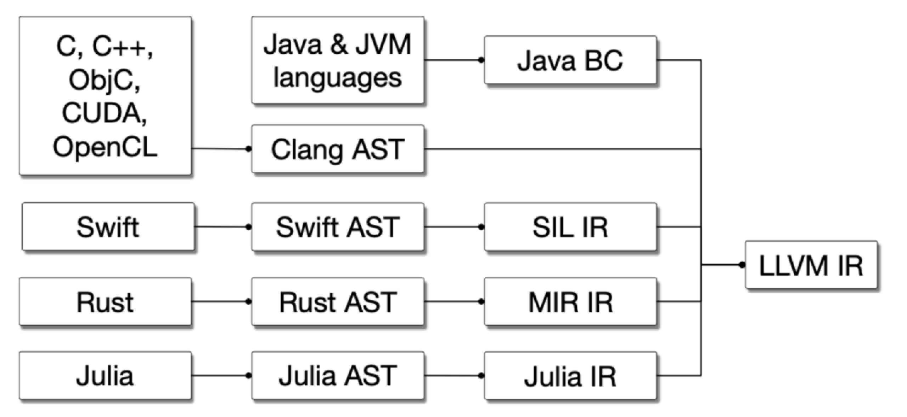

MLIR是多层IR的简称，为什么需要引入MLIR？要回答这个问题需要先回顾一下当下编译器现状。我们知道LLVM最为最流行的编译基础设施，被广泛地用于各种编译器中，其中最主要的原因是LLVM框架提供了大量的基于LLVM IR的优化，同时可以将LLVM IR生成众多后端的机器码。LLVM提供的各种功能几乎都是围绕LLVM IR进行，对编译器的开发者来说非常方便，例如要实现一款新语言的编译，只需要将新语言编译成LLVM IR就可以复用LLVM的中端优化和后端代码生成能力，从而高效实现一款编译器。
然而随着时间的推移，我们可以发现两个问题：一方面，越来越多的语言接入LLVM IR之前都需要实现自己的前端IR，用于处理语言特殊的优化，以及方便将语言降级到LLVM IR。

例如现在很多高级语言都会使用LLVM作为其中后段。如下所示：



每个语言都会有自己的AST，除了AST以外这些语言还得有自己的IR来做language- specific optimization，但是他们的IR最后往往都会接到同样的后端，比如说LLVM IR上来做代码生成，来在不同的硬件上运行。这些语言专属的IR被叫做Mid-Level IR，而且不通语言自己的IR的优化会有重复的部分，但很难互相复用代码，重复造了很多轮子。

另一方面，越来越多的新硬件出现，它们通常用于专用领域，这些领域通常引入了DSL（Domain Specific Language，领域编程语言），而针对DSL的编译优化除了传统的编译优化知识外，通用还需要相关的领域知识，而这在LLVM IR通常很难表达和优化。例如TensorFlow系统其编译过程非常复杂，如下所示：

一个Tensorflow的Graph被执行可以有若干条途径，例如可以直接通过Tensorflow Executor来调用一些手写的op-kernel函数；或者将TensorFlow Graph转化到自己的XLA HLO，由XLA HLO再转化到LLVM IR上调用CPU、GPU或者转化到TPU IR生成TPU代码执行；对于特定的后端硬件，可以转化到TensorRT、或者像是nGraph这样的针对特殊硬件优化过的编译工具来跑；或者转化到TFLite格式进一步调用NNAPI来完成模型的推理。

而MLIR则是希望通过引入多层IR的方式解决上面的两个问题：通过多层IR提供方便DSL接入，同时提供针对领域相关的优化。下面通过一个例子直接的看一下MLIR的基本概念。
假设我们有一个PyTorch的模型，代码如

```class Linear(nn.Module):
def __init__(self): 
super(Linear, self).__init__()
self.linear = nn.Linear(16, 10)

def forward(self, x): 
return self.linear(x)

linear = Linear()
mlir_module = torch_mlir.compile(linear, torch.ones( 1, 16), output_type=torch_mlir.OutputType.TOSA)
```

代码使用Linear建立一个全联接的神经网络，这个神经网络做的事情非常简单，对于输入x计算得到y，而矩阵A和骗至b是网络模型参数，在神经网络训练时得到参数，在推理时使用参数。

而作为编译器开发者希望模型执行足够快，所以可以通过编译的方式生成可执行的代码，并在编译过程进行优化。向PyTorch这样的AI框架通常会将代码变成HIR和LIR，分别进行图优化和算子优化，然后再生成代码，正如图2提到的一样，除了编译和优化工作外需要框架考虑不同后端。
而MLIR则是期望通过设计多层IR表达不同层次的功能，让编译器都能重用这些IR，同时在MLIR中对这次不同层次的IR进行针对性的优化，从而达到最优性能。

例如在MLIR设计了一个接入层IR（实际上称为方言）TOSA（Tensor Of System Architecture），可以将上述代码转换为TOSA方言表达的代码。

```func.func @forward(%arg0: tensor<1x16xf32>) -> tensor<1x10xf32> {
    %0 = "tosa.const"() {value = dense<"0xC44B..."> : tensor<1x16xf32>} : () -> tensor<1x16xf32>
    %1 = "tosa.const"() {value = dense<"0xA270..."> : tensor<1x10xf32>} : () -> tensor<1x10xf32>
    %2 = "tosa.reshape"(%arg0) {new_shape = [1, 1, 16]} : (tensor<1x16xf32>) -> tensor<1x16xf32>
    %3 = "tosa.matmul"(%2, %0) : (tensor<1x1x16xf32>, tensor<1x16x10xf32>) -> tensor<1x1x10xf32>
    %4 = "tosa.reshape"(%3) {new_shape = [1, 10]} : (tensor<1x1x10xf32>) -> tensor<1x10xf32>
    %5 = "tosa.add"(%4, %1) : (tensor<1x10xf32>, tensor<1x10xf32>) -> tensor<1x10xf32>
    return %5 : tensor
} 
```
经过这样的处理后，则就将Python代码描述的模型转换为MLIR代码。这里先暂不对MLIR进行详细介绍，我们仅仅简单介绍如何阅读上述代码。
1. 形如“dialect.operation”的字符串表示，方言为dialenct，操作为operation，方言的目的管理Operation，而Operation表述一定功能。例如func.func表示func方言里面的func操作。上述整个代码表示定义一个func方言的func操作。
2. 形如“%arg0: tensor<1x16xf32>”，其中%arg0表示变量名，tensor<1x16xf32>表示类型。这里%arg0时参数，其类型为tensor类型，并且tesnor是二维的，第一维的长度为1，地二维的长度为16，tensor的数据元素类型为float32（简写f32）。
3. 形如“%0 = = "tosa.const"() {value = dense<"0xC44B..."> : tensor<1x16xf32>} : () -> tensor<1x16xf32>”中的%0表示临时定义的变量；它使用tosa方言的const操作生成，其中const操作可以接受属性参数，其属性为value，而value是dense类型，value的类型为tensor<1x16xf32>，%0的类型也是tensor<1x16xf32>。

```
//定义函数forward，接受参数arg0，参数类型为tensor<1x16xf32>，函数的返回类型为tensor<1x10xf32>
func.func @forward(%arg0: tensor<1x16xf32>) -> tensor<1x10xf32> {
//定义常量，类型为tensor<1x16xf32>。常量是通过tosa.const操作创建，tosa.const操作接受属性value，其中value类型为tensor<1x16xf32>
    %0 = "tosa.const"() {value = dense<"0xC44B..."> : tensor<1x16xf32>} : () -> tensor<1x16xf32>
    //定义常量，类型为tensor<1x10xf32>。常量是通过tosa.const操作创建，tosa.const操作接受属性value，其中value类型为tensor<1x10xf32>
    %1 = "tosa.const"() {value = dense<"0xA270..."> : tensor<1x10xf32>} : () -> tensor<1x10xf32>
    //对arg0进行类型进行变换，从类型tensor<1x16xf32>变成tensor<1x1x16xf32>
    %2 = "tosa.reshape"(%arg0) {new_shape = [1, 1, 16]} : (tensor<1x16xf32>) -> tensor<1x1x16xf32>
    //对%2和%0进行类matmul计算，输入类型为tensor<1x1x16xf32>, tensor<1x16x10xf32>，输出类型为tensor<1x1x10xf32>
    %3 = "tosa.matmul"(%2, %0) : (tensor<1x1x16xf32>, tensor<1x16x10xf32>) -> tensor<1x1x10xf32>
    //对%3进行类型进行变换，从类型tensor<1x1x10xf32>变成tensor<1x10xf32>
    %4 = "tosa.reshape"(%3) {new_shape = [1, 10]} : (tensor<1x1x10xf32>) -> tensor<1x10xf32>
    //对%4和%1进行张量加法，输入和输出类型都是tensor<1x10xf32>
    %5 = "tosa.add"(%4, %1) : (tensor<1x10xf32>, tensor<1x10xf32>) -> tensor<1x10xf32>
    //返回%5，类型为tensor<1x10xf32>
    return %5 : tensor
} 
```
从上面的代码注释可以看出，它是Python代码的另外一种实现。也可以说通过工具将Python代码实现成为以tosa方言中的操作。

虽然通过TOSA方言可以将Python代码表示出来，但是TSOA中的操作非常高级，需要进一步降级，从而描述如何实现这些操作。例如matmul执行的是矩阵乘，而矩阵乘法需要通过循环实现。

在MLIR社区中提供了linalg方言，它有一些命名操作（如matmul等）和通用操作（如generic），这个方言是承上启下的，接受上层代码的降级，同时提供一些优化功能，并降级到更为底层的方言。例如上面的代码可以进一步降级为使用linlag方言描述的代码，如下：
```
#map0 = affine_map<(d0, d1, d2) -> (d0, d2)>
#map1 = affine_map<(d0, d1, d2) -> (d2, d1)>
#map2 = affine_map<(d0, d1, d2) -> (d0, d1)> 
func.func @forward(%arg0: tensor<1x16xf32>) -> tensor<1x10xf32> {
  %cst = arith.constant dense<"0xA270..."> : tensor<1x10xf32>
    %cst_0 = arith.constant dense<"0xC44B..."> : tensor<16x10xf32>
    %0 = linalg.generic {indexing_maps = [#map0, #map1, #map2], iterator_types = ["parallel", "parallel", "reduction"]} ins(%arg0, %cst_0 : tensor<1x16xf32>, tensor<16x10xf32>) outs(%cst : tensor<1x10xf32>)
    {
        ^bb0(%arg1: f32, %arg2: f32, %arg3: f32):
            %1 = arith.mulf %arg1, %arg2 : f32
            %2 = arith.addf %arg3, %1 : f32
            linalg.yield %2 : f32
    } -> tensor<1x10xf32>
    return %0 : tensor<1x10xf32>
} 
```
在上面的代码中有两类特殊的操作，分别是affine_map和linalg.generic。其中affine_map定义的仿射变换的定义域和值域，例如#map0 = affine_map<(d0, d1, d2) -> (d0, d2)>表示定义一个仿射变换，输入的定义域可以通过三个维度(d0, d1, d2)遍历得到，而输出的值域通过二个维度(d0, d2)遍历得到。
而linalg.eneric则是提供复杂的操作，它的输入有仿射变换规则、迭代方式，输入和输出参数。

```
//定义仿射变换
#map0 = affine_map<(d0, d1, d2) -> (d0, d2)>
#map1 = affine_map<(d0, d1, d2) -> (d2, d1)>
#map2 = affine_map<(d0, d1, d2) -> (d0, d1)> 
func.func @forward(%arg0: tensor<1x16xf32>) -> tensor<1x10xf32> {
    %cst = arith.constant dense<"0xA270..."> : tensor<1x10xf32>
    %cst_0 = arith.constant dense<"0xC44B..."> : tensor<16x10xf32>
    //定义linalg的通用操作，这个操作接受属性indexing_map、iterator_types，描述的针对输入参数%args0和%cst_0进行迭代，生成输出%cst
    %0 = linalg.generic {indexing_maps = [#map0, #map1, #map2], iterator_types = ["parallel", "parallel", "reduction"]} ins(%arg0, %cst_0 : tensor<1x16xf32>, tensor<16x10xf32>) outs(%cst : tensor<1x10xf32>)
    {
        //这是一个基本块，和一般的SSA不同，这里基本块有参数arg1、arg2和args3.
        ^bb0(%arg1: f32, %arg2: f32, %arg3: f32):
            // arg1和arg2相乘，在arg3相加得到输出。
            %1 = arith.mulf %arg1, %arg2 : f32
            %2 = arith.addf %arg3, %1 : f32
            linalg.yield %2 : f32
    } -> tensor<1x10xf32>
    return %0 : tensor<1x10xf32>
} 
```
注意：这里仅仅是演示其中一种降级方法，在这个方法中可以看到乘法和加法都放在基本块中。当然还可以先乘后加。如何降级是非常复杂的，在后续文章会详细介绍。

同理linalg中的操作非常复杂，generic仅仅描述了它的功能，具体的实现仍然不确定，所以进一步使用仿射进行描述其真实的实现，结果如下所示：

```
memref.global "private" constant @__constant_16x10xf32 : memref<16x10xf32> = dense<"0xC44B...">
memref.global "private" constant @__constant_1x10xf32 : memref<1x10xf32> = dense<"0xA270...">
func.func @forward(%arg0: memref<1x16xf32>, %arg1: memref<1x10xf32>) {
    %0 = memref.get_global @__constant_1x10xf32 : memref<1x10xf32>
    %1 = memref.get_global @__constant_16x10xf32 : memref<16x10xf32>
    memref.copy %0, %arg1 : memref<1x10xf32> to memref<1x10xf32>
    affine.for %arg2 = 0 to 10 {
        affine.for %arg3 = 0 to 16 {
            %2 = affine.load %arg0[0, %arg3] : memref<1x16xf32>
            %3 = affine.load %1[%arg3, %arg2] : memref<16x10xf32>
            %4 = affine.load %arg1[0, %arg2] : memref<1x10xf32>
            %5 = arith.mulf %2, %3 : f32
            %6 = arith.addf %4, %5 : f32
            affine.store %6, %arg1[0, %arg2] : memref<1x10xf32>
        }
    }
    return
}
```
在这个代码片段中可以看出其实现已经非常接近我们传统的代码，例如memref方言描述的数据的内存布局，affine.for表示的是一个循环，affine.load和affine.store描述的是如何从memref加载、写数据。
```
//定义个全局常量，并提供了初始化的数据
memref.global "private" constant @__constant_16x10xf32 : memref<16x10xf32> = dense<"0xC44B...">
memref.global "private" constant @__constant_1x10xf32 : memref<1x10xf32> = dense<"0xA270...">
func.func @forward(%arg0: memref<1x16xf32>, %arg1: memref<1x10xf32>) {
    %0 = memref.get_global @__constant_1x10xf32 : memref<1x10xf32>
    %1 = memref.get_global @__constant_16x10xf32 : memref<16x10xf32>
    // 为arg1赋初值，使用copy操作进行
    memref.copy %0, %arg1 : memref<1x10xf32> to memref<1x10xf32>
    //定义外层循环，循环空间从0到10，步长默认为1
    affine.for %arg2 = 0 to 10 {
         //定义内层循环，循环空间从0到16，步长默认为1
        affine.for %arg3 = 0 to 16 {
            %2 = affine.load %arg0[0, %arg3] : memref<1x16xf32>
            %3 = affine.load %1[%arg3, %arg2] : memref<16x10xf32>
            %4 = affine.load %arg1[0, %arg2] : memref<1x10xf32>
            %5 = arith.mulf %2, %3 : f32
            %6 = arith.addf %4, %5 : f32
            affine.store %6, %arg1[0, %arg2] : memref<1x10xf32>
        }
    }
    return
}
```
使用Affine方言描述的代码就非常容易转换到LLVM IR，得到的LLVM IR如下所示：

```
    ... ...
    ^bb1(%20: i64): // 2 preds: ^bb0, ^bb4
    %21 = llvm.icmp "slt" %20, %5 : i64
    llvm.cond_br %21, ^bb2(%4 : i64),
    ^bb5 ^bb2(%22: i64): // 2 preds: ^bb1, ^bb3
    %23 = llvm.icmp "slt" %22, %7 : i64
    llvm.cond_br %23, ^bb3, ^bb4
    ^bb3: // pred: ^bb2
    ... ...
    %46 = llvm.intr.masked.load %45, %36, %0 {alignment = 4 : i32} : (!llvm.ptr<vector<2xf32>>, vector<2xi1>, vector<2xf32>) -> vector<2xf32>
    %47 = llvm.fmul %30, %41 : vector<2xf32>
    %48 = llvm.fadd %46, %47 : vector<2xf32> llvm.intr.masked.store %48, %45, %36 {alignment = 4 : i32} : vector<2xf32>, vector<2xi1> into !llvm.ptr<vector<2xf32>>
    %49 = llvm.add %22, %8 : i64 llvm.br ^bb2(%49 : i64)
    ^bb4: // pred: ^bb2
    %50 = llvm.add %20, %6 : i64
    llvm.br ^bb1(%50 : i64)
    ^bb5: // pred: ^bb1
    llvm.return
} 
```
然后再利用LLVM可以将LLVM IR进行优化以及针对目标架构完成代码生成。
具体转换过程可参考：
https://file.elecfans.com/web2/M00/7E/0E/poYBAGOC6bKAZAQyADt7O8jLZCE607.pdf

通过这个例子，我们可以进一步得到如下信息：
1. MLIR通过多方言的形式，逐步将抽象、高层的代码降级到底层代码。
2. 降级过程中使用了一个非常便于优化的方言，例如Affine是多面体编译的抽象，非常方便进行循环相关的优化
3. 在降级过程并不唯一，开发者可以根据自己的代码意图选择合适的降级路线。从而实现代码性能最优。

<!-- more -->
