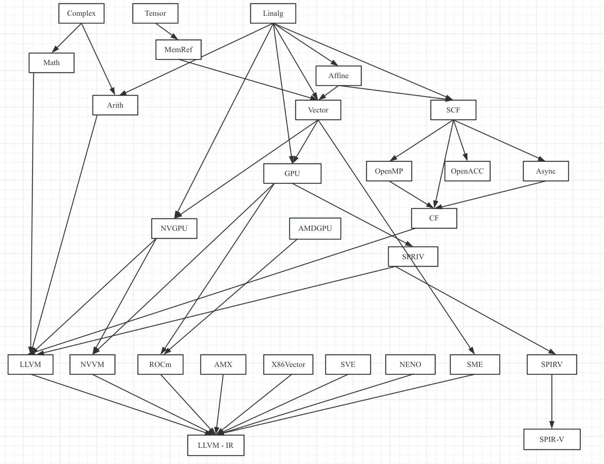

# 方言概述

MLIR社区提供的方言超过40余个方言，理解全部的方言已经非常困难。下面是有一个部分重要方言的降级流程图。

<!-- more -->

为了方便理解方言的功能，我们将上图换划分成四层介绍：

1. 硬件方言：目的是将MLIR转换到LLVM IR。例如：
*  LLVM方言将MLIR转换至通用的LLVM IR；
*  X86Vector、ArmSME、ArmSVE、ARMNeon、AMX、AVX512、NVVM、ROCm等方言MLIR转换至特定硬件架构的LLVM IR（通常通过Instrsic实现）。

2. 结构方言：目的是提供表示程序的控制流。例如：
* 控制流方言：SCF（Standard Control Flow，标准控制流）方言和CF（Control Flow，控制流）方言用于描述程序的控制流。其中SCF可以描述循环、分支等，它的抽象更高；CF描述分支，其抽象程度低；SCF一般会降级到CF。

3. 数据和内存描述的MLIR。例如：
*  Tensor、MemRef和Arith方言用于描述程序中高级和基础数据结构。其中Tensor描述张量；MemRef描述内存；Arith描述基础数学运算。

4. 优化方言：目的提供公共优化能力。例如：

* 循环优化：Affine方言提供针对循环的多面体优化；
* 分块优化：Vector方言提供针对数据分块的优化；
* 线性算法优化：Linalg方言提供针对线性算法的优化；
* 常见优化库：OpenMP和OpenACC方言提供常见优化库功能；
* 其它优化：如Async方言提供程序异步执行优化、Bufferization方言提供缓存优化。

注意1:上面的划分可能存在非常大的争议，例如在2023年Jeff等人在LLVM峰会上对方言也做了分类介绍，可以参考：https://youtu.be/hIt6J1_E21c。这里的划分主要是从降级的维度出发，而Jeff它们的分类来自于LLVM社区最早对于方言的分类，参考：https://discourse.llvm.org/t/codegen-dialect-overview/2723。

注意2: 在这里我们仅仅关注MLIR社区方言，在社区方言外还存在业务方言，例如将Python描述的大模型通过转化变成MLIR方言，由于这么方言属于业务方言，我们此处并不讨论。
