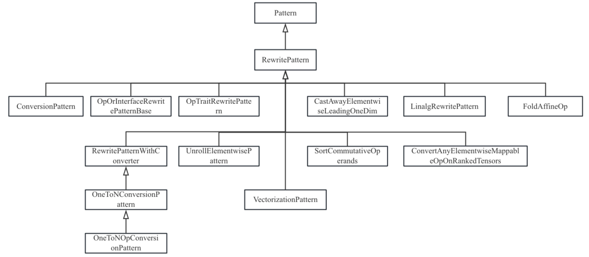

操作匹配和重写是MLIR中最重要的概念，通过操作匹配和重写实现方言降级和操作变换。在MLIR中为了实现编译和优化功能，一般需要将高级方言的操作转换（Convert）到低级方言的操作，该过程一般也称为降级（Lowering），实现编译功能；或者将方言中的操作变换（Transform）到本方言中的其它的操作，从而实现操作优化功能；它们都依赖于操作匹配和重写机制。
匹配是编译原理中非常常见的问题，例如编译器后端实现的指令匹配。常见的匹配方法有：宏展开、树匹配、DAG（有向无环图）匹配等，DAG匹配因为其匹配效率和性能优势被广泛用在当前编译器中。在第2章IR结构中提到，每一个操作中CFG区域[ 虽然MLIR区域包括CFG和Graph两种类型，但大多数区域都是CFG区域，只有很少的不要求代码执行顺序的区域才是Graph区域，例如代码的顶级操作module，它的嵌套操作包含global、func等无关顺序的操作，所以module操作是Graph类型。]的IR都满足SSA特性，根据SSA特性对于Use—Def非常容易获得，而整个程序的Use—Def信息通常是一个DAG，因此实现一套基于DAG的匹配和重写机制可能满足MLIR编译优化的大多数场景。
MLIR的操作匹配和重写机制吸收其它编译项目的优点，通过一套针对操作的匹配和重写框架，提供了多种操作模式匹配能力，包含：支持操作一对一、一对多、多对一匹配重写，目前MLIR的匹配/重写机制基于Pass框架进行实现，在Pass运行时找到操作锚点后，将操作锚点作为待处理的操作，对操作内嵌的负载IR使用DAG图进行匹配和重写。为了灵活的处理DAG匹配的优先级问题，提供匹配成本模型，开发者可以通过成本模型定义模式匹配的顺序。
另外在匹配过程中将常量折叠这样的优化提升至较高的地位，在框架中支持操作的常量折叠，只需要开发者在定于操作时定义常量折叠的实现就可以自动实现常量折叠。当然目前MLIR框架提供的这套操作匹配和重写机制也存在一些不足，不适用于任意操作的匹配，例如CSE这样的优化可以应用于任意的操作，对于这样的优化框架难以提供非常优雅的方式（要多每个操作都提供类似的匹配模版），所以这样的优化自MLIR社区中并未使用操作匹配和重写的框架，而是基于Pass框架进行实现。除此以外，MLIR中Pass机制都要求操作具有IsolatedFromAbove特质，该特质打断了操作的Def–Use关系，因此操作匹配和重写框架也不能支持跨Pass锚点的处理（表示匹配、重写机制也是局部优化），同时匹配、重写机制也要满足5.1.5节介绍的Pass实现约束。
本章首先介绍MLIR中操作匹配的设计和实现，然后介绍MLIR中操作变换和方言降级的实现，最后简单介绍MLIR为开发者提供的三种操作匹配方法。

## 6.1操作匹配设计和实现
MLIR以操作为核心进行IR设计和变换，在匹配、重写过程中也是围绕操作进行的。在操作匹配和重写机制中涉及到三个概念，分别是模式（Pattern）、重写（Rewrite）和应用（Applicator）。
* 模式：针对操作定义匹配的模式，模式包括待匹配的操作、操作的约束（如操作的接口或者特质）、匹配后生成的操作、操作匹配的成本模型等信息。除此以外模式还提供匹配和重写函数，它们可由mlir-tblgen根据模式的TD定义自动生成，也可由开发者实现。
* 重写：针对具体的操作实现操作的添加、删除、移动、替换功能以及相关变化的通知等功能（通知机制是框架最为主要的特征，通过通知机制跟踪变化的操作，从而实现6.2节介绍的贪婪匹配、方言降级）。
* 应用：将模式和重写进行组合的驱动，允许定义多个匹配模式、重写实现、成本模型信息，针对多个匹配模式，根据成本模型在每次匹配时都选择最优匹配模式，然后执行匹配和重写。在匹配的过程中，可能存在多种不同类型的模式，例如一般的匹配模式、任意操作的匹配模式和通过PDL定义的模式，当多种类型同时存在时当匹配模式相同时会按照一般匹配模式、任意操作匹配模式、PDL模式依次进行匹配、重写。
下面看一下这三部分的具体实现。

### 6.1.1模式
MLIR中DAG匹配由模式确定匹配图中节点，同时也要反映操作以及操作结构、约束信息。而实际上以操作为锚点，准确描述操作的信息就能完成DAG匹配。例如要匹配操作Operation，首先它被其它两个操作使用，另外它由三个操作数，假设第一个操作数是常量记为Operand1，而第二个操作数是另一个操作的输出，其类型记为Sub-Op1，第三个操作数是一个操作的输出，其类型记为Sub-Op2，再假如Sub-Op1也由两个操作数，分别为Operand2和Sub-Op3。如果要匹配锚点操作，本质上就是在整个图中匹配子图，子图结构如图6-1所示。

MLIR定义Pattern结构用于描述模式，其中Pattern包括的数据成员主要是匹配基础信息，包括成本、待匹配的目标、匹配后的操作。同时还定义了RewritePattern继承于Pattern，在Pattern类的基础上增加了成员函数match、rewrite、matchAndRewrite等。另外为了方便社区开发者的使用，定义了ConversionPattern继承于RewritePattern，并添加了类型的支持；定义OpRewritePattern、OpInterfaceRewritePattern、OpTraitRewritePattern等模式分别用于操作模式、带接口的操作模式和带特质的操作模式。目前Pattern的类继承结构如图6-2所示。


模式的定义有三种方法，在本节介绍通过C++代码方式的定义模式。假设定义一个模式MyPattern如代码6-1所示。

```//定义模式MyPattern
class MyPattern: public RewritePattern{
public:
//定义MyPattern的构造方式，模式匹配的操作为MyOp
MyPattern(PatternBenefit benefit, MLIRContext* context)
:RewritePattern(MyOp::getOperationName(), benefit, context){}
//除了定义匹配锚点操作的模式外，还可以定义匹配任意操作的模式，例如匹配任意操作的
//模式可以设置匹配类型为MatchAnyOpTypeTag，它本质上是一个占位符
//在匹配过程时会特殊处理这个类型
MyPattern(PatternBenefit benefit)
:RewritePattern(benefit, MatchAnyOpTypeTag()){}
//重载match和rewrite函数
//根据模式的锚点操作，match进一步确定匹配操作的信息，比如可以要求操作的操作数样子
//是否包含某一个特质或者某一种接口等
LogicalResult match(Operation* op) const override;
//如果匹配成功后，调用rewrite函数完成操作重写，开发者根据业务需要可以删除、
//更新操作，或者增加新的操作等
void rewrite(Operation* op, PatternRewriter& rewriter);
//将match和rewrite组合在一起，提供一个入口。注意基类RewritePattern的
//matchAndRewrite就是调用match和rewrite，开发者只需重载match和rewrite
//开发者也可以重载matchAndRewrite
LogicalResult matchAndRewrite(Operation* op,PatternRewriter& rewriter);
};
```
当然开发者需要实现指定匹配操作，可以直接让MyPattern直接继承于模版类OpRewritePattern，它接受操作类型作为模版参数，例如可以定义模式为Struct MyPattern: public OpRewritePattern<MyOp>，则MyPattern仅仅匹配MyOp操作。。


### 6.1.2重写
MLIR社区对于重写机制的基础能力进行实现，包括了操作的修改、添加、更新、删除等。开发者只需要根据匹配结果调用重写机制中的相关API完成业务即可。目前社区关于重写的类结构图如图6-3所示。


注意：在代码6-1中rewriter方法中使用PatternRewriter中的API对操作进行更新、插入、删除等处理，而不能直接使用类Opeartion中的方法（Operation也继承于OpBuilder），原因是PatternRewriter不仅仅调用Opeartion中的方法，还提供了通知机制，该通知机制可以把相关变化的操作通知给其他组件，从而保证递归处理的正确性。
在图6-3中有几个值得注意的地方：
* 除IRRewriter外，其他派生类都继承于PatternRewriter。IRRewriter和PatternRewriter最大的区别是：*IRRewriter可以针对任意的操作进行重写*，而PatternRewriter仅仅针对当前正在处理的操作进行重写。所以IRRewriter通常只有在无法使用PatternRewriter时才会使用。
* ConversionPatternRewriter主要用于方言降级中，它主要是提供了方言降级中需要使用的一些功能，例如对于基本块参数类型的转换等方法。
* GreedyPatternRewriteDriver主要用于优化变换中，它主要提供了贪婪的方法用于递归处理操作的匹配和重写，它有两个派生类，分别是RegionPatternRewriteDriver和MultiOpPatternRewriteDriver，这两个派生类分别针对区域中的操作、多个操作进行匹配、重写。
下面通过TD描述的方式简单定义一个模式的匹配、重写。如代码6-2所示。

```//该代码片段来自于社区
//定义操作OpN，它们位于test方言中，定义了TEST_OP记录。操作包含两个操作数
//两个操作数都是I32类型，输出为I32类型
def OpN : TEST_Op<"op_n"> {
  let arguments = (ins I32, I32);
  let results = (outs I32);
}
//定义OpP操作，包括六个操作数，都是I32类型。输出为I32类型
def OpP : TEST_Op<"op_p"> {
  let arguments = (ins I32, I32, I32, I32, I32, I32);
  let results = (outs I32);
}
//定义一个匹配模式，匹配操作OpN，第一个操作数为变量b
//第二个操作数为OpP操作定义的变量，由于OpP的输出为I32类型
//所以OpP可以作为OpN操作的输入
//OpP包含六个操作数，分别是变量a、b、c、d、e、f
//模式的重写规则是：使用变量b替换整个OpN操作
def TestNestedOpEqualArgsPattern :
  Pat<(OpN $b, (OpP $a, $b, $c, $d, $e, $f)), (replaceWithValue $b)>;
```
通过mlir-tblgen工具可以将代码6-2翻译成C++代码，如代码6-3所示。

```//模式类TestNestedOpEqualArgsPattern，它继承于RewritePattern
//它要匹配操作的名字为test.op_n即OpN操作，该模式的优先级为2，原因是OpN包含了
//子操作OpP，没有包含子操作的默认优先级为1，优先级高一般会先匹配
struct TestNestedOpEqualArgsPattern : public ::mlir::RewritePattern {
  TestNestedOpEqualArgsPattern(::mlir::MLIRContext *context)
      : ::mlir::RewritePattern("test.op_n", 2, context, {}) {}
//重写matchAndRewrite操作
  ::mlir::LogicalResult matchAndRewrite(::mlir::Operation *op0,
      ::mlir::PatternRewriter &rewriter) const override {
    // 创建7个临时变量，分别对于OpN和OpP的操作数
    ::mlir::Operation::operand_range f(op0->getOperands());
...
    ::mlir::Operation::operand_range b(op0->getOperands());
    ::mlir::Operation::operand_range b0(op0->getOperands());
    ::llvm::SmallVector<::mlir::Operation *, 4> tblgen_ops;
    // 定义匹配操作的图结构，包括以下条件
//OpP操作是OpN的第二个操作数，OpN的第一个操作数b和OpP的第二个操作数相同
    tblgen_ops.push_back(op0);
//OpN操作对象
    auto castedOp0 = ::llvm::dyn_cast<::test::OpN>(op0); (void)castedOp0;
//第一额操作数，记为b0
    b0 = castedOp0.getODSOperands(0);
    {
    //第二操作数记为Op1，Op1的类型为OpP
      auto *op1 = (*castedOp0.getODSOperands(1).begin()).getDefiningOp();
...
       auto castedOp1 = ::llvm::dyn_cast<::test::OpP>(op1); (void)castedOp1;
      if (!(castedOp1)){
        return rewriter.notifyMatchFailure(op1, [&](::mlir::Diagnostic &diag) {
          diag << "castedOp1 is not ::test::OpP type";
        });
      }
      a = castedOp1.getODSOperands(0);
...
      f = castedOp1.getODSOperands(5);
      tblgen_ops.push_back(op1);
    }
//要求OpN对象的第一个操作数和OpP的第二个操作数相同
    if (!(*b.begin() == *b0.begin())){
      return rewriter.notifyMatchFailure(op0, [&](::mlir::Diagnostic &diag) {
        diag << "Operands 'b' and 'b0' must be equal";
      });
    }
    // 重写，用b替换OpN操作对象
    auto odsLoc = rewriter.getFusedLoc({tblgen_ops[0]->getLoc(), tblgen_ops[1]->getLoc()}); (void)odsLoc;
    ::llvm::SmallVector<::mlir::Value, 4> tblgen_repl_values;

    for (auto v: ::llvm::SmallVector<::mlir::Value, 4>{ b }) {
      tblgen_repl_values.push_back(v);
    }
    rewriter.replaceOp(op0, tblgen_repl_values);
    return ::mlir::success();
  };
};
```
使用TD的方式和开发者自定义C++代码方式完全一致，但两者在灵活性以及功能完备性略有差异，我们将在6.3节详细讨论。

### 6.1.3应用
当开发者定义好匹配模式以及重写机制后，就可以将其组合进行使用，在MLIR社区提供了PatternApplicator机制，可以将其组合起来进行使用，它接受三个信息：
* 定义好的模式集合，每个模式都定义了如何匹配和重写操作。
* 自定义的重写机制；如果社区提供的PatternRewriter不满足开发者的需要，可以自行实现，应用可以使用自定义的PatternRewriter。
* 自定义的模式成本模型：允许开发者重新为模式定义收益。
* 对操作进行匹配和重写：针对操作调用它的matchAndRewrite函数实现匹配和重写。
一个典型的使用如代码6-4所示：

```//定义匹配模式MyPattern，匹配MyOp
class MyPattern : public RewritePattern{
public:
MyPattern(PatternBenefit benefit, MLIRContext* context)
:RewritePattern(MyOp::getOperationName(), benefit, context){}
//假设开发者实现了match和rewriter函数，这里忽略
};
//将所有带匹配的模式收集到一个集合中。这里只有一个模式MyPattern
void collectMyPatterns(RewritePatternSet& patterns, MLIRContext* ctx){
patterns.add<MyPattern>(/*benefit=*/1,ctx);
}
//自定义重写机制PatternRewriter
class MyPatternRewriter : public PatternRewriter{
public:
MyPatternRewriter(MLIRContext* ctx): PatternRewriter(ctx){}
//根据需要实现PatternRewriter相关的添加、删除、修改、更新的操作
};
//针对操作定义驱动
void applyMyPatternDriver(Operation* op,
const FrozenRewritePatternSet& patterns){
//初始化PatternRewriter
MyPatternRewriterrewriter(op->getContext());
//创建应用并为应用定义模式的成本模型and apply our costmodel.
PatternApplicator applicator(patterns);
applicator.applyCostModel([](const Pattern& pattern){
//成本模型的输入为模式，输出为模式的收益。这里仅仅是演示示例
//直接使用模式的收益，开发者可以根据自己的需要重新调整模式的收益
return pattern.getBenefit();
});
//对操作进行匹配和重新
LogicalResult result = applicator.matchAndRewrite(op, rewriter);
if(failed(result)){
//...匹配或者重新失败，则没有任何模式适用，开发者可以输出必要的信息，并返回
}
//...模式匹配和重写成功，开发者也可以输出必要的信息，并返回
}
```
通过应用将匹配、重写机制进行组合，从而方便实现针对操作的匹配和重写。MLIR框架提供了两种经典的匹配、重写应用，分别是贪婪匹配和方言降级。

<!-- more -->
