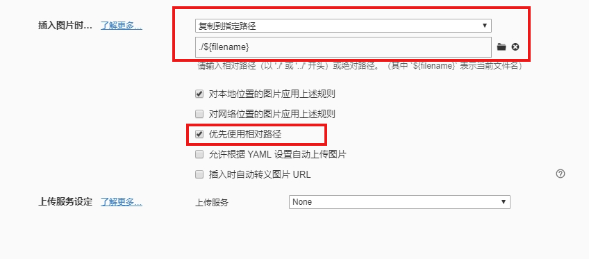

## 搭建环境

1.  拉取代码

2. 安装 nodejs 和 npm

3. 安装 hexo

4. 更新代码中 node module

   ```
   npm intall
   ```
<!-- more -->
## 编写博客

1. 创建博客

   ```
   hexo new blog_name
   ```

2. 编写博客 md 文件

3. 生成 css 和 html 等文件

   ```
   hexo g
   ```

4. 发布

   ```
   hexo d
   ```

## 使用建议

### 图片相关

使用 md 编写工具的时候可以设置图片存放路径为相对路径。



然后通过如下命令在 md 中插入图片，即可在md中看到图片，也可以在网页中看到图片。注意：要写路径要以“./”开头。


## 参考

1. [nvm安装]([Ubuntu 安装 nvm, 并使用其安装 node.js 与 npm-CSDN博客](https://blog.csdn.net/weixin_44623897/article/details/122690638))

2. [npm报错问题原因]([npm报错 Cannot read property 'insert' of undefined_前端-CSDN问答](https://ask.csdn.net/questions/7898679))

3. [hexo 多端同步]([使用hexo，如果换了电脑怎么更新博客？ - 知乎 (zhihu.com)](https://www.zhihu.com/question/21193762/answer/489124966))

4. [ubuntu | 镜像站使用帮助 | 清华大学开源软件镜像站 | Tsinghua Open Source Mirror](https://mirror.tuna.tsinghua.edu.cn/help/ubuntu/)

5. [next主题设置](http://home.ustc.edu.cn/~liujunyan/blog/hexo-next-theme-config/)

6. [添加Gitalk作为评论区]([[Gitalk\]评论系统 - Hexo-NexT](https://hexo-next.readthedocs.io/zh-cn/latest/next/advanced/gitalk-评论系统/))

7. [hexo 配置]([Next 7.0+ 字数统计与阅读时长 | Alex_McAvoy (alex-mcavoy.github.io)](https://alex-mcavoy.github.io/hexo/c7b3748f.html))

8. 

   

